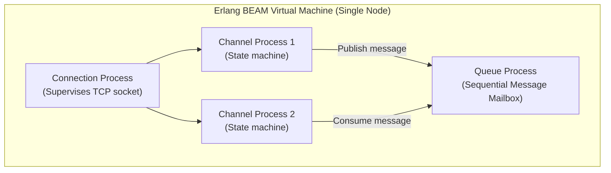
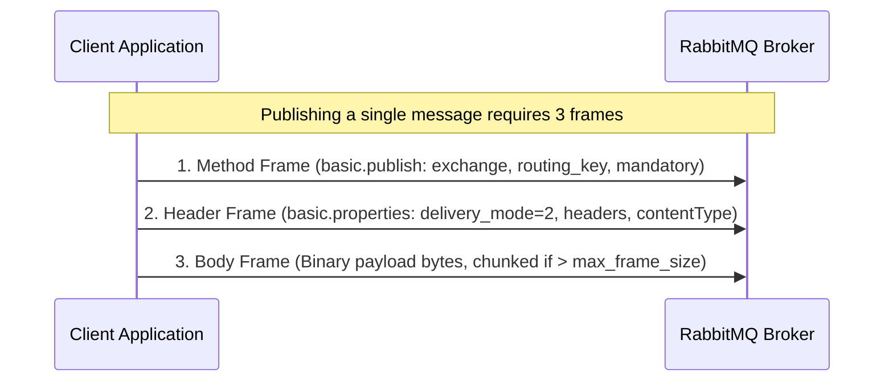

# RabbitMQ Internals & Deep Mechanics

RabbitMQ is built on the **Erlang Open Telecom Platform (OTP)** and the **BEAM virtual machine**, giving it unique concurrency, fault-isolation, and clustering characteristics.

---

## 1. Erlang Process Model and Queue Concurrency

In RabbitMQ, every entity (connection, channel, queue) is an isolated, lightweight **Erlang actor process**:



### The Single-Queue Concurrency Limit

- Each queue is managed by **exactly one** Erlang actor process.
- Erlang processes have no shared memory; communication occurs exclusively via message passing into the process's mailbox.
- Because an individual Erlang process runs on a single CPU core at any instant, a single classic queue has a hard throughput ceiling (typically 30,000 to 50,000 messages per second).
- To scale beyond a single CPU core, systems shard messages across multiple queues using the **Consistent Hash Exchange** plugin (`x-consistent-hash`).

---

## 2. AMQP Protocol Framing Mechanics

The AMQP 0-9-1 wire protocol transfers messages as structured binary frames over TCP:



- **Frame Anatomy**: Every frame begins with a 1-byte type (Method, Header, Body, Heartbeat), a 2-byte channel number, a 4-byte payload size, the payload bytes, and a 1-byte end-of-frame delimiter (`0xCE`).
- **Heartbeat Frames**: Sent bidirectionally at `heartbeat` intervals (default 60s) on channel 0. If two consecutive heartbeats are missed, the TCP socket is closed immediately.

---

## 3. Raft Consensus in Quorum Queues

Quorum queues use a dedicated implementation of the **Raft consensus algorithm** written in Erlang (`ra` library):

```mermaid
flowchart TD
    subgraph Cluster["3-Node RabbitMQ Cluster"]
        Leader["Node 1 (Raft Leader)<br/>Appends write to WAL"]
        Follower1["Node 2 (Raft Follower)<br/>Replicates WAL"]
        Follower2["Node 3 (Raft Follower)<br/>Replicates WAL"]
    end

    Publisher["Publisher (Confirms enabled)"] -->|Publish| Leader
    Leader -.->|Raft AppendEntries RPC| Follower1
    Leader -.->|Raft AppendEntries RPC| Follower2
    Follower1 -- Ack --> Leader
    Note over Leader: Quorum reached (2/3 replicas committed)
    Leader -- basic.ack (Publisher Confirm) --> Publisher
```

- **Write-Ahead Log (WAL)**: All incoming messages and state transitions are appended to an on-disk Raft segment log before acknowledging.
- **Majority Quorum ($Q = \lfloor N/2 \rfloor + 1$)**: For a 3-node quorum queue, 2 nodes must commit the write. For a 5-node queue, 3 nodes must commit.
- **No Split-Brain**: Unlike legacy classic mirrored queues that allowed inconsistent split-brain states during network partitions, Raft mathematically prevents multiple active leaders.

---

## 4. RabbitMQ Flow Control and Backpressure

RabbitMQ implements a multi-tiered flow control system to prevent fast producers from overwhelming slow consumers and exhausting broker memory:

```mermaid
flowchart TD
    subgraph FlowControl["Credit-Based Flow Control Chain"]
        SocketReader["Socket Reader Process"]
        ChannelProcess["Channel Process"]
        QueueProcess["Queue Process"]

        SocketReader -->|Grants credit tokens| ChannelProcess
        ChannelProcess -->|Grants credit tokens| QueueProcess
    end
    subgraph Alarms["Cluster-Wide Resource Alarms"]
        MemCheck{"RAM > vm_memory_high_watermark (40%)?"}
        DiskCheck{"Free Disk < disk_free_limit (50MB)?"}
    end

    Alarms -->|Alarm Tripped| SocketReader
    Note over SocketReader: Stops reading TCP socket (TCP zero-window)<br/>Publishers freeze on socket write
```

1. **Internal Credit-Based Flow Control**: Each Erlang process in the message chain grants credit tokens to upstream processes. When a queue process becomes congested, it stops granting credit to the channel process, which stops granting credit to the socket reader.
2. **TCP Zero-Window Backpressure**: When the socket reader runs out of credit, it pauses calling `recv()` on the underlying Linux TCP socket. The OS TCP receive window shrinks to zero, causing the publishing client's OS socket buffer to fill and blocking the application's `RabbitTemplate.convertAndSend()` thread without dropping messages.
3. **Memory and Disk Alarms**: If cluster memory hits the high watermark (default 40% of host RAM) or disk space drops below the threshold, RabbitMQ immediately blocks all publisher socket readers cluster-wide while leaving consumers running to drain backlogged queues.
