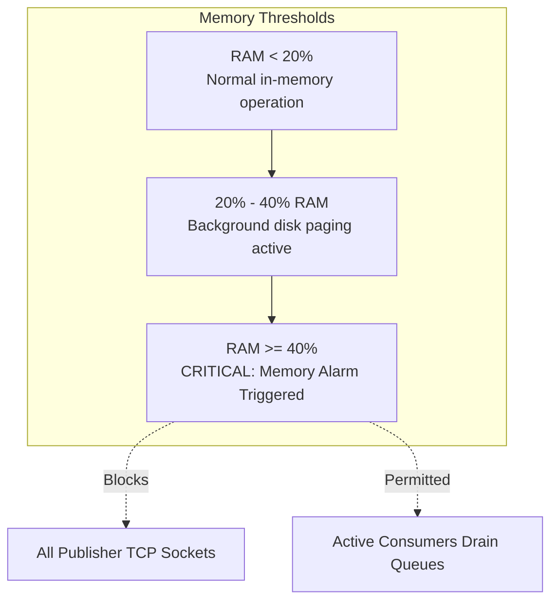

# RabbitMQ in Production

Production operations, high-availability architecture, cluster tuning, alarm handling, and incident triage for RabbitMQ in enterprise environments.

## 1. Flow Control, Memory Watermarks, and Disk Alarms

RabbitMQ protects its host nodes from out-of-memory crashes and disk saturation using active flow control alarms.

### Memory Watermark Architecture

RabbitMQ sets a configurable memory threshold (`vm_memory_high_watermark`, default `0.4` or 40% of available system RAM).

- **Paging to Disk**: When memory reaches $50\%$ of the watermark ($0.2$ of RAM), RabbitMQ starts paging messages from RAM to disk to free memory. Paging causes a severe drop in message throughput.
- **Memory Alarm Trigger**: When RAM usage reaches the watermark ($0.4$), the node enters a **memory alarm state**. RabbitMQ blocks all publishing TCP connections immediately by ceasing to read from publisher sockets.
- **Consumer Processing**: Consumers continue reading and acknowledging messages uninterrupted, draining queues until memory falls below the watermark.



### Disk Free Limit Alarms

RabbitMQ requires free disk space specified by `disk_free_limit` (default $50\text{ MB}$, recommended $5-10\text{ GB}$ or $1.5\times$ RAM in production). When free disk space drops below this limit, publishers are blocked identically to a memory alarm.

```ini
# rabbitmq.conf
vm_memory_high_watermark.relative = 0.4
vm_memory_high_watermark_paging_ratio = 0.5
disk_free_limit.absolute = 10GB
```

---

## 2. Quorum Queues vs Classic Mirrored Queues

RabbitMQ has deprecated Classic Mirrored Queues (`x-ha-policy`) in favor of **Quorum Queues**.

| Feature | Classic Mirrored Queues (Deprecated) | Quorum Queues (Production Standard) |
|---|---|---|
| **Consensus Algorithm** | Custom chain replication | Raft consensus algorithm |
| **Data Safety** | Synchronization can drop messages during failover | Strong quorum consistency; guarantees zero message loss across partitions |
| **Network Partitions** | Prone to split-brain and message duplication | Raft leader election requires strict majority ($> N/2$) |
| **Delivery Limits** | Not natively supported | Native `x-delivery-limit` for automatic DLX routing |
| **Poison Pill Defense** | Requires application-level counter | Automated transfer to DLQ after $N$ failed deliveries |
| **Throughput & Storage** | High in-memory throughput, fragile disk sync | Optimized WAL (Write-Ahead Log) on disk |

### Configuring a Quorum Queue in Spring AMQP

```java
// Declarative Quorum Queue with delivery limit
Queue quorumQueue = QueueBuilder.durable("orders.processing")
        .quorum()
        .deliveryLimit(5)
        .deadLetterExchange("orders.dlx")
        .deadLetterRoutingKey("deadletter")
        .build();
```

---

## 3. Consumer Prefetch and QoS Optimization

The AMQP `basicQos(prefetchCount)` setting dictates how many unacknowledged messages a worker can buffer.

### Sizing Rule of Thumb

$$\text{Optimal Prefetch} = \frac{\text{Network RTT} + \text{Message Processing Time}}{\text{Message Processing Time}} \times \text{Concurrency}$$

- **Heavy Tasks (video transcoding, PDF generation, external HTTP calls)**: Set `prefetchCount = 1`. This guarantees fair dispatch and prevents worker memory exhaustion.
- **Standard Microservice CRUD / Database Writes (5–20ms)**: Set `prefetchCount = 20 - 50`.
- **High-Throughput Streaming / Telemetry (sub-millisecond processing)**: Set `prefetchCount = 100 - 250`.

```yaml
# application.yml
spring:
  rabbitmq:
    listener:
      simple:
        prefetch: 20
        concurrency: 5
        max-concurrency: 15
        acknowledge-mode: manual
```

---

## 4. Production Metrics and Alerting Rules

Monitor these vital Prometheus metrics exposed by the RabbitMQ Prometheus plugin (`rabbitmq_prometheus` on port `15692`):

| Metric | Alert Threshold | Severity | Meaning |
|---|---|---|---|
| `rabbitmq_node_mem_alarm` | `> 0` | **P1 (Critical)** | Node memory alarm active; publishers blocked |
| `rabbitmq_node_disk_free_alarm` | `> 0` | **P1 (Critical)** | Disk space exhausted; publishers blocked |
| `rabbitmq_queue_messages_ready` | Sustained increase $> 30\text{m}$ | **P2 (Major)** | Consumer lag; backlog accumulating |
| `rabbitmq_queue_messages_unacknowledged` | Sustained spike with 0 ACK rate | **P2 (Major)** | Consumer hang, deadlocks, or runaway prefetch |
| `rabbitmq_queue_messages{queue=~".*dlq.*"}` | `> 0` | **P3 (Warning)** | Dead letters detected; poison pills or expired messages |
| `rabbitmq_channel_closed_total` | High rate of churn | **P3 (Warning)** | AMQP exceptions (precondition failed, channel closed) |

---

## 5. Incident Runbooks

### Incident 1: Unacknowledged Message Pileup & Consumer Starvation

- **Symptoms**: `rabbitmq_queue_messages_unacknowledged` spikes; no messages being acknowledged; other consumer pods are idle.
- **Root Cause**: A consumer node has an unbounded or high prefetch count and encountered a blocking downstream dependency or deadlocked thread.
- **Remediation**:
  1. Inspect the consumers tab in RabbitMQ Management UI to identify the consumer channel holding unacknowledged messages.
  2. Kill or restart the stuck consumer pod. RabbitMQ automatically re-queues unacknowledged messages upon socket disconnect.
  3. Deploy a fix constraining `spring.rabbitmq.listener.simple.prefetch = 10` and adding strict timeouts to downstream HTTP/database calls.

### Incident 2: Poison Pill Causing Infinite Requeue Loop

- **Symptoms**: CPU at 100% on consumer nodes; message rate is tens of thousands of deliveries per second, but queue length does not decrease.
- **Root Cause**: Consumer throws an unhandled exception and issues `basicNack(requeue = true)`.
- **Remediation**:
  1. Inspect the message payload at the queue head using `rabbitmqadmin get queue=<queue_name> requeue=false`.
  2. If the message payload is malformed, route it to a DLQ or reject without requeue:
     `rabbitmqadmin get queue=<queue_name> ackmode=ack_requeue_false`.
  3. Configure a dead-letter exchange (DLX) with bounded retries (`x-delivery-limit` on Quorum queues).

### Incident 3: Network Partition in Cluster

- **Symptoms**: `rabbitmqctl cluster_status` reports partitions detected; nodes disagree on queue leaders.
- **Remediation**:
  1. Configure `cluster_partition_handling = pause_minority` in `rabbitmq.conf` to guarantee consistency over availability.
  2. For non-quorum queues, manually restart nodes on the minority side after network connectivity is restored.
  3. Migrate all mission-critical queues to Quorum Queues, which handle network partitions automatically via Raft consensus.

---

## 6. Production Readiness Checklist

- [ ] **Durable Exchanges and Queues**: All queues, exchanges, and bindings declared with `durable = true`.
- [ ] **Persistent Messages**: Publishers set `MessageProperties.PERSISTENT_TEXT_PLAIN` or delivery mode `2`.
- [ ] **Publisher Confirms Configured**: `spring.rabbitmq.publisher-confirm-type = correlated` with affirmative ACK tracking and bounded timeouts.
- [ ] **Mandatory Flag & Returns Callback**: Unroutable messages detected and logged or alerted via `ReturnsCallback`.
- [ ] **Bounded Prefetch**: `prefetchCount` explicitly set (1 for long-running jobs, 20–50 for standard workloads, never 0).
- [ ] **Dead Letter Exchange (DLX)**: All queues configure `x-dead-letter-exchange` and `x-dead-letter-routing-key` pointing to a monitored DLQ.
- [ ] **Idempotent Consumers**: Consumers check unique deduplication keys before executing side effects.
- [ ] **Quorum Queues for High Availability**: Mission-critical queues use Quorum queues with `x-delivery-limit` configured.
- [ ] **Graceful Shutdown**: Spring Boot `spring.lifecycle.timeout-per-shutdown-phase` configured to allow in-flight consumer tasks to finish and ACK before container termination.

---

## Related

- [Concepts](concepts.md)
- [Internals](internals.md)
- [Solutions](solutions.md)
- [Tests](tests.md)
- [Code Review](code-review.md)
