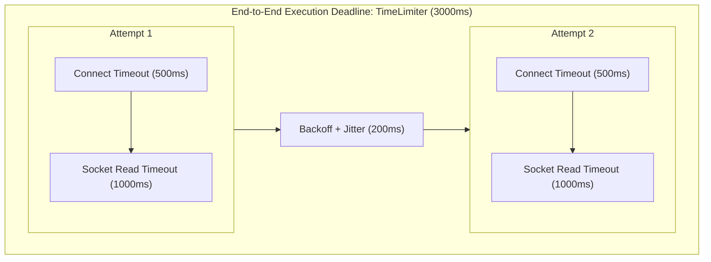
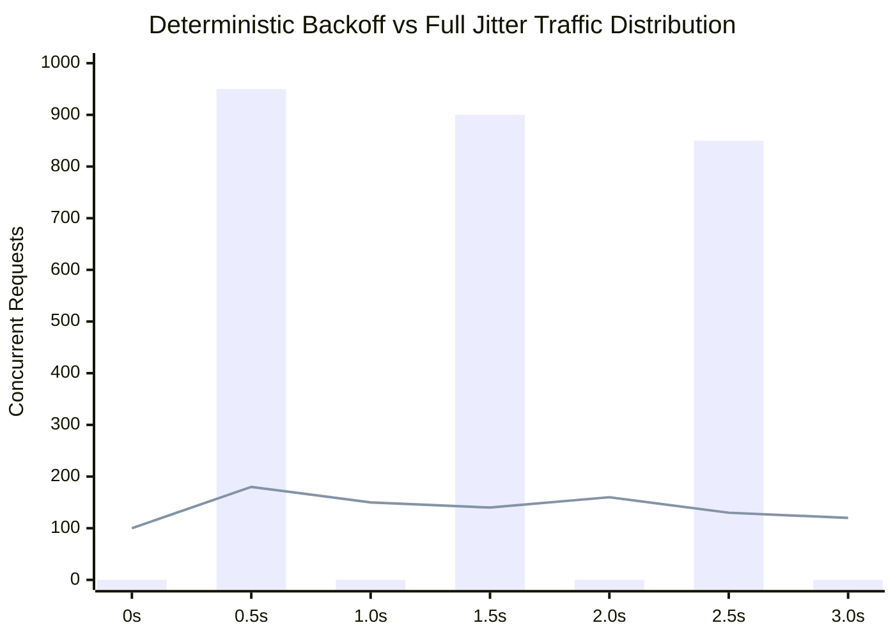
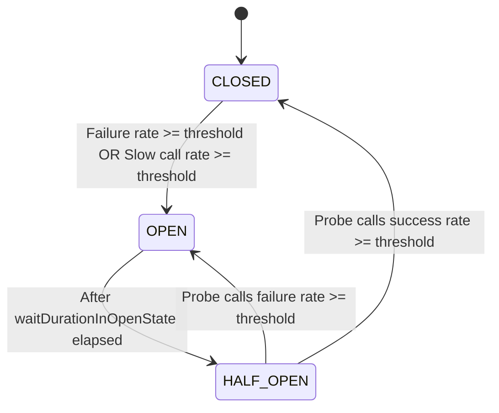

# Resilience Concepts

Resilience is not merely error handling; it is the deliberate containment of blast radius in distributed systems. When dependencies fail, resilient systems shed load, fail fast, and degrade gracefully.

## 1. Timeout Hierarchy

A robust microservice establishes a clear timeout hierarchy:

- **Connect Timeout**: Maximum time spent completing the TCP 3-way handshake (SYN, SYN-ACK, ACK) or TLS session negotiation. Typical value: $200\text{ms} - 1000\text{ms}$.
- **Socket Read Timeout**: Maximum time of inactivity between two consecutive data packets received across the established TCP connection. Typical value: $1\text{s} - 3\text{s}$.
- **Execution / Overall Timeout (TimeLimiter)**: End-to-end deadline capping total elapsed wall-clock time across all retry attempts, backoffs, and execution steps.

## 2. Retries, Amplification, and Jitter

### The Danger of Retry Amplification
If three tiers of microservices each retry 3 times upon failure:
$$\text{Total Requests} = 3_{\text{Tier 1}} \times 3_{\text{Tier 2}} \times 3_{\text{Tier 3}} = 27\times \text{ load}$$
This multiplier transforms a modest 10% traffic spike into a crushing 270% overload on the deepest dependency.

### Jitter Algorithms
When hundreds of concurrent requests fail simultaneously (e.g. during a network blip), deterministic exponential backoff synchronizes retries into periodic spikes. Jitter introduces stochastic delay to break synchronization.

- **No Jitter (Deterministic)**: $t = \text{base} \times 2^{\text{attempt}-1}$ (generates thundering herds).
- **Full Jitter**: $t = \text{random}(0, \min(\text{cap}, \text{base} \times 2^{\text{attempt}-1}))$. AWS architecture research proves Full Jitter delivers the lowest downstream contention and shortest recovery times.
- **Equal Jitter**: $t = \frac{\text{temp}}{2} + \text{random}(0, \frac{\text{temp}}{2})$, preserving a guaranteed minimum backoff floor.
- **Decorrelated Jitter**: $t = \min(\text{cap}, \text{random}(\text{base}, t_{\text{prev}} \times 3))$, where each sleep depends on the prior sleep without fixed exponential multipliers.

## 3. Circuit Breaker States & Transitions

A Circuit Breaker acts as an electrical fuse for network calls:

- **CLOSED**: Normal operation. Remote calls pass through. Invocations are recorded in a sliding window.
- **OPEN**: Downstream is failing. Calls fail fast immediately with `CallNotPermittedException` without touching the network, preserving worker threads.
- **HALF_OPEN**: Recovery trial state. A small, configured number of trial requests (`permittedNumberOfCallsInHalfOpenState`) are allowed through to probe downstream health.

## 4. Sliding Window Types

Resilience4j implements two sliding window formats:
1. **Count-Based**: Evaluates the outcome of the last $N$ calls (e.g. last 50 calls). Best for steady, high-throughput traffic.
2. **Time-Based**: Evaluates outcomes across the last $N$ seconds, bucketing calls into ring segments. Best for bursty or low-frequency traffic where 50 calls might span hours.

## 5. Bulkhead Concurrency Isolation

Bulkheads prevent failure in one compartment of a ship from sinking the entire vessel:
- **Semaphore Bulkhead**: Limits concurrent execution count using a thread-local counter (`AtomicInteger` or `Semaphore`). Does not spawn threads; blocks the calling thread if saturated. Best for Virtual Threads (Project Loom) and low-overhead microservices.
- **ThreadPool Bulkhead**: Executes calls asynchronously on dedicated bounded thread pools with bounded task queues. Provides full CPU and thread isolation; if the thread pool fills up, calling threads are rejected without blocking.

## 6. Rate Limiting vs Load Shedding

- **Rate Limiting**: Protects downstream APIs from client abuse based on tokens or fixed intervals (Token Bucket, Leaky Bucket). Rate limiters are **client-centric** contracts.
- **Load Shedding**: Protects the server itself when resources (CPU, heap, garbage collection pause, queue latency) breach critical saturation thresholds. Load shedders reject low-priority or non-essential traffic to prioritize critical checkout and payment requests.

## 7. Fallback & Graceful Degradation

When calls fail or circuits open, resilience decorators intercept the exception:
- **Cached Stale Value**: Return data from a local read-through cache (e.g. Caffeine).
- **Default Stub**: Return sensible defaults (e.g. empty recommendation list, generic greeting).
- **Asynchronous Compensating Queue**: Enqueue the mutation to a local dead-letter store or transactional outbox for background reconciliation.
