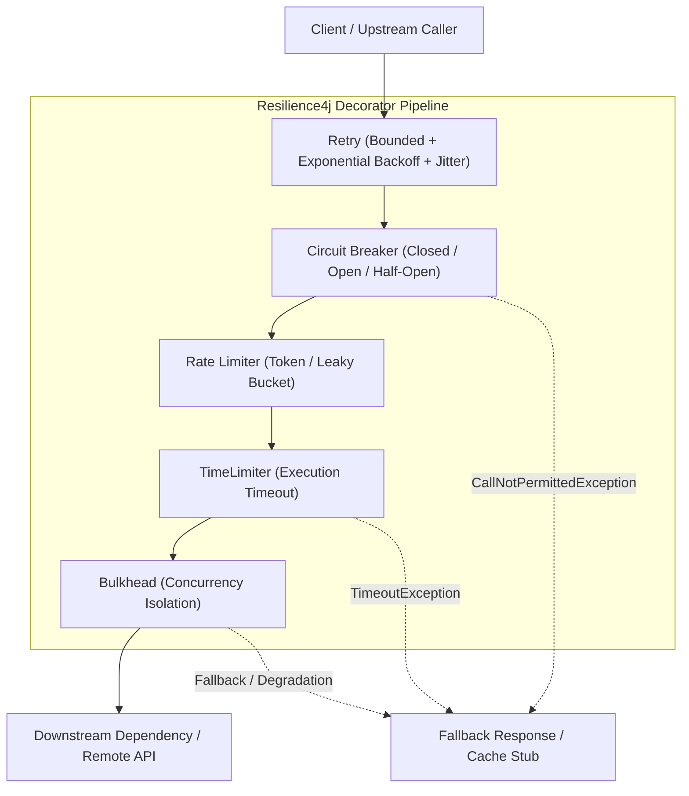

# Resilience

In microservice and distributed architectures, network latency, hardware degradation, remote outages,
and concurrency bottlenecks are inevitable. Resilience is the discipline of designing software to absorb,
contain, isolate, and recover gracefully from partial failures rather than collapsing in cascading system-wide outages.

## Architectural Overview

Fault isolation and overload protection require layered defense mechanisms:

## Key Invariants

1. **Explicit Multi-Layer Timeouts**: Every network connection and remote call must define strict connect, read, and execution deadlines. Leaving timeouts unset allows remote stalls to monopolize thread pools indefinitely.
2. **Bounded Retries with Full Jitter**: Retries must be bounded (e.g., maximum 3 attempts) and combined with exponential backoff plus randomized jitter (`Full Jitter`). Unbounded or deterministic retries produce synchronized thundering herds that knock recovering systems back offline.
3. **Idempotency on Mutating Calls**: Mutating operations (such as HTTP `POST` payments) must never be retried across read timeouts without a client-supplied unique `Idempotency-Key` or distributed deduplication token.
4. **Fast-Failing Circuit Breakers**: Circuit breakers must monitor failure and slow call rates across sliding windows, fast-failing callers with `CallNotPermittedException` during downstream outages to protect upstream worker threads.
5. **Concurrency Bulkhead Isolation**: Critical dependencies must be isolated into dedicated execution bulkheads (via semaphores or separate thread pools) to prevent a single degraded remote service from exhausting container-wide worker threads.
6. **Graceful Fallback & Degradation**: Non-critical dependencies (e.g. recommendation engines or telemetry) must degrade gracefully to static stubs or cached data rather than throwing unhandled exceptions to users.

## Module Topics

| Section | Focus |
|---|---|
| [Concepts](concepts.md) | Connect/read timeouts, bounded retries, jitter algorithms, circuit breakers, sliding windows, bulkheads, rate limiters, load shedding, fallback patterns |
| [Internals](internals.md) | Resilience4j decorator execution order, ring bit-set sliding window data structure, concurrency limiters, and thread isolation mechanics |
| [Interview Questions](questions.md) | 23 questions across 4 tiers: Basic, Intermediate, Senior, and Production Incident Scenarios |
| [Code Review](code-review.md) | 5 realistic broken review targets covering infinite retries, missing timeouts, non-idempotent retries, retry storms, and swallowed errors |
| [Solutions](solutions.md) | Production-grade implementations with rationale, trade-offs, and failure prevention analysis |
| [Tests](tests.md) | Mockito unit verification and WireMock HTTP fault-injection integration test suites |
| [Production](production.md) | The Thundering Herd Retry Storm incident walkthrough, Prometheus alerting metrics, and production readiness checklist |
| [Exercises](exercises.md) | Hands-on exercises: Custom Full Jitter Backoff Generator and Dynamic Adaptive Concurrency Limiter |

## Related Modules

- [REST API](../rest-api/index.md) — HTTP status codes, error handling with ProblemDetail, and REST client timeouts
- [Distributed Systems](../distributed-systems/index.md) — Partial failure, network partitions, and idempotency guarantees
- [Spring Transactions](../spring-transactions/index.md) — Transaction boundaries and connection pool timeout management
