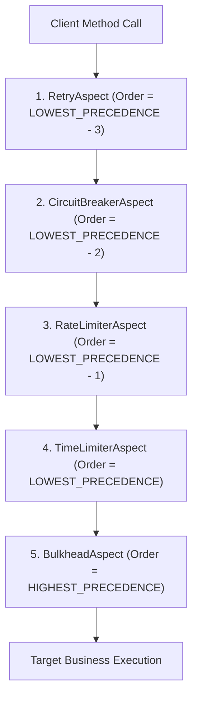

# Resilience Internals

Understanding how Resilience4j operates under the hood enables engineers to optimize performance, eliminate race conditions, and correctly tune production metrics.

## 1. Resilience4j Decorator Pipeline Order

Resilience4j provides Spring AOP aspects and functional functional composition. When multiple annotations are stacked on a Spring bean method, the default Spring AOP order is:



### Why This Order Matters
1. **Retry is Outermost**: If a call fails or times out, the `Retry` aspect catches the exception and re-executes the inner pipeline.
2. **CircuitBreaker is Inside Retry**: The circuit breaker records **each individual attempt** rather than the overall user invocation. If an operation fails 3 times across retries, the circuit breaker window records 3 separate failures.
3. **RateLimiter is Inside CircuitBreaker**: When the circuit is `OPEN`, calls are rejected immediately before consuming rate limiter permits.
4. **TimeLimiter Wraps Bulkhead**: The execution timeout cancels the task and releases the bulkhead semaphore or thread pool worker.

## 2. Sliding Window Data Structures

Resilience4j uses lock-free ring buffers to compute failure and slow-call rates with minimal memory overhead:

### Count-Based Sliding Window: RingBitSet
A `FixedSizeSlidingWindow` allocates an internal `RingBitSet` represented as a `long[]` array:
- Each call result is encoded as a single bit: `0` for SUCCESS, `1` for FAILURE.
- An atomic index `head` tracks the current insertion position via bit-masking:
  ```java
  int index = (int) (head.getAndIncrement() % size);
  ```
- Failure rate computation is $O(1)$: it maintains an atomic `totalFailures` counter by subtracting the overwritten bit and adding the new bit upon ring wrap-around.

### Time-Based Sliding Window: Epoch Bucketing
The `TimeBasedSlidingWindow` divides the window of $N$ seconds into discrete 1-second buckets arranged in a circular array:
- Each bucket contains two atomic integers: `successCount` and `failureCount`.
- When an invocation completes, the epoch second calculates the active bucket index:
  ```java
  int bucketIndex = (int) (epochSecond % windowSize);
  ```
- Buckets older than $N$ seconds are lazily cleared when written to.

## 3. Bulkhead Concurrency Mechanics

### SemaphoreBulkhead
The `SemaphoreBulkhead` uses a lock-free atomic state machine rather than `java.util.concurrent.Semaphore`:
- It packs available permits and waiting thread counters into a single `AtomicReference` or `AtomicInteger`.
- Threads call `tryAcquirePermission()` with an optional timeout duration. If permits are exhausted, caller threads wait using `LockSupport.parkNanos()`.

### ThreadPoolBulkhead
The `ThreadPoolBulkhead` wraps an isolated `ThreadPoolExecutor`:
- Calls must return a `CompletionStage<T>`.
- Invocations are submitted to a bounded `ArrayBlockingQueue`. If the queue is full, the task is rejected immediately with a `BulkheadFullException`.

## 4. Virtual Threads (Project Loom) Interaction

In JDK 21+, virtual threads make thread pool bulkheads largely obsolete:
- Virtual threads are ultra-lightweight ($<1\text{KB}$ memory) and can be created per request without pool limits.
- Wrapping virtual threads in a `ThreadPoolBulkhead` forces carrier threads to switch contexts and introduces unnecessary queueing overhead.
- **Best Practice for Java 21+**: Use `SemaphoreBulkhead` with virtual threads to cap concurrent downstream socket connections without thread-pool bottlenecks.
