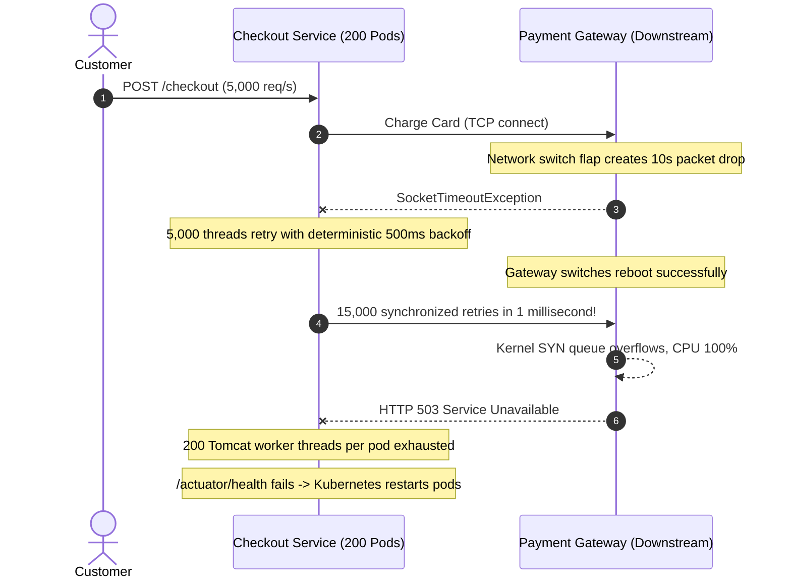

# Resilience in Production

Operating fault-tolerant distributed systems requires observability, strict telemetry, automated alerting, and defensive capacity engineering.

## 1. Incident Walkthrough: The Thundering Herd Retry Storm

### Incident Profile
- **Severity**: P1 Outage (Total Checkout Paralyzation)
- **Duration**: 72 minutes
- **Impact**: 42,000 failed customer orders, estimated \$1.2M revenue loss.

### The Trigger & Cascading Failure



### Root Cause Analysis
1. **Deterministic Backoff**: Retries used $t = 500\text{ms} \times 2^{\text{attempt}-1}$ with no jitter. All 5,000 failed requests woke up at the exact same millisecond and hammered the recovering gateway.
2. **Missing Circuit Breaker**: Upstream callers continued attempting outbound network calls instead of fast-failing callers immediately during the outage.
3. **Thread Saturation**: Because calls took 2 seconds to time out across 3 attempts, all Tomcat worker threads were occupied waiting on network I/O, preventing Kubernetes health check probes from responding.

### Remediation & Post-Mortem Actions
- Added Resilience4j `IntervalFunction.ofExponentialRandomBackoff(100ms, 2.0, 0.5)` to provide Full Jitter.
- Configured a Circuit Breaker with `failureRateThreshold: 50%` and `slidingWindowSize: 100`.
- Decoupled Spring Boot Actuator to a separate management port (`management.server.port=8081`) so health checks respond even if application request threads are saturated.

---

## 2. Micrometer & Prometheus Alerting

Monitor resilience metrics continuously using Prometheus and Grafana dashboards:

### Key Metrics
- `resilience4j_circuitbreaker_state`: Gauge reporting current circuit state (`0` for closed, `1` for open, `2` for half-open).
- `resilience4j_circuitbreaker_failure_rate`: Current percentage of errors in the sliding window.
- `resilience4j_circuitbreaker_slow_call_rate`: Percentage of calls exceeding latency thresholds.
- `resilience4j_retry_calls_total`: Counter tracking successful and failed retry attempts.

### Critical Prometheus Alerts

```yaml
groups:
  - name: resilience-alerts
    rules:
      - alert: CircuitBreakerOpen
        expr: resilience4j_circuitbreaker_state{state="open"} == 1
        for: 2m
        labels:
          severity: critical
        annotations:
          summary: "Circuit breaker {{ $labels.name }} is OPEN"
          description: "Downstream calls to {{ $labels.name }} are fast-failing. Dependency is degraded."

      - alert: HighRetryRate
        expr: sum(rate(resilience4j_retry_calls_total{kind=~"successful_with_retry|failed_with_retry"}[5m])) 
              / sum(rate(resilience4j_retry_calls_total[5m])) > 0.15
        for: 5m
        labels:
          severity: warning
        annotations:
          summary: "High retry rate on {{ $labels.name }}"
          description: "More than 15% of calls to {{ $labels.name }} are requiring retries. Check downstream latency."
```

---

## 3. Production Readiness Checklist

Before deploying any remote network client to production, verify:

- [ ] **Independent Timeouts**: Connect timeout ($\le 1\text{s}$) and socket read timeout ($\le 3\text{s}$) explicitly configured.
- [ ] **Bounded Retries**: Maximum retry attempts capped ($\le 3$).
- [ ] **Full Jitter**: Exponential backoff configured with randomized jitter (`Full Jitter`).
- [ ] **Mutating Idempotency**: All retried `POST`/`PATCH` endpoints supply an `Idempotency-Key` header.
- [ ] **Circuit Breaker Active**: Circuit breaker sliding window configured with appropriate `minimumNumberOfCalls`.
- [ ] **Fast Fallbacks**: Fallback methods return instantly without executing secondary blocking network calls.
- [ ] **Telemetry Exported**: Micrometer metrics exported to Prometheus and tagged with service identity.
- [ ] **Dedicated Management Port**: Actuator health endpoint configured on an isolated port to prevent false pod restarts during high load.
