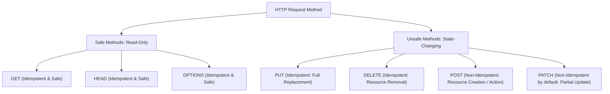
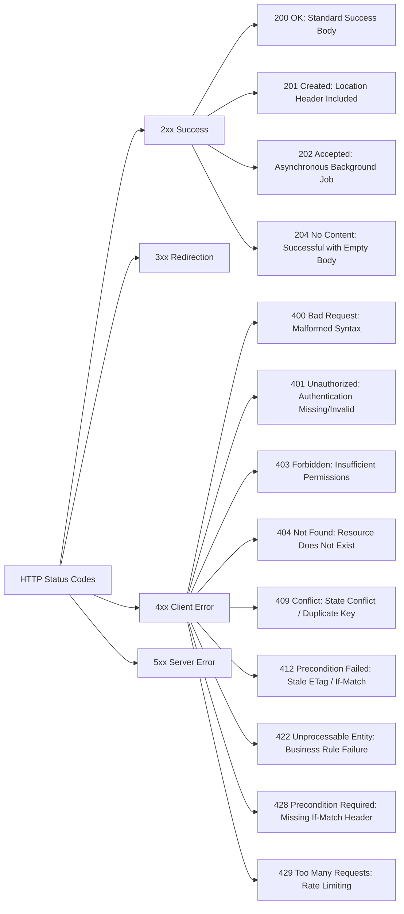
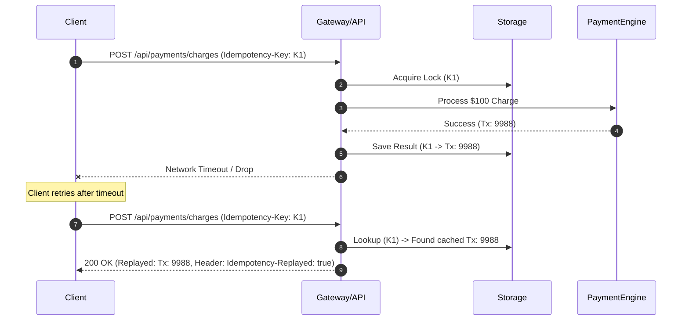
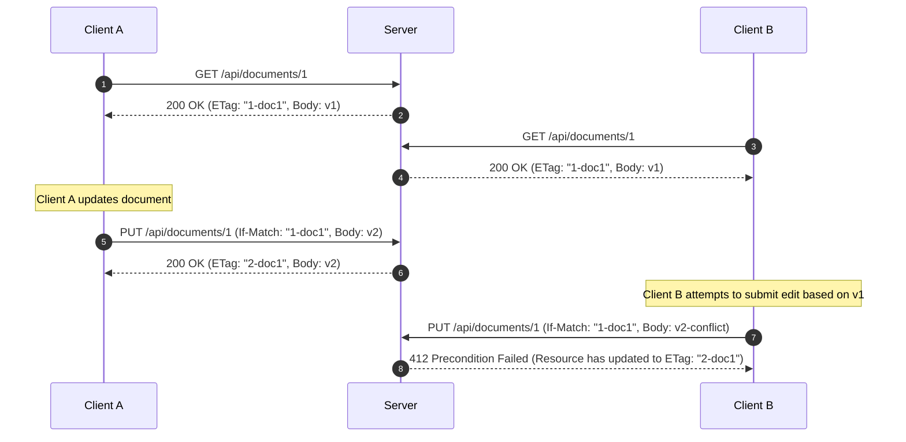

# REST API Design & Architecture Concepts

## 1. HTTP Methods & Protocol Semantics

HTTP methods are defined by RFC 9110 with explicit behavioral guarantees regarding safety and idempotency.



| Method | Safe | Idempotent | RFC Specification | Typical Use Case |
|---|---|---|---|---|
| `GET` | **Yes** | **Yes** | RFC 9110 §9.3.1 | Retrieve resource representation without server mutation |
| `HEAD` | **Yes** | **Yes** | RFC 9110 §9.3.2 | Retrieve response headers (ETag, Content-Length) without body |
| `OPTIONS` | **Yes** | **Yes** | RFC 9110 §9.3.7 | Discover supported HTTP verbs and CORS capabilities |
| `POST` | **No** | **No** | RFC 9110 §9.3.3 | Create sub-resource or execute non-idempotent operation |
| `PUT` | **No** | **Yes** | RFC 9110 §9.3.4 | Create or completely replace resource at target URI |
| `PATCH` | **No** | **No** | RFC 5789 | Apply partial delta modification to target resource |
| `DELETE` | **No** | **Yes** | RFC 9110 §9.3.5 | Remove resource at target URI |

---

## 2. HTTP Status Code Taxonomy

A production REST API uses standard status codes to express domain and protocol outcomes unambiguously.



---

## 3. RFC 9457 Problem Details for HTTP APIs

RFC 9457 establishes a standard machine-readable JSON format for reporting HTTP error details (`application/problem+json`).

```json
{
  "type": "https://api.example.com/errors/insufficient-funds",
  "title": "Insufficient Funds",
  "status": 422,
  "detail": "Your current credit balance of $10.00 is insufficient for this charge of $50.00.",
  "instance": "/api/customers/00000000-0000-0000-0000-000000000001/charge",
  "customerId": "00000000-0000-0000-0000-000000000001",
  "currentBalance": 10.00,
  "requiredAmount": 50.00,
  "timestamp": "2026-09-20T12:00:00Z"
}
```

Standard Problem Details attributes:
- `type` (URI reference): Identifies problem type. Should resolve to human-readable documentation.
- `title` (string): Short, human-readable summary of problem type (does not change across instances).
- `status` (number): The HTTP status code generated by the origin server.
- `detail` (string): Human-readable explanation specific to this occurrence.
- `instance` (URI reference): Identifies the specific occurrence of the problem.
- **Extension Members**: Custom contextual properties (`invalidParams`, `errorCode`, `timestamp`).

---

## 4. Idempotency in Mutating Operations

Network timeouts between client and server frequently result in retry requests. Without idempotency controls, POST endpoints (e.g., `/api/payments/charges`) cause duplicate charges.



---

## 5. HTTP Caching and Optimistic Concurrency Control

HTTP protocol conditional requests eliminate unnecessary bandwidth consumption (`304 Not Modified`) and protect shared resources against concurrent write lost updates (`412 Precondition Failed`).

### Strong Entity Tags (ETags)
An `ETag` is an opaque token assigned by the web server to represent the exact version/state of a resource.

- **Conditional GET (`If-None-Match`)**: Client transmits cached `ETag`. If unchanged, server responds with `304 Not Modified` and zero payload body.
- **Conditional Mutation (`If-Match`)**: Client transmits known `ETag` on `PUT`, `PATCH`, or `DELETE`. If server resource version has evolved, request fails with `412 Precondition Failed`.



---

## 6. Pagination Strategies: Offset vs Keyset

| Strategy | Mechanism | Performance | Trade-offs | Best For |
|---|---|---|---|---|
| **Offset-Based** | `LIMIT size OFFSET (page * size)` | $O(N)$ scanning cost. High page numbers degrade database I/O severely. | Supports arbitrary page jumping ("Go to page 50"). Inconsistent results if rows are inserted/deleted during pagination. | Small static datasets, admin tables with low row count. |
| **Keyset / Cursor-Based** | `WHERE id > last_seen_id ORDER BY id ASC LIMIT size` | $O(1)$ constant time seek via B-Tree index scan. | Stable pagination during concurrent inserts. Does not support random page jumping. | High-scale APIs, continuous infinite scrolling, mobile feeds. |

---

## 7. Security: DTO Projection & Mass Assignment Prevention

Exposing JPA entities directly to `@RequestBody` or `@ResponseBody` causes severe security vulnerabilities:
- **Mass Assignment (CWE-915)**: Malicious clients inject administrative fields (e.g. `role: "ADMIN"`, `verified: true`, `creditBalance: 10000`) that bind directly to database models.
- **Entity Leakage**: Password hashes, internal database IDs, audit metadata, and sensitive tokens get serialized to responses.
- **LazyInitializationException**: Jackson triggers uninitialized Hibernate proxies outside transaction boundaries.
