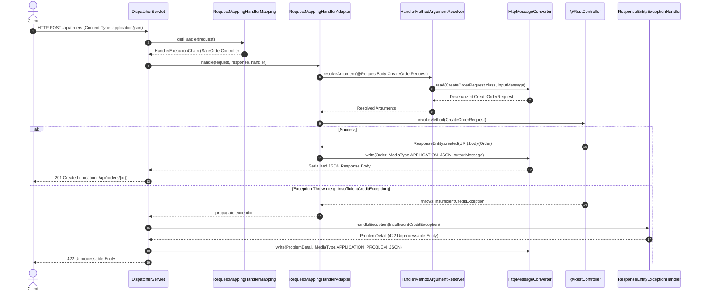
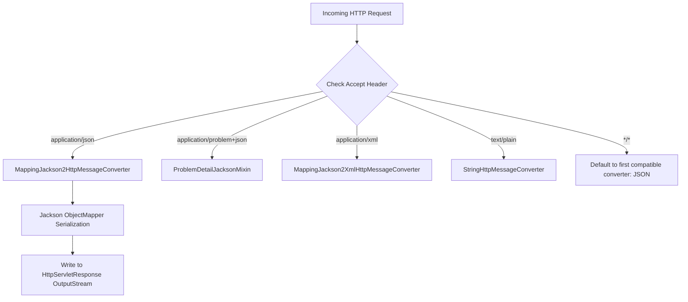

# REST API Architecture & Spring MVC Internals

## 1. Request Processing Lifecycle in Spring MVC REST Controllers

When an HTTP client executes a request against a Spring MVC `@RestController`, the request traverses a series of internal infrastructure components.



---

## 2. Content Negotiation & `HttpMessageConverter` Resolution

Spring MVC resolves the appropriate `HttpMessageConverter` using the incoming `Content-Type` header (for request body reading) and the client's `Accept` header (for response body writing).



### Registered Default Converters in Spring Boot 3.5.x
1. `ByteArrayHttpMessageConverter`: reads/writes raw byte arrays (`application/octet-stream`).
2. `StringHttpMessageConverter`: reads/writes plain text strings (`text/plain`).
3. `ResourceHttpMessageConverter`: reads/writes Spring `Resource` objects.
4. `MappingJackson2HttpMessageConverter`: JSON serialization using `Jackson2ObjectMapperBuilder`.
5. `ProblemDetailHttpMessageConverter`: RFC 9457 `application/problem+json` formatting.

---

## 3. RFC 9457 ProblemDetail Pipeline & `ResponseEntityExceptionHandler`

In Spring Boot 3+, `ProblemDetail` is built directly into Spring Framework (`org.springframework.http.ProblemDetail`).

When `spring.mvc.problemdetails.enabled=true` is set, or when custom `@RestControllerAdvice` inherits from `ResponseEntityExceptionHandler`:
- Standard Spring Web exceptions (`MethodArgumentNotValidException`, `HttpRequestMethodNotSupportedException`, `HttpMediaTypeNotSupportedException`, `MissingRequestHeaderException`) are automatically transformed into compliant `ProblemDetail` responses.
- Application-defined domain exceptions map to custom `ProblemDetail` instances using `@ExceptionHandler` methods.

```mermaid
flowchart TD
    Ex[Domain Exception Thrown] --> Advice[@RestControllerAdvice: GlobalRestExceptionHandler]
    Advice --> MatchHandler{Find Matching @ExceptionHandler}
    MatchHandler --> MethodFound[handleCustomerNotFound / handleInsufficientCredit]
    MethodFound --> BuildProblem[ProblemDetail.forStatusAndDetail]
    BuildProblem --> EnrichProblem[Set type URI, title, instance, and custom properties]
    EnrichProblem --> WriteResponse[Write application/problem+json response]
```

---

## 4. Conditional Request Processing (`ShallowEtagHeaderFilter` vs Manual Controller Validation)

Spring MVC supports two approaches for ETag conditional caching:

1. **`ShallowEtagHeaderFilter`**:
   - Calculates an MD5 hash over the **entire rendered response body**.
   - Compares the generated MD5 with the incoming `If-None-Match` header.
   - If matched, clears the response body and emits `304 Not Modified`.
   - **Limitation**: The database query and controller logic still execute entirely; it only saves downstream network bandwidth.

2. **Manual Resource Versioning (Recommended for Scale)**:
   - The database entity holds a `version` or `updated_at` timestamp.
   - Controller checks `If-None-Match` or `If-Match` **before** executing heavy queries or mutations.
   - Saves database CPU, connection pool slots, and application processing time.
