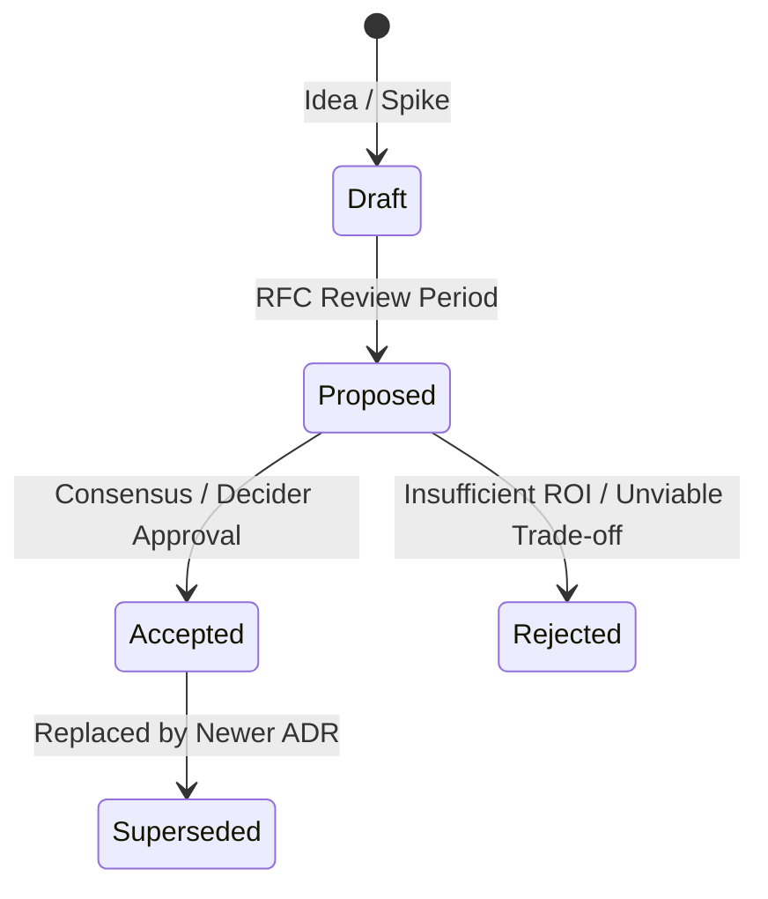
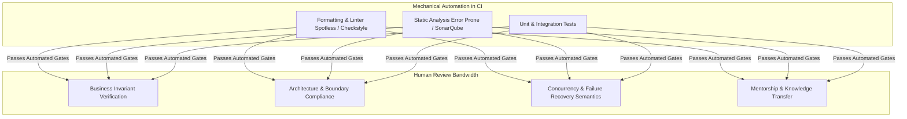
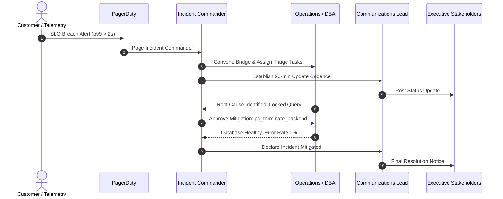
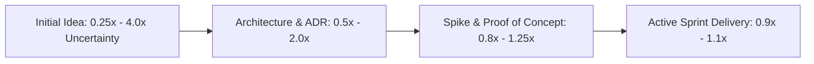

# Senior Engineering Concepts & Mental Models

Senior engineers lead through influence, architectural clarity, and engineering rigor. This page details the core frameworks and mental models required to evaluate decisions, guide teams, and maintain production health.

---

## 1. Architecture Decision Records (ADRs) & RFCs

An **Architecture Decision Record (ADR)** is a lightweight document that captures a significant architectural choice, the context in which it was made, the alternatives considered, and its consequences.

### The Michael Nygard Structure
A standard ADR contains:
1. **Title**: Numbered and descriptive (e.g., `ADR 004: Adopt Modular Monolith over Microservices`).
2. **Status**: `Draft`, `Proposed`, `Accepted`, `Rejected`, or `Superseded`.
3. **Context**: The business, organizational, and technical forces driving the decision. Must include concrete metrics (QPS, latency SLOs, team size, budget).
4. **Decision**: What we decided to do, phrased actively ("We will...").
5. **Considered Alternatives**: Real, viable alternatives evaluated against clear decision drivers.
6. **Consequences**:
   - **Positive**: What becomes easier or faster.
   - **Negative**: What becomes harder, more expensive, or slower (trade-offs).
   - **Neutral**: What stays unchanged.

---

## 2. Code Review as Mentorship

Code reviews serve two primary functions:
1. **Defensive Quality Gate**: Catching architectural flaws, security vulnerabilities (SQLi, IDOR), concurrency race conditions, and unhandled failure paths before production.
2. **Knowledge Sharing & Mentorship**: Leveling up teammates, reinforcing domain idioms, and establishing shared engineering norms.

### Conventional Comments Specification
To eliminate ambiguity, high-performing engineering teams prefix review comments with explicit labels:

| Label | Meaning | Blocks Merge? |
|---|---|---|
| `blocking:` | Critical defect: security flaw, data corruption, concurrency bug, missing test. | **Yes** |
| `suggestion:` | Proposed improvement: cleaner idiom, better readability, non-critical refactor. | No |
| `question:` | Clarification request: seeking to understand why an approach was chosen. | No |
| `nit:` | Minor detail: grammar in comments, tiny style preference. | No |
| `praise:` | Positive reinforcement: highlighting excellent design, thorough tests, or clean code. | No |

### Parkinson's Law of Triviality (Bikeshedding)
The time spent debating an issue is inversely proportional to its importance. Engineers will argue for hours over variable names or bracket placement (trivial) while skimming over complex distributed transactions (critical). Automate the trivial so humans focus on the critical.

---

## 3. Technical Debt Management

Technical debt, first coined by Ward Cunningham, is the implied cost of additional rework caused by choosing an easy or fast solution now instead of a better approach that would take longer.

### Martin Fowler's Technical Debt Quadrant

| Dimension | Prudent (Thoughtful) | Reckless (Careless) |
|---|---|---|
| **Deliberate** | *"We must ship now to secure funding; we will refactor the billing adapter in Q3."* | *"We don't have time for unit tests or architecture boundaries; just get it out."* |
| **Inadvertent** | *"Now that we have 10M users, we realize this domain model should have been two separate aggregates."* | *"What is an SQL injection or thread safety?"* |

### Principal vs. Interest
- **Principal**: The engineering effort required to refactor the code to the target architecture.
- **Interest**: The ongoing penalty paid on every sprint in the form of slower feature velocity, frequent regressions, prolonged onboarding, and recurring production incidents.
- **Decision Rule**: Only pay down technical debt when the accumulated *interest* exceeds the cost of paying the *principal*, or when the debt blocks a strategic business initiative.

---

## 4. Incident Response & Blameless Post-Mortems

In complex sociotechnical systems, failure is inevitable. High-reliability organizations (HROs) treat failures as learning opportunities rather than moral failings.

### Blameless Culture (John Allspaw & Dr. Sidney Dekker)
- **The "First Story"**: Superficial, blame-oriented explanation attributing failure to human error ("Engineer forgot to add an index").
- **The "Second Story"**: Systemic investigation of the tools, processes, cognitive loads, and organizational pressures that made the engineer's action make sense at the time.
- **The Swiss Cheese Model (James Reason)**: Accidents occur when holes in multiple layers of defense (lack of staging volume, lack of automated query timeouts, missing CI schema validation, direct production access) align simultaneously.

---

## 5. Engineering Estimation & Scope Negotiation

Estimation is forecasting under uncertainty, not a binding contractual guarantee.

### The Cone of Uncertainty
At project inception, actual delivery time varies by a factor of $0.25\times$ to $4.0\times$. As architecture is proven, spikes are completed, and initial user stories are delivered, the variance narrows towards $1.0\times$.

### PERT Three-Point Estimation
$$E = \frac{O + 4M + P}{6}$$
Where:
- $O$ = Optimistic estimate (everything goes right)
- $M$ = Most likely estimate
- $P$ = Pessimistic estimate (edge cases, flaky dependencies, blockers emerge)
- Standard Deviation: $\sigma = \frac{P - O}{6}$

---

## 6. Disagreements, Consensus & Mentorship

### "Disagree and Commit" (Andy Grove)
When technical decisions reach an impasse, endless debate paralyzes delivery. Senior engineers:
1. Ensure all voices and evidence are heard.
2. If consensus cannot be reached, the designated decision-maker (Tech Lead or Architecture Owner) decides.
3. Once decided, everyone commits 100% to making the chosen solution succeed. Sabotaging or saying "I told you so" violates senior engineering ethics.

### The SBI Mentoring Feedback Model
When coaching junior engineers:
- **Situation**: Specific anchor in time and space (*"In yesterday's PR #104..."*).
- **Behavior**: Observable action, not character judgment (*"...the database query concatenated raw strings rather than using parameterized inputs..."*).
- **Impact**: Real-world consequence (*"...which creates an SQL injection vulnerability and blocks our security compliance audit."*).
- **Alternative**: Constructive forward path (*"Let's switch to Spring's JdbcClient to automate parameter binding."*).
