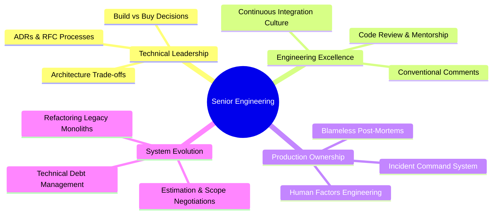

# Senior Engineering & Technical Leadership

Senior and Staff Backend Engineers operate beyond individual task completion: they shape technical direction, mentor engineers, navigate trade-offs, manage production incidents, and foster psychological safety and operational rigor across teams.

---

## What This Topic Covers

1. **Architecture Decision Records (ADRs) & RFCs**: Framing context, evaluating viable alternatives, analyzing technical trade-offs, and documenting positive, negative, and neutral consequences.
2. **Incident Management & Blameless Culture**: Incident Commander (IC) operational dynamics, blameless post-mortem facilitation, cognitive biases, and high-leverage systemic defenses (Swiss Cheese Model).
3. **Code Review as Mentorship**: Conventional Comments, separating architectural blockers from minor nits, psychological safety, and coaching junior engineers.
4. **Technical Debt Governance**: Technical debt taxonomy (Prudent vs Reckless), quantifying debt interest, negotiating capacity with product stakeholders, and safe refactoring strategies (Strangler Fig, Mikado Method).
5. **Engineering Estimation & Delivery**: Cone of Uncertainty, PERT three-point estimates, managing scope creep, and balancing velocity with maintainability.
6. **Disagreements & Situational Leadership**: "Disagree and commit" (Andy Grove), resolving technical impasses via spikes and evidence, situational coaching, and delegating ownership.

---

## Documentation Guide

| Page | What You Will Learn |
|---|---|
| [Concepts](concepts.md) | The mental models of Senior+ engineering: ADRs, blameless post-mortems, debt quadrants, Conventional Comments, estimation, and disagreement resolution. |
| [Internals](internals.md) | Concrete templates, operational workflows, RFC lifecycles, PR review SLAs, and DORA engineering metrics. |
| [Interview Questions](questions.md) | 23 comprehensive questions across Basic, Intermediate, Senior, and Incident Scenario tiers. |
| [Code Review](code-review.md) | Hands-on review targets: flawed ADRs, blame-oriented post-mortems, and destructive PR reviews. |
| [Solutions](solutions.md) | In-depth critique, root-cause analyses, and full corrected artifacts from `broken-examples/`. |
| [Production Guide](production.md) | Sev-1 incident commander runbooks, blameless retrospective facilitation scripts, and tech debt prioritization matrices. |
| [Exercises](exercises.md) | Interactive exercises: authoring an ADR for event-driven messaging and transforming toxic PR comments into actionable mentorship. |

---

## Quick Reference: The Senior Engineering Matrix

| Dimension | Junior Engineer | Mid-Level Engineer | Senior Engineer | Staff / Principal Engineer |
|---|---|---|---|---|
| **Scope** | Single task / function | Single user story / feature | Cross-service subsystem / team domain | Multi-team / organizational platform |
| **Code Review** | Consumes feedback | Gives functional feedback, catches syntax | Mentors design, catches security & concurrency bugs, models empathy | Sets architectural fitness functions, review SLAs, and CI gates |
| **Decisions** | Follows existing patterns | Proposes local patterns | Authors ADRs/RFCs with trade-off matrices | Defines multi-year architectural roadmaps and tech radar |
| **Incidents** | Observes and learns | Troubleshoots application errors | Leads triage, communicates status, authors blameless post-mortems | Analyzes systemic patterns, eliminates classes of outages |
| **Tech Debt** | Often unaware | Laments tech debt | Quantifies debt interest, negotiates 20% backlog allocation | Establishes strategic deprecation cycles and migration programs |
