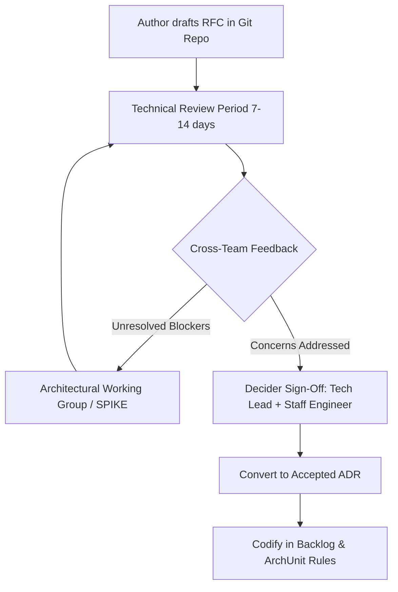
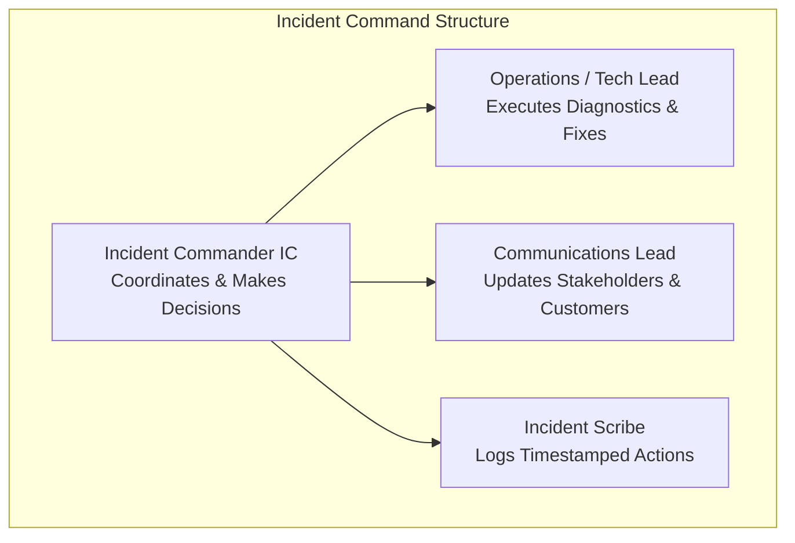
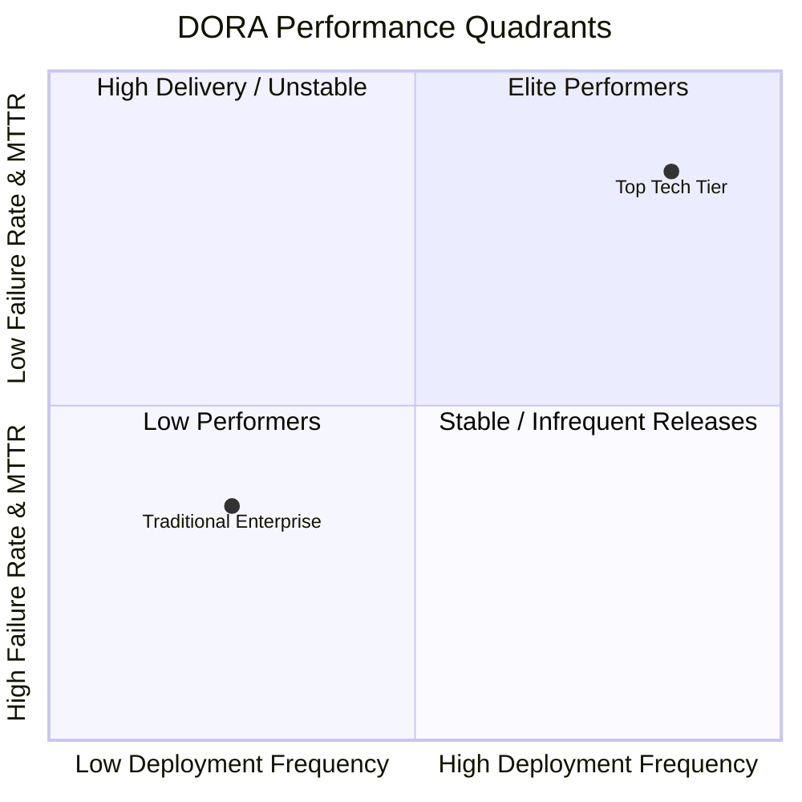

# Senior Engineering Internals & Operational Mechanics

This page details the internal processes, metrics, SLAs, and governance structures that turn abstract engineering principles into repeatable organizational habits.

---

## 1. Enterprise ADR Schema & RFC Governance

Large engineering organizations use a structured RFC (Request for Comments) workflow before writing code for major architectural changes.

### The RFC Lifecycle

### Mandatory Sections of an Enterprise ADR
1. **Metadata Header**:
   - `ID`: Unique monotonic integer (e.g., `ADR-004`).
   - `Title`: Short active statement.
   - `Status`: `Proposed` | `Accepted` | `Rejected` | `Superseded by ADR-XXX`.
   - `Deciders`: List of accountable owners.
   - `Date`: ISO-8601 date.
2. **Context & Problem Statement**:
   - Business objective and current operational metrics.
   - Constraints: budget, timeline, team headcount, compliance (SOC2, PCI-DSS).
3. **Decision Drivers**:
   - Prioritized forces (e.g. 1. Low operational complexity, 2. Developer iteration speed, 3. Throughput).
4. **Options Evaluated**:
   - Minimum of 3 viable approaches.
   - Trade-off matrix comparing against decision drivers.
5. **Decision & Rationale**:
   - Why the winning option was chosen over alternatives.
6. **Consequences & Failure Scenarios**:
   - Explicit negative consequences.
   - Rollback strategy if the decision fails to deliver expected outcomes.

---

## 2. Incident Command System (ICS) for Engineering

During Sev-1 outages, standard team hierarchies dissolve in favor of the **Incident Command System (ICS)**:

### The 3 Golden Rules of Incident Response
1. **Mitigate First, Root-Cause Later**:
   - The primary goal of incident response is restoring customer service (failover, rollback, restart, traffic shedding).
   - Deep-dive debugging and permanent code refactoring belong in the post-mortem, never during active outage triage.
2. **One Voice (The Incident Commander)**:
   - Only the IC directs actions on the incident bridge.
   - Prevents three engineers from executing conflicting production changes simultaneously.
3. **Dedicated Communications Cadence**:
   - Internal stakeholders (support, executive leadership, sales) must be updated every **15 to 30 minutes**, regardless of whether new technical progress has been made.
   - Silence generates panic and invites executive micromanagement into the technical bridge.

---

## 3. Pull Request Review Mechanics & SLAs

High review velocity prevents merge queues, stale branch conflicts, and developer context switching.

### Pull Request Sizing & Defect Rate
Research across tech companies shows a direct correlation between PR size and review thoroughness:

| PR Size (Lines of Code Changed) | Review Time | Defect Density Detected | Review Quality |
|---|---|---|---|
| **< 200 lines** | < 15 minutes | High (catches deep design & concurrency bugs) | **Thorough** |
| **200 – 400 lines** | 30–45 minutes | Moderate | Good |
| **400 – 800 lines** | > 90 minutes | Low (rubber-stamp syndrome begins) | Superficial |
| **> 1,000 lines** | "Looks good to me" | Near Zero (subtle bugs guaranteed to slip through) | **Extremely Poor** |

### Standard Engineering SLAs
- **First Review Response**: Within **4 business hours** (maximum 24 hours).
- **PR Lifetime**: Merged or closed within **48 hours** of opening.
- **Automated Pre-Flight Gates**: Spotless, ArchUnit, Error Prone, and Unit tests must execute in CI in **under 3 minutes** before notifying human reviewers.

---

## 4. DORA Metrics & Engineering Health

The DevOps Research and Assessment (DORA) framework identifies 4 key metrics that predict organizational software delivery performance:

### The 4 DORA Metrics Benchmarks

| Metric | Definition | Elite Performers | Low Performers |
|---|---|---|---|
| **Deployment Frequency** | How often code is deployed to production. | Multiple times per day (on-demand) | Once per month to once every 6 months |
| **Lead Time for Changes** | Time from commit to running in production. | Less than 1 hour | More than 1 month |
| **Change Failure Rate (CFR)** | Percentage of deployments causing a degradation or outage. | **0% – 15%** | **46% – 60%** |
| **Mean Time to Restore (MTTR)** | Time required to restore service after an incident. | Less than 1 hour | One week to one month |
