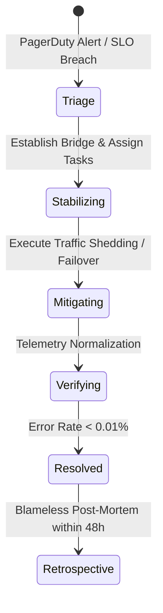

# Senior Engineering Production Guide & Operational Runbooks

Senior engineers bridge technical implementation with high-stakes production operations. This guide provides actionable runbooks for Incident Commanders, blameless post-mortem facilitators, and technical debt governance.

---

## 1. Sev-1 Incident Commander (IC) Runbook

When a critical production incident is declared, the on-call Incident Commander assumes operational control to coordinate triage, mitigation, and stakeholder communication.



### Phase 1: Incident Bridge Opening (0–5 Minutes)
1. **Convene the Response Bridge**:
   - Spin up a dedicated video bridge and Slack channel (e.g., `#incident-2026-02-14-checkout`).
2. **Assign Core Roles**:
   - **Incident Commander (IC)**: Sets priorities, manages cadence, approves actions.
   - **Operations Lead (Ops)**: Leads technical diagnostics and executes commands.
   - **Communications Lead (Comms)**: Drafts external and internal status updates.
   - **Scribe**: Records a timestamped log of observations, hypotheses, and mutations.
3. **Establish Operational Rules**:
   - Silence all non-essential participants.
   - Mandate that **no production changes occur without explicit IC approval**.

### Phase 2: Triage & Hypothesis Testing (5–20 Minutes)
1. **Focus on Mitigation Over Root-Cause**:
   - Do not spend time deep-debugging why a query is slow if traffic shedding, cache warming, or rolling back the latest release immediately restores service.
2. **Time-Box Hypotheses**:
   - Give each diagnostic hypothesis a strict 5-minute time-box:
     *"DBA, you have 5 minutes to verify lock contention in pg_stat_activity. If not conclusive, we initiate read-replica failover."*

### Phase 3: Stakeholder Communication Cadence (Every 15–20 Minutes)
Post regular updates to `#company-incidents` and status pages following this strict format:

```text
[INCIDENT STATUS UPDATE #2 - 16:30 UTC]
- Severity: Sev-1 (Critical)
- Impact: Checkout errors impacting ~80% of North American customers.
- Current Status: Mitigating.
- Actions Completed: Identified blocking query PID 31822 holding row lock on orders table. Hard termination executed via pg_terminate_backend.
- Next Steps: Monitoring connection pool recovery across backend pods.
- Next Update: 16:45 UTC (in 15 minutes) or upon service restoration.
```

---

## 2. Blameless Retrospective Facilitation Guide

Conducting an effective post-mortem requires careful facilitation to prevent defensiveness and uncover systemic failure modes.

### The Facilitator's Checklist
1. **Timing**: Schedule within **48 to 72 hours** of the incident while memories are fresh but emotions have cooled.
2. **Pre-Meeting Preparation**:
   - Have the scribe and technical leads build a high-resolution, factual timeline with telemetry graphs before the meeting.
   - Verify that all timestamps are aligned to a single timezone (preferably UTC).
3. **Meeting Ground Rules**:
   - Read the **Post-Mortem Prime Directive**:
     > *"Regardless of what we discover, we understand and truly believe that everyone did the best job they could, given what they knew at the time, their skills and abilities, the resources available, and the situation at hand."* (Norm Kerth)
   - Intervene immediately if language shifts to personal attribution ("Alex forgot", "John made a mistake"). Reframe to environmental conditions ("What warning signs were missing from our tooling?").
4. **Constructing Action Items**:
   - Reject vague items ("Be more careful", "Write better tests").
   - Require SMART action items (Specific, Measurable, Achievable, Relevant, Time-bound) tied to Jira tickets.

---

## 3. Technical Debt Prioritization Framework

Technical debt must be managed systematically alongside product features. High-performing engineering teams use an **Impact vs. Effort vs. Risk Matrix**:

```mermaid
quadrantChart
    title Technical Debt Prioritization Matrix
    x-axis Low Effort --> High Effort
    y-axis Low Risk & Impact --> High Risk & Impact
    quadrant-1 Strategic Modernization (Schedule as dedicated epic)
    quadrant-2 Quick Wins (Pay down in current sprint)
    quadrant-3 Deprioritize (Leave alone)
    quadrant-4 Re-architect or Contain
    "HikariCP Timeout & Query Limits": [0.25, 0.85]
    "Extract Modulith Payment Domain": [0.80, 0.80]
    "Rename legacy user variables": [0.15, 0.15]
    "Rewrite ORM layer to JOOQ": [0.90, 0.35]
```

### The 20% Capacity Agreement
Negotiate an institutional capacity allocation with product leadership:
- **70%**: Customer-facing product features.
- **20%**: Technical debt paydown, architectural fitness functions, and performance tuning.
- **10%**: Innovation, spikes, and engineering tooling.

### Debt Triage Criteria
Prioritize paying down technical debt when:
1. **Regressions Cluster in Hotspots**: Git churn analysis reveals that 60% of all production bugs originate in the same 5 legacy classes.
2. **Developer Onboarding Stalls**: New engineers take longer than 4 weeks to complete their first production deployment due to tangled dependencies.
3. **Strategic Blockers**: A planned business initiative (e.g. internationalization or multi-tenancy) cannot proceed without domain boundary refactoring.
