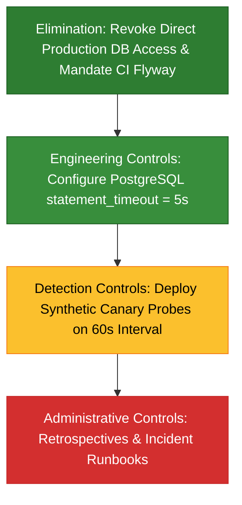

# Senior Engineering Solutions & Correct Implementations

This page provides the architectural critiques, root cause analyses, and full production-grade corrected artifacts for the broken review examples in Module 30.

---

## 1. Poorly Written Architecture Decision Record (ADR)

### Flaws in the Original Artifact
1. **Unquantified Problem Definition**:
   The original ADR claimed the monolith was "too slow" and "too big" without metrics. A Senior Engineer anchors decisions on measurable operational telemetry: p99 latency ($120\text{ms}$), throughput ($350\text{ QPS}$), and CI build duration ($14\text{ minutes}$).
2. **Conway's Law & Team Topologies**:
   A team of 8 backend engineers cannot sustainably maintain 12 distributed services, 12 independent databases, 12 CI/CD pipelines, and 12 on-call schedules. Microservices introduce a heavy tax in distributed tracing, service mesh management, and cross-service schema evolution.
3. **Absence of Alternatives**:
   The author jumped directly to a high-risk big-bang rewrite without evaluating intermediate architectures like a Modular Monolith or targeted domain extraction.
4. **One-Sided Bias**:
   Omits all negative trade-offs of microservices (network latency, distributed Sagas, eventual consistency).

### Architectural Trade-Off Matrix

| Dimension | Monolith (Current) | Modular Monolith (Chosen) | Microservices Rewrite |
|---|---|---|---|
| **Deployment Simplicity** | Single artifact & pipeline | Single artifact & pipeline | 12 distinct CI/CD pipelines |
| **Transactional Consistency** | Local Spring `@Transactional` (ACID) | Local Spring `@Transactional` (ACID) | Distributed Sagas / Eventual Consistency |
| **Boundary Enforcement** | Weak (accidental package coupling) | Strong (verified by Spring Modulith / ArchUnit) | Physical network boundary (HTTP / gRPC) |
| **Operational Overhead** | Low (single DB connection pool) | Low (single DB with isolated schemas) | High (Kubernetes, mesh, distributed tracing) |
| **Team Fit (8 Backend Devs)** | Sustainable | **Optimal** | Unsustainable burnout |

### Corrected Production Artifact

--8<-- "modules/30-senior-engineering/broken-examples/poorly-written-adr/correct/adr-004-modular-monolith-vs-microservices.md"

---

## 2. Blame-Oriented Incident Post-Mortem

### Flaws in the Original Artifact
1. **Fundamental Attribution Error**:
   The report singled out an individual developer ("Alex was negligent"), creating a culture of fear. In high-reliability engineering organizations, human error is the starting point of an investigation, never the conclusion.
2. **Superficial "First Story" vs. Resilient "Second Story"**:
   - *First Story*: "Alex forgot to add an index to the migration script."
   - *Second Story*: Why did our environment allow an unindexed query to freeze the database?
     - Production lacked a PostgreSQL `statement_timeout` (queries could run indefinitely).
     - Staging lacked production-scale data ($50\text{k}$ rows vs $48\text{M}$ rows), hiding sequential scan penalties.
     - Developers had direct write access to the production primary rather than deploying via CI/CD Flyway pipelines.
3. **Zero-Leverage Action Items**:
   Reminding engineers to "be more careful" has a 100% failure rate over time. Systems must be hardened with high-leverage engineering controls (automated query timeouts, IAM least-privilege access, synthetic canary alerts).

### Hierarchy of Action Item Leverage

### Corrected Production Artifact

--8<-- "modules/30-senior-engineering/broken-examples/blame-oriented-post-mortem/correct/post-mortem-incident-4082-blameless.md"

---

## 3. Unhelpful Code Review Comments

### Flaws in the Original Artifact
1. **Missed Critical Security & Concurrency Defects**:
   While bikeshedding variable names and indentation, the reviewer missed:
   - **Critical SQL Injection**: `"SELECT * FROM customers WHERE email = '" + queryParam + "'"` allows arbitrary data theft.
   - **Connection Leak**: Unclosed `Connection`, `Statement`, and `ResultSet` exhaust the HikariCP connection pool under minimal traffic.
   - **Concurrency Hazard**: `HashMap` is not thread-safe. Concurrent writes in a Spring web service corrupt internal bucket pointers and cause infinite CPU spin loops.
   - **Memory Leak**: Unbounded in-memory map without a TTL or eviction policy will trigger `OutOfMemoryError`.
2. **Bikeshedding (Parkinson's Law of Triviality)**:
   The reviewer spent all their time demanding arbitrary renames (`CustomerSearchQueryFacadeHandler`, `instantiatedCustomerDomainObject`) and complaining about spacing.
3. **Destructive Communication Tone**:
   Condescending remarks ("Did you even bother running the formatter before pinging me?", "amateur code") erode psychological safety and discourage junior engineers from asking questions.

### Code Review Feedback Comparison

| Aspect | Destructive Review | Constructive Conventional Comments Review |
|---|---|---|
| **Tone** | Hostile, condescending, impatient | Empathetic, respectful, professional |
| **Clarity** | Ambiguous whether comments are blockers | Explicit labels (`blocking:`, `suggestion:`, `nit:`) |
| **Focus** | 100% bikeshedding (spacing, naming) | 80% security, concurrency, connection leaks |
| **Education** | Demands arbitrary changes without rationale | Explains the *why* (SQLi, OWASP, thread safety) |
| **Actionability** | Vague complaints ("code is messy") | Provides concrete, modern Spring `JdbcClient` code snippets |

### Corrected Production Artifact

--8<-- "modules/30-senior-engineering/broken-examples/unhelpful-code-review-comments/correct/pr-review-comments-constructive.md"
