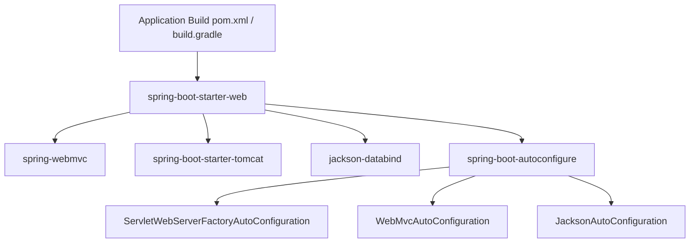
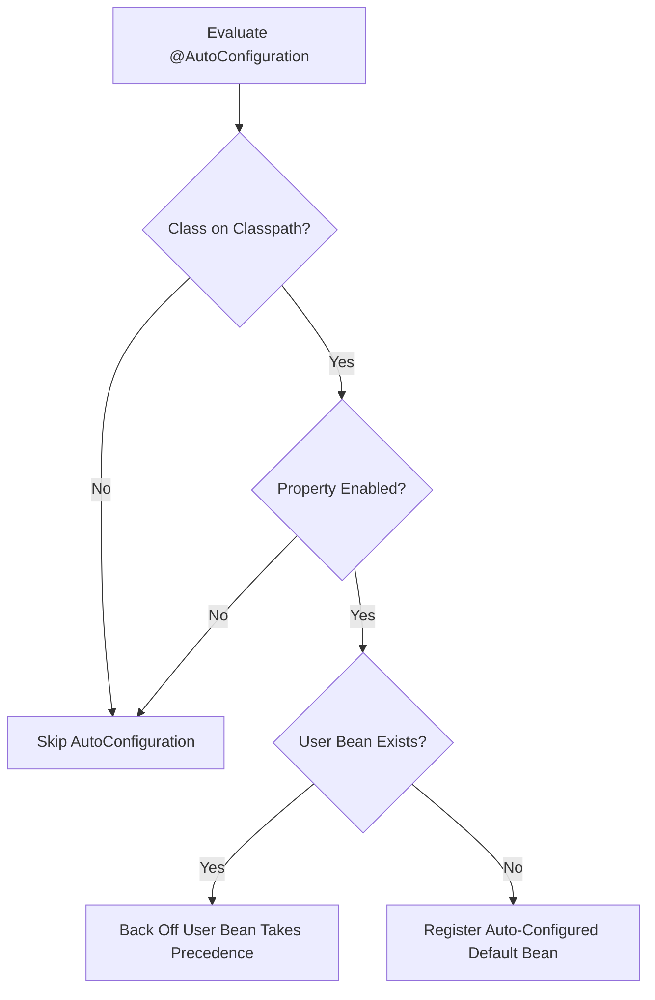

# Spring Boot: Core Concepts

Spring Boot transforms the Spring Framework from a configuration-heavy framework into an opinionated, cloud-native development platform.

---

## 1. Opinionated Defaults & Starters

Traditional Spring applications required extensive XML or Java config declarations for every infrastructure component (e.g. `DispatcherServlet`, Jackson ObjectMapper, DataSource pool, transaction manager).

Spring Boot replaces manual assembly with **Starters** (`spring-boot-starter-*`):
- A starter is a dependency aggregator containing curated transitives and BOM-managed versions.
- Starters contain no Java code; they package dependency sets that trigger auto-configuration conditions.

---

## 2. Auto-Configuration Engine

Auto-configuration inspects the classpath, existing bean definitions, and environment properties at startup to automatically register sensible bean defaults.

### Auto-Configuration Discovery
In Spring Boot 3.x, auto-configuration classes are registered in:
`META-INF/spring/org.springframework.boot.autoconfigure.AutoConfiguration.imports`

Each auto-configuration class is annotated with `@AutoConfiguration` and guarded by conditional annotations.

### Conditional Annotations

| Annotation | Evaluation Trigger |
|---|---|
| `@ConditionalOnClass(Target.class)` | Matches if the specified class is present on the runtime classpath |
| `@ConditionalOnMissingBean(Target.class)` | Matches only if no user-defined bean of that type exists in the `ApplicationContext` |
| `@ConditionalOnProperty(prefix, name, havingValue)` | Matches based on external configuration properties |
| `@ConditionalOnWebApplication(type)` | Matches if running in a Servlet or Reactive web environment |
| `@ConditionalOnResource(resources)` | Matches if a specific resource (e.g. `schema.sql`) is present |

---

## 3. Externalized Configuration & Precedence

Spring Boot provides a sophisticated 17-level property resolution hierarchy. Values higher in the hierarchy override lower ones:

1. Devtools global settings (`~/.config/spring-boot`)
2. `@TestPropertySource` on test classes
3. `@SpringBootTest(properties = "...")`
4. **Command-line arguments** (`--server.port=9090`)
5. `SPRING_APPLICATION_JSON` properties
6. `ServletConfig` init parameters
7. `ServletContext` init parameters
8. JNDI attributes (`java:comp/env`)
9. **Java System properties** (`-Dserver.port=9090`)
10. **OS Environment variables** (`SERVER_PORT=9090` via relaxed binding)
11. `RandomValuePropertySource` (`random.*`)
12. **Profile-specific application properties outside packaged jar** (`config/application-{profile}.yml`)
13. **Profile-specific application properties inside packaged jar** (`application-{profile}.yml`)
14. **Application properties outside packaged jar** (`config/application.yml`)
15. **Application properties inside packaged jar** (`application.yml`)
16. `@PropertySource` annotations on `@Configuration` classes
17. Default properties (`SpringApplication.setDefaultProperties`)

---

## 4. Type-Safe Configuration Properties

Direct `@Value` injection scatters property keys across classes, lacks type hierarchy, and misses startup validation. Spring Boot provides `@ConfigurationProperties`:

- **Immutable Records**: Mapped via constructor binding.
- **Validation**: Enforced at startup using `@Validated` and Jakarta Bean Validation (`@NotNull`, `@Min`, `@NotBlank`).
- **Relaxed Binding**: Automatically bridges kebab-case (`app.billing.tax-percent`), camelCase (`taxPercent`), and uppercase environment variables (`APP_BILLING_TAXPERCENT`).

---

## 5. Actuator & Production Telemetry

Spring Boot Actuator exposes production-ready endpoints for health, metrics, tracing, and diagnostics:

- **Health Groups**: Isolate Kubernetes `liveness` (`ping`, `diskSpace`) and `readiness` (`db`, `redis`, downstream queues) probes.
- **Security Audit**: Never expose sensitive diagnostic endpoints (`/actuator/env`, `/actuator/heapdump`, `/actuator/shutdown`) over public unauthenticated HTTP.
- **Port Isolation**: Bind `management.server.port` to an internal private network interface.

---

## 6. Embedded Runtimes & Graceful Shutdown

Spring Boot packages embedded web servers (Tomcat, Jetty, Undertow) directly within the executable JAR:

- **Immediate vs Graceful Shutdown**:
  - `server.shutdown: immediate` terminates connections immediately upon receiving `SIGTERM`, resulting in upstream 502 Bad Gateway errors.
  - `server.shutdown: graceful` stops accepting new requests and allows active in-flight requests to complete within `spring.lifecycle.timeout-per-shutdown-phase`.
- **Virtual Threads**: Setting `spring.threads.virtual.enabled=true` switches Tomcat request workers and Spring `@Async` executors to Java 21 Virtual Threads (`Executors.newVirtualThreadPerTaskExecutor()`).
