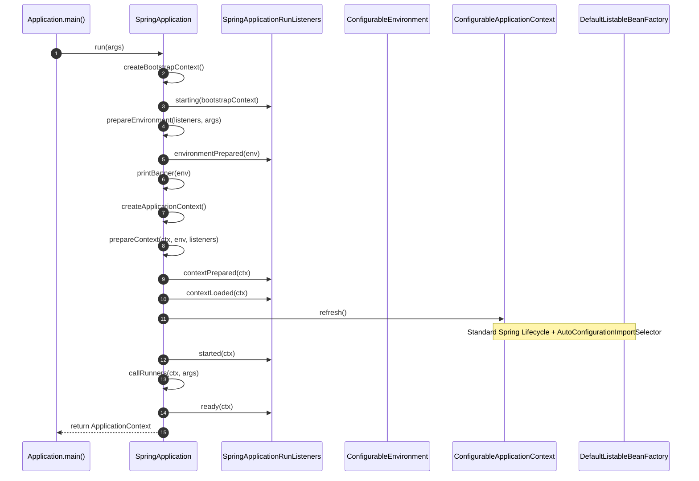
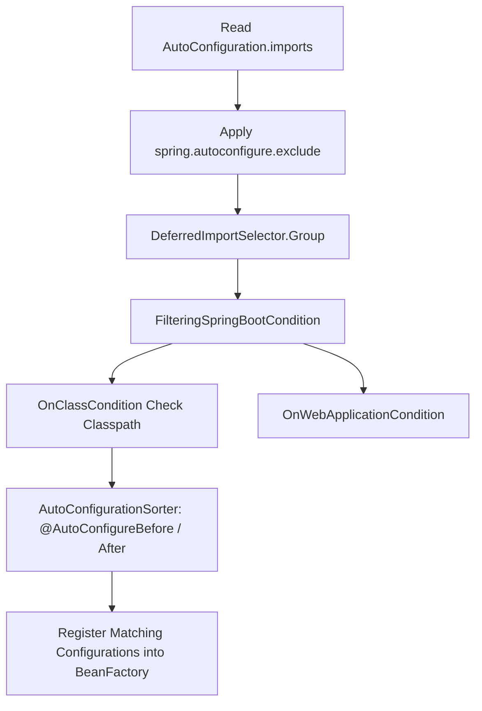
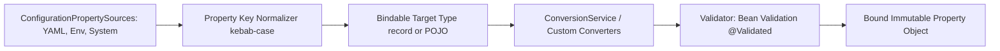

# Spring Boot: Internals & Architecture

Understanding the internal mechanisms of `SpringApplication`, auto-configuration filtering, conditional evaluation, and the `Binder` subsystem.

---

## 1. `SpringApplication.run()` Execution Flow

When `SpringApplication.run(Application.class, args)` is invoked, it coordinates the following sequence:

### Key Phases:
1. **Bootstrap Context**: Initializes `DefaultBootstrapContext` to manage early startup singletons.
2. **Environment Preparation**: Loads `PropertySourceLoader` instances (YAML, properties) and activates profiles.
3. **ApplicationContext Creation**: Chooses between `AnnotationConfigServletWebServerApplicationContext` (Servlet), `AnnotationConfigReactiveWebServerApplicationContext` (Reactive), or `AnnotationConfigApplicationContext` (Non-web).
4. **Context Refresh**: Invokes standard Spring bean factory post-processors and triggers auto-configuration.
5. **Runners Execution**: Executes `ApplicationRunner` and `CommandLineRunner` beans before firing `ApplicationReadyEvent`.

---

## 2. AutoConfigurationImportSelector & Filtering

Auto-configuration is orchestrated via `AutoConfigurationImportSelector`, which implements `DeferredImportSelector`:

### Two-Phase Condition Evaluation:
1. **Class-Level Filtering**: Before class loading or parsing, `OnClassCondition` inspects bytecode with ASM (`MetadataReader`) to discard entire auto-configurations without loading unresolvable classes.
2. **Bean-Level Condition Evaluation**: During bean definition registration, `ConditionEvaluator` assesses `@ConditionalOnMissingBean` and `@ConditionalOnProperty`.

---

## 3. The `Binder` Subsystem

`@ConfigurationProperties` is powered by the Spring Boot `Binder` API (`org.springframework.boot.context.properties.bind.Binder`):

- **Relaxed Binding**: Normalizes property keys into uniform lowercase alphanumeric tokens so `app.billing-rate`, `app.billingRate`, `app.billing_rate`, and `APP_BILLINGRATE` map to the identical property target.
- **Constructor Binding**: Inspects the canonical constructor of records or classes annotated with `@ConstructorBinding` to instantiate immutable property objects directly.

---

## 4. Graceful Shutdown & Lifecycle Management

When a container orchestrator (e.g. Kubernetes) issues a `SIGTERM`:

1. `GracefulShutdown` phase on the embedded web server (e.g. `TomcatWebServer`) stops accepting new TCP connections.
2. The server allows currently active HTTP requests to complete within `spring.lifecycle.timeout-per-shutdown-phase` (default 30 seconds).
3. The `ApplicationContext` closes, triggering `SmartLifecycle.stop()` on asynchronous task executors and message listeners.
4. Database connection pools (HikariCP) and cache connections (Redis) close after worker threads complete their in-flight tasks.
