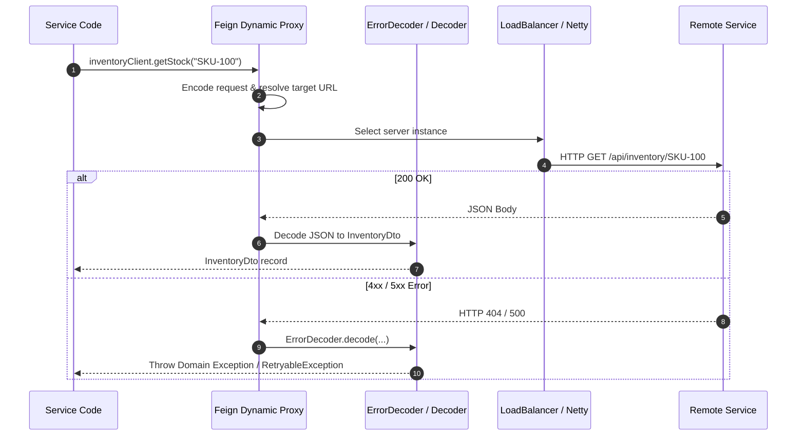
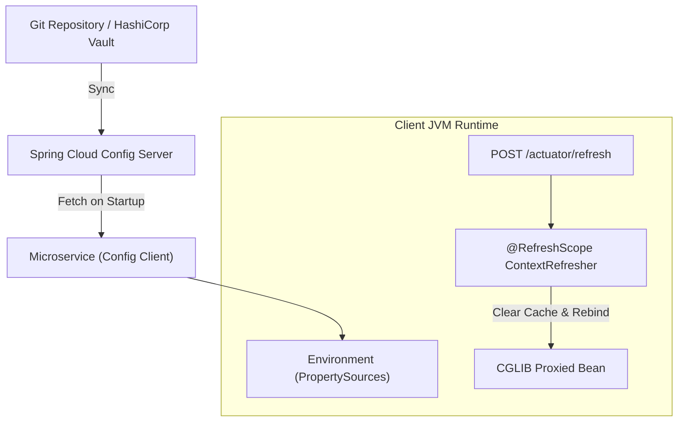
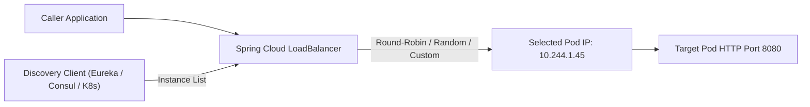

# Spring Cloud Concepts

Spring Cloud provides an ecosystem of components to solve distributed computing patterns: routing, client-side load balancing, service registration, declarative HTTP communication, and distributed configuration.

This page explores the foundational concepts of Spring Cloud and analyzes how modern cloud-native architectures (Kubernetes and AWS) alter their usage.

---

## 1. Spring Cloud Gateway

Spring Cloud Gateway provides an API gateway built on top of Spring WebFlux, Project Reactor, and Netty. Unlike legacy Netflix Zuul 1.x (which was blocking and servlet-based), Spring Cloud Gateway is fully non-blocking and reactive.

### Core Building Blocks

```mermaid
flowchart LR
    Request["Incoming HTTP Request"] --> RoutePredicate["Route Predicate Handler"]
    RoutePredicate -->|Match: true| FilterChain["Gateway Filter Chain"]
    FilterChain --> Filter1["Pre-Filter: Auth / Rate Limiting"]
    Filter1 --> Filter2["Pre-Filter: Header Mutation"]
    Filter2 --> Downstream["Downstream Microservice"]
    Downstream --> Filter3["Post-Filter: Metrics / Response Header"]
    Filter3 --> Response["HTTP Response to Client"]
```



1. **Route**: The basic building block of the gateway. It is defined by an ID, a destination URI (e.g. `lb://order-service` or `https://httpbin.org`), a collection of predicates, and a collection of filters.
2. **Predicate**: Matches HTTP request attributes (Path, Method, Headers, Query parameters, Host, RemoteAddr). If the predicate evaluates to `true`, the route is selected.
3. **GatewayFilter**: Allows modifying incoming HTTP requests (Pre) or outgoing HTTP responses (Post). Filters can strip prefixes, rewrite paths, add request headers, limit rates via token buckets, or inject circuit breakers.
4. **GlobalFilter**: Special filters applied conditionally or unconditionally to all routes (e.g., Netty routing filter, metrics filter).

### Reactive Netty Model vs Servlet Gateways

- Traditional servlet gateways (Zuul 1.x, Spring MVC) dedicate one thread per request (`Thread-per-request`). When a downstream service slows down, gateway worker threads block waiting for I/O, quickly exhausting thread pools.
- Spring Cloud Gateway runs on **Netty Event Loops** (typically 1 event loop thread per CPU core). Network I/O is completely non-blocking using selector channels and reactive streams. A single gateway node can maintain tens of thousands of concurrent open connections with minimal memory overhead.

---

## 2. Declarative HTTP Clients: OpenFeign vs Modern Alternatives

OpenFeign provides declarative HTTP client interfaces where developers annotate Java interfaces with Spring MVC annotations (`@GetMapping`, `@PostMapping`), and Feign generates the dynamic runtime client proxy.

### How Feign Operates



### Feign Configuration Pillars

- **Timeouts (`Request.Options`)**: Must be configured explicitly (`connectTimeoutMillis`, `readTimeoutMillis`). Without them, Feign relies on defaults that can block for minutes.
- **ErrorDecoder**: Translates non-2xx HTTP responses into domain exceptions. By default, Feign throws generic `FeignException`. A custom `ErrorDecoder` translates 404 to domain `NotFoundException` and 503 to `RetryableException`.
- **Retryer**: Determines retry logic. The default retryer retries on `RetryableException`. In production, blind retries inside Feign must be restricted or disabled (`Retryer.NEVER_RETRY`) in favor of structured Resilience4j decorators.

### Feign vs Spring 6 `HttpInterfaces` & `RestClient`

With Spring Framework 6 and Spring Boot 3, Spring introduced built-in HTTP Interfaces:

```java
// Spring 6 Native HTTP Interface (No OpenFeign dependency needed)
@HttpExchange("/api/inventory")
public interface InventoryClient {
  @GetExchange("/{sku}")
  InventoryDto getStock(@PathVariable("sku") String sku);
}
```

Modern Spring Boot 3.5+ architectures increasingly prefer native `RestClient` with `@HttpExchange` over OpenFeign, eliminating Netflix-era dependencies while maintaining clean declarative interfaces.

---

## 3. Spring Cloud Config Server & Client

Spring Cloud Config provides centralized externalized configuration across distributed environments backed by Git, Vault, or SVN.

### Configuration Hierarchy and `@RefreshScope`



- **Bootstrap Context vs Application Context**: In Spring Cloud, configuration is resolved early. Properties from Config Server are loaded into the `Environment` before application beans instantiate.
- **`@RefreshScope`**: Beans marked with `@RefreshScope` are lazily instantiated proxies. When a `POST /actuator/refresh` occurs (or a Spring Cloud Bus Kafka/RabbitMQ message arrives), the scope cache is cleared. The next method invocation on the bean creates a new instance using updated configuration properties without restarting the JVM.

### Risks of Dynamic Reload

Dynamic property refresh via `@RefreshScope` carries production risks:
1. **Thread-Safety Anomalies**: If a bean's internal state is partially updated while worker threads are executing, race conditions can occur.
2. **Resource Leaks**: Database connection pools (HikariCP) or HTTP connection pools recreated dynamically may leak unclosed sockets if not destroyed gracefully.
3. **Cluster Inconsistency**: Refreshing nodes sequentially creates periods where half the cluster operates with new configuration and half with old configuration.

---

## 4. Service Discovery: Eureka vs Consul vs Kubernetes DNS

Service discovery enables microservices to locate downstream instances dynamically without hardcoding IP addresses.

| Dimension | Netflix Eureka | HashiCorp Consul | Kubernetes CoreDNS |
|---|---|---|---|
| **Architecture** | Client-side discovery + registry server | Client/agent-side + Raft consensus | Platform-native DNS + kube-proxy / IPVS |
| **Consistency Model** | AP (Peer-to-peer eventual replication) | CP (Raft consensus cluster) | Strong/Eventual (Etcd backed, DNS caching) |
| **Health Checking** | Periodic client heartbeat (`leaseRenewalIntervalInSeconds`) | Active agent health checks + script execution | K8s Liveness/Readiness HTTP/TCP probes |
| **JVM Footprint** | High (Eureka client polling, memory cache) | Low (Consul client agent or HTTP API) | **Zero JVM overhead** (Standard OS DNS resolution) |
| **Operational Overhead** | Dedicated JVM Eureka cluster to maintain | Dedicated Consul cluster to operate | Native to Kubernetes cluster infrastructure |

### Why Kubernetes Replaces Eureka

When deploying microservices on Kubernetes:
- Kubernetes assigns every `Service` a stable cluster DNS name: `order-service.default.svc.cluster.local`.
- `kube-proxy` (or eBPF Cilium) routes traffic to healthy pod IPs automatically.
- Running Eureka inside Kubernetes creates redundant registrations: Kubernetes readiness probes already know pod health, while Eureka heartbeats lag behind pod terminations, causing 502 Bad Gateway errors when routing to terminating pods.

---

## 5. Client-Side Load Balancing: Spring Cloud LoadBalancer vs Netflix Ribbon

Client-side load balancing allows the caller to pick one server instance from a list of healthy instances returned by the discovery client.



- **Netflix Ribbon (Deprecated)**: Ribbon was blocking, relied on background polling threads, and is completely deprecated.
- **Spring Cloud LoadBalancer (Reactive)**: Built on Project Reactor, supports non-blocking instance selection, weighted response time, and custom `ServiceInstanceListSupplier` filters (e.g. zone-affinity routing).
- **Kubernetes ClusterIP Comparison**: With Kubernetes, load balancing occurs transparently at layer 4 (iptables / IPVS / eBPF) without client-side coordination. Client-side load balancing is primarily beneficial when connection reuse (HTTP/2, gRPC) or application-layer routing (canary header weighting) is required.

---

## 6. Cloud Native Evolution: When to Replace Spring Cloud

| Traditional Spring Cloud Pattern | Modern Cloud Native Replacement | Rationale |
|---|---|---|
| **Spring Cloud Gateway** | Kubernetes Ingress / Gateway API / AWS ALB | Offload TLS termination, DDoS protection, and HTTP routing to managed infrastructure; retain Spring Cloud Gateway only when custom Java business filters or OAuth token exchange is mandatory. |
| **Netflix Eureka / Consul** | Kubernetes CoreDNS | Eliminate registry servers, client heartbeats, and instance cache drift; leverage native Kubernetes service resolution. |
| **Spring Cloud Config** | K8s ConfigMaps & Secrets / AWS Secrets Manager | Standardize configuration across all polyglot services; avoid managing dedicated Config Server instances. |
| **Spring Cloud Bus (RabbitMQ/Kafka)** | GitOps (ArgoCD / Flux) + Rolling Deployments | Eliminate JVM runtime dynamic reload complexity. Update Git, let ArgoCD trigger a rolling deployment of new pods with zero downtime. |
| **Spring Cloud LoadBalancer** | Kubernetes Service `ClusterIP` / Service Mesh | Eliminate client-side discovery caching; let Linux kernel / eBPF handle low-latency packet routing. |
