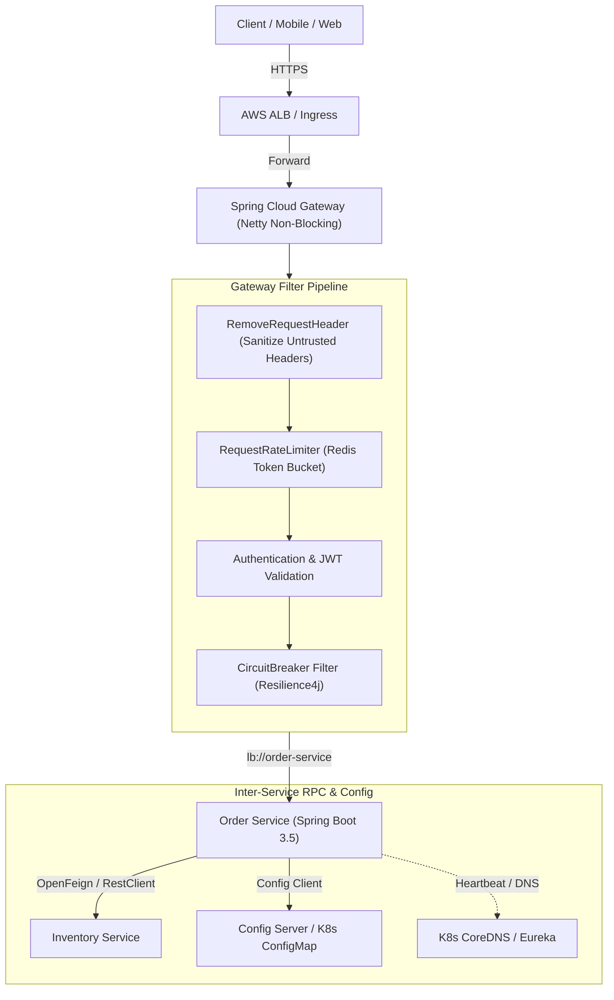

# Spring Cloud

Spring Cloud provides tools for developers to quickly build common patterns in distributed systems: configuration management, service discovery, circuit breakers, intelligent routing, micro-proxy, and declarative REST clients.

While Spring Cloud was foundational in the early microservices era (when Netflix OSS components like Eureka, Ribbon, Zuul, and Hystrix filled gaps in infrastructure), modern cloud architectures increasingly delegate routing, discovery, and resilience to cloud-native platforms like **Kubernetes** and **AWS**. Understanding both the Spring Cloud abstractions and when to replace them with infrastructure primitives is a hallmark of senior backend engineering.

This topic is a **doc module** covering Spring Cloud Gateway, OpenFeign, Config Server, Service Discovery, Load Balancing, and the Cloud-Native evolution.

---

## Spring Cloud vs Modern Cloud Native Infrastructure

In modern deployments, the responsibilities previously managed inside the JVM application layer have shifted toward infrastructure and platform layers:

| Capability | Spring Cloud (Application / JVM) | Kubernetes / AWS (Infrastructure) | Senior Trade-Off & Recommendation |
|---|---|---|---|
| **API Gateway** | Spring Cloud Gateway (Netty, Reactor) | Kubernetes Ingress, Gateway API, AWS ALB / API Gateway, Envoy | SC Gateway provides fine-grained Java logic & auth filters; Cloud/Envoy gateways reduce JVM memory & cross-team coupling. |
| **Service Discovery** | Netflix Eureka, Consul Discovery | Kubernetes CoreDNS (`service.namespace.svc.cluster.local`), AWS Cloud Map | **Kubernetes DNS** is ubiquitous. Avoid running Eureka inside K8s (avoids double registration, heartbeat drift, and extra JVM memory). |
| **Client Load Balancing** | Spring Cloud LoadBalancer, Netflix Ribbon | Kubernetes Service `ClusterIP` (kube-proxy / IPVS / eBPF Cilium), Envoy | K8s `ClusterIP` handles L4 load balancing transparently. Spring Cloud LoadBalancer is useful for gRPC client balancing or multi-cluster routing. |
| **Declarative RPC** | OpenFeign, Spring 6 `HttpInterfaces` | gRPC with Protobuf, `RestClient` / `WebClient`, Service Mesh | OpenFeign reduces boilerplate for REST. In modern Spring 6+, `RestClient` + `HttpInterfaces` is preferred over Feign. |
| **Distributed Config** | Spring Cloud Config Server (Git / Vault) | Kubernetes ConfigMaps & Secrets, AWS Secrets Manager / Parameter Store | Use ConfigMaps/Secrets for standard app config. Spring Cloud Config is still valuable for multi-cloud dynamic refresh (`@RefreshScope`). |
| **Circuit Breaking** | Resilience4j, Spring Cloud CircuitBreaker | Service Mesh (Istio / Linkerd), Envoy outlier detection | Resilience4j allows application-level fallback return values and domain error handling; Envoy handles network-level connection pooling and ejections. |
| **Distributed Tracing** | Spring Cloud Sleuth (Legacy) $\to$ Micrometer Tracing | OpenTelemetry Collector, AWS X-Ray, Jaeger | Standardize on **Micrometer Tracing** with OpenTelemetry bridge (W3C tracecontext headers). |

---

## Architecture Blueprint: Edge Gateway to Microservice RPC

---

## Module Overview

| Resource | Purpose |
|---|---|
| [Concepts](concepts.md) | Gateway architecture, OpenFeign mechanics, Config Server & RefreshScope, Discovery, Load Balancing, Cloud-native migration |
| [Internals](internals.md) | Netty event loop & connection pooling, Feign invocation pipeline & decoders, `@RefreshScope` CGLIB proxy lifecycle |
| [Interview Questions](questions.md) | 23 questions across Basic, Intermediate, Senior, and Production Incident Scenarios |
| [Code Review](code-review.md) | 2 architectural review targets (Gateway unbounded routes, Feign missing timeouts/decoder) with collapsed issue reveals |
| [Solutions](solutions.md) | Corrected configuration & Feign clients with why it works and operational trade-offs |
| [Production](production.md) | Incident walkthroughs (The Gateway Netty Freeze, The RefreshScope Storm), telemetry, and production checklist |
| [Exercises](exercises.md) | Hands-on architectural challenges: Custom Gateway Rate Limiter Filter & Resilient Feign Client with ErrorDecoder |

---

## Related

- [Distributed Systems](../distributed-systems/index.md)
- [Resilience](../resilience/index.md)
- [REST API](../rest-api/index.md)
- [Architecture spec](../../spec/curriculum.md)
