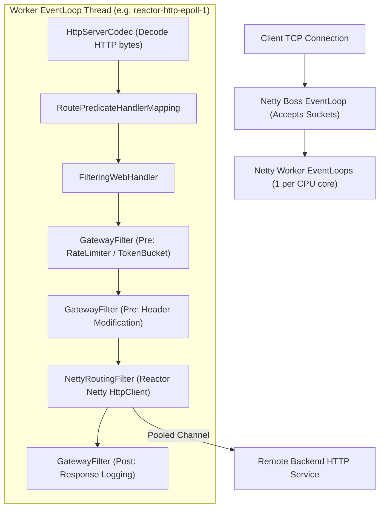
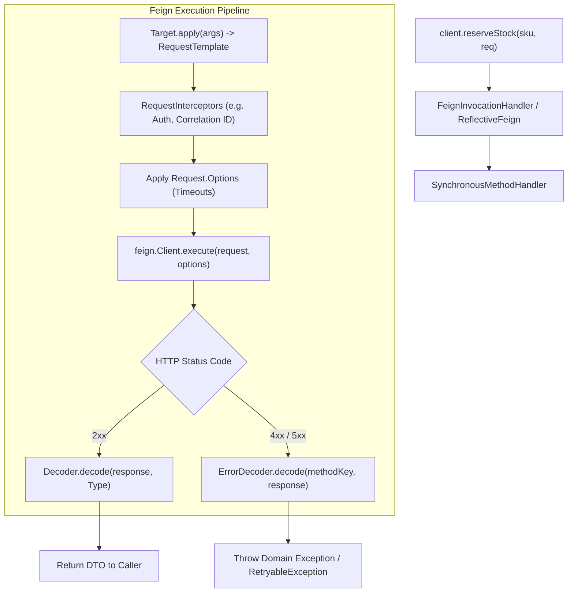
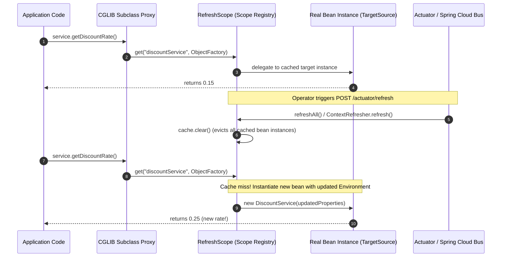

# Spring Cloud Internals

Deep dive into the runtime architecture, threading models, dynamic proxies, and network mechanics underpinning Spring Cloud components.

---

## 1. Spring Cloud Gateway: Netty Event Loops & WebFilter Pipeline

Spring Cloud Gateway executes on top of **Project Reactor** and **Reactor Netty**. Understanding its internal mechanics is essential for preventing event loop starvation.



### The Netty Routing Filter & Connection Pool

When a route is matched, `NettyRoutingFilter` converts the reactive `ServerWebExchange` into an outbound Reactor Netty `HttpClient` request:

1. **Channel Acquisition**: Reactor Netty requests an outbound TCP channel from `ConnectionProvider` (Elastic or Fixed pool).
2. **Asynchronous Send**: The request payload is streamed via `Mono<HttpClientResponse>` without blocking.
3. **Response Streaming**: Once headers arrive, chunks are forwarded back to the incoming client channel asynchronously.
4. **The Golden Rule of Gateway**: **Never block on an Event Loop thread!** Invoking `Mono.block()`, synchronous JDBC (`JdbcTemplate`), or blocking Thread sleeps inside a GatewayFilter stalls the entire Netty worker thread, freezing thousands of concurrent client connections assigned to that core.

### Connection Pool Configuration Parameters

```yaml
spring:
  cloud:
    gateway:
      httpclient:
        connect-timeout: 1000        # TCP SYN handshake timeout (ms)
        response-timeout: 3s         # Time to wait for HTTP response bytes
        pool:
          type: ELASTIC              # ELASTIC or FIXED
          max-connections: 1000      # Max active TCP sockets to backends
          max-idle-time: 30s         # Prune idle TCP connections
          max-life-time: 60s         # Max age of pooled connection
```

---

## 2. OpenFeign: Dynamic Proxy & Request Interception Pipeline

OpenFeign turns annotated interfaces into executable HTTP invocations via Java Dynamic Proxies (`java.lang.reflect.Proxy`) and method dispatchers.



### Key Internal Components

1. **`ReflectiveFeign.ParseHandlersByName`**: Parses Spring MVC annotations (`@GetMapping`, `@PathVariable`) at startup and constructs metadata maps describing URL templates and parameters.
2. **`SynchronousMethodHandler`**: Executes each method invocation synchronously. It builds a `RequestTemplate`, executes registered `RequestInterceptor` beans, applies timeouts, and delegates to the underlying HTTP client (`ApacheHttpClient`, `OkHttpClient`, or `Client.Default`).
3. **`ErrorDecoder`**: If the HTTP response status is not in the range $[200, 300)$, Feign bypasses the standard `Decoder` and routes the raw `feign.Response` to `ErrorDecoder`. The default implementation returns `FeignException.errorStatus(methodKey, response)`.
4. **`Retryer`**: Caught `RetryableException` instances are handled by the `Retryer`. The retryer calculates sleep intervals using `Thread.sleep()` in blocking Feign. If max attempts are reached, the original exception is rethrown.

---

## 3. `@RefreshScope` Proxy Mechanics

Spring Cloud's dynamic configuration refresh relies on custom bean scope caching and CGLIB dynamic subclasses.



### How `@RefreshScope` Actually Works Internally

1. **Custom Scope Registration**: `GenericScope` implements Spring's `org.springframework.beans.factory.config.Scope` interface, maintaining an internal thread-safe map `BeanLifecycleWrapperCache`.
2. **Proxy Creation**: When a bean is annotated with `@RefreshScope`, Spring defines it with proxy mode `ScopedProxyMode.TARGET_CLASS`. Spring wraps the bean in a CGLIB subclass proxy backed by a `SimpleBeanTargetSource`.
3. **Lazy Delegation**: When a method is called on the proxy, the proxy intercepts the call and asks `RefreshScope.get(beanName, objectFactory)` for the current target instance.
4. **Eviction on Refresh**: When `ContextRefresher.refresh()` runs:
   - It reloads `PropertySource` objects from Git / Vault.
   - It computes the configuration diff (`EnvironmentChangeEvent`).
   - It calls `RefreshScope.refreshAll()`, clearing the internal cache.
   - The old bean instances become eligible for garbage collection once in-flight methods complete.
   - The next method invocation creates a fresh bean instance bound to the new properties.

---

## 4. Spring Cloud LoadBalancer: Reactive Resolution Engine

Spring Cloud LoadBalancer replaces legacy Netflix Ribbon with a lightweight, reactive abstraction.

```mermaid
flowchart LR
    Request["ServiceRequest (lb://catalog-service)"] --> LBClient["BlockingLoadBalancerClient / ReactorLoadBalancerExchangeFilterFunction"]
    LBClient --> Factory["LoadBalancerClientFactory"]
    Factory --> Supplier["ServiceInstanceListSupplier (Discovery DiscoveryClient / Caching)"]
    Supplier --> Algorithm["RoundRobinLoadBalancer / RandomLoadBalancer"]
    Algorithm --> Selected["ServiceInstance (host: 10.0.1.5, port: 8080)"]
    Selected --> TargetUri["Reconstructed URI: http://10.0.1.5:8080"]
```



### Instance List Supplier Chain

LoadBalancer utilizes a decorator chain of `ServiceInstanceListSupplier`:
- `DiscoveryClientServiceInstanceListSupplier`: Queries the underlying discovery client (Eureka, Consul, Kubernetes API) for raw endpoints.
- `CachingServiceInstanceListSupplier`: Caches instance lists for a configurable TTL (e.g. 35 seconds) to prevent hammering the registry on every RPC.
- `ZonePreferenceServiceInstanceListSupplier`: Prioritizes instances situated in the same AWS Availability Zone or Kubernetes zone to minimize cross-AZ network egress costs.
- `HealthCheckServiceInstanceListSupplier`: Periodically probes backend endpoints before handing them to the routing algorithm.
