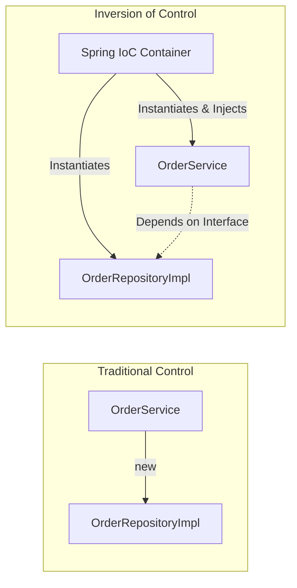
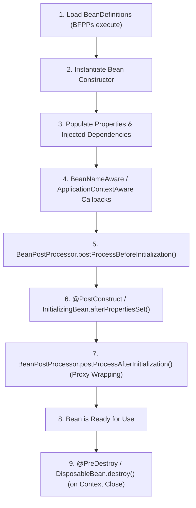

# Spring Core Concepts

## 1. Inversion of Control (IoC) & Dependency Injection (DI)

- **Inversion of Control (IoC)**: An architectural principle where the control flow of object creation, configuration, and lifecycle management is transferred from application code to a framework container.
- **Dependency Injection (DI)**: The specific pattern used to implement IoC by providing dependent objects to a class from the outside rather than allowing the class to instantiate them directly.

### Dependency Injection Flavours:
1. **Constructor Injection (Standard & Recommended)**: Dependencies are declared as `final` constructor parameters. Enforces immutability, guarantees complete object initialization before use, and enables fast unit testing without Spring context.
2. **Setter Injection**: Dependencies are injected via public `set...()` methods. Useful for optional dependencies.
3. **Field Injection (`@Autowired` on private fields)**: Anti-pattern. Hides dependencies, creates circular dependency risks, and makes classes impossible to instantiate immutably in unit tests without reflection.

## 2. ApplicationContext vs BeanFactory

| Feature | `BeanFactory` | `ApplicationContext` |
|---|---|---|
| **Instantiation Strategy** | Lazy (instantiates beans on `getBean()`) | Eager (pre-instantiates all singletons on startup) |
| **Enterprise Features** | Basic DI and lifecycle management | AOP integration, ApplicationEvents, i18n message sources, Environment profiles |
| **Use Case** | Memory-constrained embedded footprints | Standard enterprise web & microservice applications |

## 3. Bean Scopes & Scoped Proxies

- **`singleton` (Default)**: Exactly one instance per Spring `ApplicationContext`. Shared across all threads and requests.
- **`prototype`**: A new instance is created every time the bean is requested from the container (`getBean()` or via `ObjectProvider`).
- **`request` / `session` / `application`**: Web-aware scopes bound to HTTP servlet request/session lifecycles.
- **Scoped Proxy (`proxyMode = ScopedProxyMode.TARGET_CLASS`)**: Injects a CGLIB proxy that dynamically resolves and delegates method calls to the active thread/request-scoped bean instance at runtime.

## 4. The Spring Bean Lifecycle

## 5. Proxy Mechanisms & AOP

Spring AOP uses runtime proxies to weave cross-cutting concerns (such as `@Transactional`, `@Async`, `@Cacheable`, `@Audited`):

- **JDK Dynamic Proxies**: Generated via `java.lang.reflect.Proxy`. Requires the target class to implement one or more interfaces.
- **CGLIB Proxies**: Generated via bytecode enhancement by subclassing the target class at runtime. Default in Spring Boot.

### The Self-Invocation Problem
Spring AOP advice only executes when a method call enters from the **outside through the proxy**. If method `A()` calls method `B()` within the same class (`this.B()`), the call executes on the target instance directly, completely bypassing the proxy and its aspect interceptors.

## 6. Decoupled Events

`ApplicationEventPublisher` and `@EventListener` decouple domain services without direct compile-time or runtime circular dependencies:
- Publishers emit domain event records (`publisher.publishEvent(new OrderCreatedEvent(...))`).
- Subscribers handle events synchronously by default or asynchronously via `@Async`.
- `@TransactionalEventListener` defers event execution until the enclosing transaction reaches a specific phase (e.g., `AFTER_COMMIT`).

## Related

- [Internals](internals.md)
- [Interview Questions](questions.md)
- [Code Review](code-review.md)
