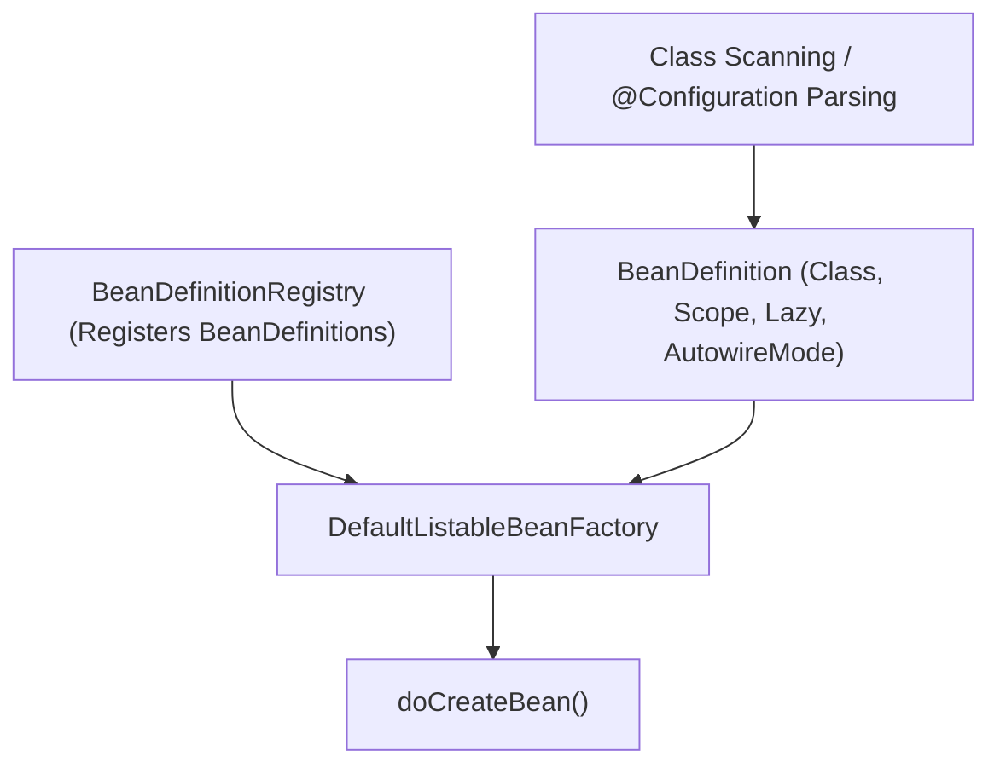
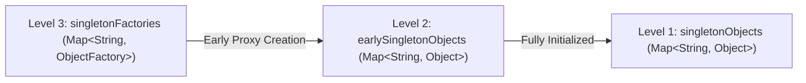
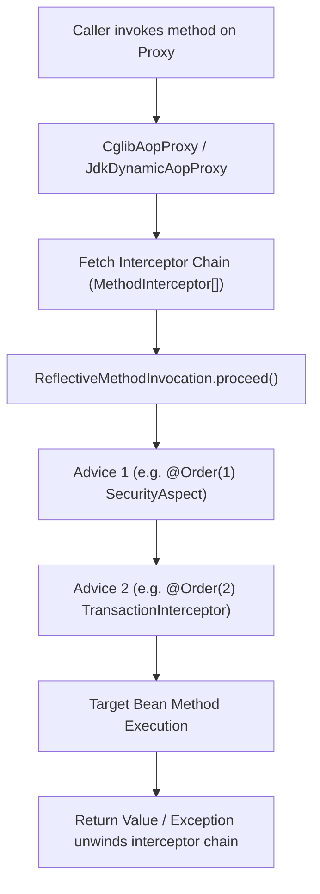

# Spring Core Internals

## 1. DefaultListableBeanFactory Architecture

`DefaultListableBeanFactory` is the core engine of Spring's IoC container:

- **`BeanDefinition`**: Encapsulates metadata describing how a bean should be created (class name, scope, factory method name, constructor argument values, property overrides).
- **`BeanFactoryPostProcessor` (BFPP)**: Executes after all `BeanDefinition`s are registered but before any bean instance is created, allowing property placeholder replacement (`PropertySourcesPlaceholderConfigurer`) and configuration parsing (`ConfigurationClassPostProcessor`).

## 2. The Three-Level Singleton Cache & Circular Dependencies

To resolve circular dependencies between singleton beans, `DefaultSingletonBeanRegistry` maintains three distinct caching levels:

1. **`singletonObjects` (Level 1 Cache)**: Holds fully initialized, post-processed singleton beans ready for public consumption.
2. **`earlySingletonObjects` (Level 2 Cache)**: Holds early references to beans (partially initialized instances or early proxies) exposed to break circular references.
3. **`singletonFactories` (Level 3 Cache)**: Holds lambda `ObjectFactory<?>` producing the early reference or early AOP proxy if required (`getEarlyBeanReference`).

### Why Constructor Cycles Fail:
The three-level cache relies on instantiating the raw object via default/empty constructor first before populating dependencies. With **constructor injection**, Bean A cannot be instantiated until Bean B is fully resolved, and Bean B cannot be instantiated until Bean A is resolved, making circular constructor injection physically impossible.

## 3. CGLIB Configuration Class Enhancement (`proxyBeanMethods`)

When a class is annotated `@Configuration(proxyBeanMethods = true)`:

1. `ConfigurationClassPostProcessor` uses CGLIB `Enhancer` to generate a subclass of the configuration class at runtime.
2. Inter-method `@Bean` invocations (e.g. `repoA()` calling `dbConnection()`) are intercepted by `ConfigurationClassEnhancer.BeanMethodInterceptor`.
3. If the bean already exists in the container, the interceptor returns the existing singleton bean from `beanFactory.getBean("dbConnection")` rather than executing the method body again, ensuring strict singleton guarantees.

## 4. Spring AOP Interceptor Chain Execution

When a proxied bean method is invoked:

- **`AbstractAutoProxyCreator`**: A `BeanPostProcessor` that scans for matching advisor aspects in `postProcessAfterInitialization()` and wraps the target in a proxy if matches exist.
- **`ReflectiveMethodInvocation`**: Maintains an index pointer advancing through the `List<MethodInterceptor>`. Each interceptor calls `mi.proceed()` to yield control to the next advice in the chain.

## Related

- [Concepts](concepts.md)
- [Interview Questions](questions.md)
- [Solutions](solutions.md)
