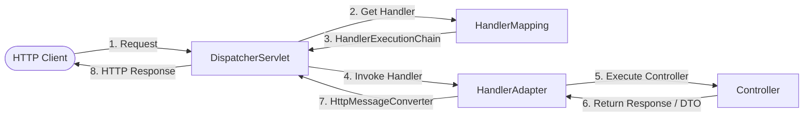

# Spring MVC Concepts

Understanding Spring MVC core concepts and architectural components is essential for designing high-performance, maintainable RESTful web services.

## 1. Front-Controller Pattern & DispatcherServlet

Spring MVC is centered around a front-controller named `DispatcherServlet`. The front controller acts as the single entry point for all HTTP requests, coordinating request routing, handler mapping, parameter binding, interceptors, view resolution, and error translation.



### Key Components

- **`DispatcherServlet`**: The central orchestrator receiving all requests from the Servlet container (e.g. Apache Tomcat).
- **`HandlerMapping`**: Maps incoming HTTP requests (URL path, HTTP method, headers) to a handler method (typically a `@RequestMapping` in a `@RestController`).
- **`HandlerAdapter`**: Adapts the invocation of the handler method, abstracting parameter resolution and return value handling via `RequestMappingHandlerAdapter`.
- **`HandlerInterceptor`**: Intercepts requests before handling (`preHandle`), after handling (`postHandle`), and after completion (`afterCompletion`).
- **`HandlerMethodArgumentResolver`**: Resolves controller method parameters from HTTP request data (`@PathVariable`, `@RequestParam`, `@RequestBody`, `@RequestHeader`, `@AuthenticationPrincipal`).
- **`HttpMessageConverter`**: Serializes and deserializes Java objects to/from HTTP message payloads (e.g. `MappingJackson2HttpMessageConverter` for JSON).

---

## 2. Controller Annotations & Semantic Routing

Spring MVC provides expressive annotations for mapping HTTP verbs and request structures:

| Annotation | Purpose | Example |
|---|---|---|
| `@RestController` | Combines `@Controller` and `@ResponseBody`. Automatically serializes return values into the response body via Jackson. | `@RestController @RequestMapping("/api/v1/orders")` |
| `@GetMapping` | Maps HTTP `GET` requests (safe, idempotent reads). | `@GetMapping("/{id}")` |
| `@PostMapping` | Maps HTTP `POST` requests (non-idempotent creations). | `@PostMapping` |
| `@PutMapping` | Maps HTTP `PUT` requests (idempotent complete replacements). | `@PutMapping("/{id}")` |
| `@PatchMapping` | Maps HTTP `PATCH` requests (partial updates). | `@PatchMapping("/{id}")` |
| `@DeleteMapping` | Maps HTTP `DELETE` requests (idempotent deletions). | `@DeleteMapping("/{id}")` |
| `@PathVariable` | Extracts path template variables. | `@PathVariable String id` |
| `@RequestParam` | Extracts query parameters or form fields. | `@RequestParam(defaultValue = "10") int limit` |
| `@RequestBody` | Deserializes the HTTP request body into a Java DTO. | `@RequestBody @Valid OrderRequest req` |
| `@RequestHeader` | Reads specific HTTP request headers. | `@RequestHeader("X-Correlation-Id") String traceId` |

---

## 3. Input Validation & Jakarta Validation

Input validation prevents invalid or malicious data from reaching business logic or persistence layers.

- Place Jakarta Bean Validation annotations (`@NotNull`, `@NotBlank`, `@Email`, `@Size`, `@Min`, `@Pattern`) on request DTO records.
- Annotate controller parameters with `@Valid` to trigger automatic validation.
- When validation fails, Spring throws `MethodArgumentNotValidException`, containing a `BindingResult` with field errors.
- Handle validation exceptions in `@ExceptionHandler` to return RFC 9457 `400 Bad Request` with actionable error descriptions.

```java
public record CreateUserRequest(
        @NotBlank(message = "Username cannot be blank")
        @Size(min = 3, max = 50, message = "Username must be between 3 and 50 characters")
        String username,

        @NotBlank(message = "Email cannot be blank")
        @Email(message = "Email must be a well-formed address")
        String email,

        @Min(value = 18, message = "Age must be at least 18")
        int age) {}
```

---

## 4. Centralized Exception Handling & RFC 9457 Problem Details

Spring Boot 3 introduces native support for **RFC 9457 Problem Details** (`org.springframework.http.ProblemDetail`), standardizing HTTP error response schemas:

- `type`: URI reference identifying the problem type.
- `title`: Short human-readable summary.
- `status`: HTTP status code.
- `detail`: Human-readable explanation specific to this occurrence.
- `instance`: URI reference identifying the specific occurrence.
- `properties`: Custom extension fields (e.g. validation errors, trace IDs).

```mermaid
flowchart TD
    Req[Incoming HTTP Request] --> Ctrl[Controller Method]
    Ctrl -->|Throws OrderNotFoundException| Adv[@RestControllerAdvice]
    Adv -->|Handles Exception| ExHandler[@ExceptionHandler(OrderNotFoundException.class)]
    ExHandler -->|Constructs| PD[ProblemDetail: 404 Not Found]
    PD -->|JSON Response| Resp[RFC 9457 Standardized Error Response]
```

---

## 5. Asynchronous Request Processing

Under high concurrency, long-running blocking operations (e.g. slow downstream APIs, heavy report generation) can exhaust the Servlet container's thread pool (e.g. Tomcat's default 200 worker threads).

Spring MVC supports non-blocking asynchronous request processing:

1. **`DeferredResult<T>`**: The controller returns a `DeferredResult` and immediately releases the Tomcat worker thread back to the pool. A separate background worker thread completes the `DeferredResult`, prompting the Servlet container to resume the response.
2. **`CompletableFuture<T>`**: Spring MVC natively handles `CompletableFuture` return values, offloading execution to an `Executor`.
3. **`ResponseBodyEmitter` / `SseEmitter`**: Used for streaming responses and Server-Sent Events over long-lived connections.

---

## 6. Cross-Origin Resource Sharing (CORS) Security

CORS is a browser security mechanism that restricts cross-origin HTTP requests.

- **Wildcard Danger**: Specifying `allowedOrigins("*")` combined with `allowCredentials(true)` is invalid and rejected by modern browsers, or creates severe session hijacking vulnerabilities if misconfigured.
- **Production Standard**: Configure explicit, trusted origins (`allowedOrigins("https://app.example.com")` or `allowedOriginPatterns("https://*.example.com")`), specify allowed HTTP methods, allowed headers, and a sensible `maxAge` cache duration for preflight `OPTIONS` requests.
