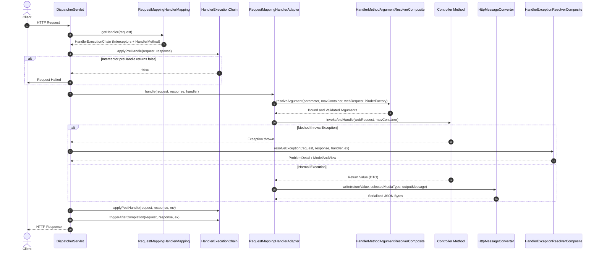
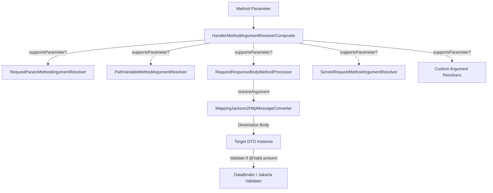

# Spring MVC Internals

A deep dive into the internal execution pipeline of Spring MVC: `DispatcherServlet.doDispatch()`, handler mapping resolution, argument resolver composites, return value processing, interceptor execution, and async dispatching.

## 1. The `DispatcherServlet.doDispatch()` Lifecycle

At the core of Spring MVC is `DispatcherServlet.doDispatch(HttpServletRequest request, HttpServletResponse response)`. The execution flow proceeds through well-defined phases:

---

## 2. Handler Mapping & Lookup

When a request enters `doDispatch()`:

1. `DispatcherServlet` queries registered `HandlerMapping` beans in order of priority.
2. `RequestMappingHandlerMapping` scans all `@Controller` and `@RestController` beans during startup, populating a `MappingRegistry` with `RequestMappingInfo` keys.
3. It performs a path lookup and matches HTTP method, headers, params, and consumes/produces clauses.
4. It wraps the matched `HandlerMethod` with any applicable `HandlerInterceptor` instances into a `HandlerExecutionChain`.

---

## 3. Argument Resolution (`HandlerMethodArgumentResolverComposite`)

The `RequestMappingHandlerAdapter` delegates parameter resolution to a composite chain of `HandlerMethodArgumentResolver` implementations:

### Argument Resolver Execution Steps

1. **`supportsParameter(MethodParameter parameter)`**: Iterates through registered resolvers until one returns `true`.
2. **`resolveArgument(...)`**:
   - Reads request attributes, headers, or body stream.
   - Converts raw strings/streams into typed Java objects via `ConversionService` or `HttpMessageConverter`.
   - If `@Valid` or `@Validated` is present, triggers `WebDataBinder.validate()`.
   - If validation errors are detected and no `BindingResult` parameter immediately follows, throws `MethodArgumentNotValidException`.

---

## 4. Return Value Handling & `HttpMessageConverter` Pipeline

For `@RestController` methods (or `@ResponseBody` methods), `RequestResponseBodyMethodProcessor` acts as both an argument resolver and a return value handler:

1. **Content Negotiation**: Inspects the incoming `Accept` header and matching `@RequestMapping(produces = ...)` specifications.
2. **Converter Selection**: Iterates through registered `HttpMessageConverter` instances (e.g. `ByteArrayHttpMessageConverter`, `StringHttpMessageConverter`, `MappingJackson2HttpMessageConverter`).
3. **Serialization**: `MappingJackson2HttpMessageConverter` writes the serialized Java object directly to `response.getOutputStream()` using Jackson's `ObjectMapper`.
4. Marks the `ModelAndViewContainer` as resolved so no view resolution takes place.

---

## 5. Centralized Exception Handling (`HandlerExceptionResolver`)

When an unhandled exception escapes controller execution:

1. `DispatcherServlet.processHandlerException(...)` delegates to `HandlerExceptionResolverComposite`.
2. `ExceptionHandlerExceptionResolver` checks for `@ControllerAdvice` or `@RestControllerAdvice` beans containing matching `@ExceptionHandler` methods.
3. Method matching resolves by most specific exception class hierarchy.
4. For methods returning `ProblemDetail` or `@ResponseBody`, Jackson serializes the RFC 9457 error payload to the HTTP response with the configured HTTP status code.
5. Interceptors' `afterCompletion()` hooks are invoked with the resulting exception or completion status.

---

## 6. Async Request Processing Pipeline

When a controller returns a `DeferredResult<T>` or `CompletableFuture<T>`:

1. `AsyncWebRequest` starts Servlet 3.0 asynchronous processing via `request.startAsync()`.
2. The initial Tomcat worker thread completes `DispatcherServlet.doDispatch()` and is returned to the worker pool.
3. The underlying async task runs in a separate thread (e.g. `ForkJoinPool` or a custom `ThreadPoolTaskExecutor`).
4. When `deferredResult.setResult(value)` is called, the container performs an async dispatch back to `DispatcherServlet`.
5. `DispatcherServlet` handles the dispatch type `ASYNC`, resolving the result value with `HttpMessageConverter` and writing the HTTP response.
