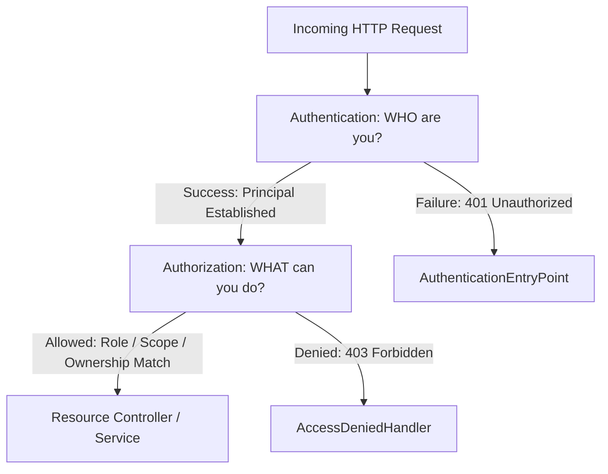
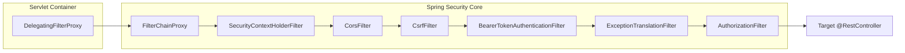
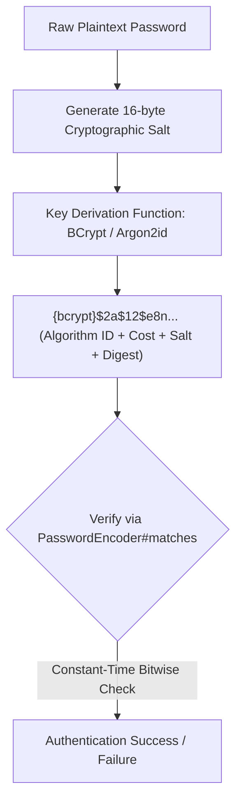
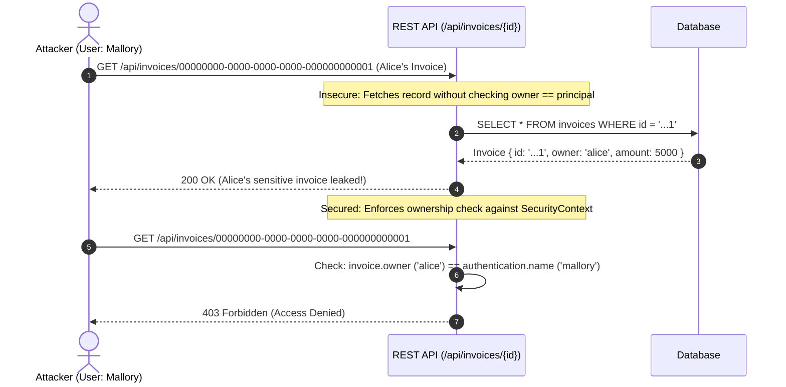

# Spring Security Architecture & Concepts

## 1. Authentication vs Authorization

Security in Spring is architected around two decoupled concerns:



- **Authentication (AuthN)**: Validates identity using credentials (passwords, JWT bearer tokens, client certificates, API keys) and constructs an `Authentication` object inside `SecurityContextHolder`.
- **Authorization (AuthZ)**: Evaluates whether the authenticated principal possesses the required roles (`hasRole('ADMIN')`), scopes (`hasAuthority('SCOPE_read')`), or resource ownership attributes.

---

## 2. The `SecurityFilterChain` Pipeline

Spring Security injects an interception pipeline into the Servlet container via `DelegatingFilterProxy` and `FilterChainProxy`.



---

## 3. Password Hashing Mechanics

Storing passwords requires cryptographic adaptive one-way hashing with per-user unique random salts.



### Password Encoders Compared

| Encoder | Salting | Work Factor | GPU Attack Resistance | Spring Factory ID |
|---|---|---|---|---|
| **BCrypt** | Built-in 128-bit salt | Configurable log rounds (default 10, recommended $\ge 12$) | High (memory constrained) | `{bcrypt}` (Default) |
| **Argon2id** | Built-in cryptographic salt | Configurable iterations, memory (e.g. 64MB), and parallelism | Maximum (Memory-hard winner of Password Hashing Competition) | `{argon2}` |
| **PBKDF2** | Configurable salt | Iteration count (e.g. 310,000+) | Moderate | `{pbkdf2}` |
| **MD5 / SHA-1** | None (Broken) | 0 (Instant GPU cracking) | None (Trivial collision / rainbow table recovery) | Deprecated / Insecure |

---

## 4. Insecure Direct Object Reference (IDOR / BOLA)

IDOR (OWASP API1:2023 - Broken Object Level Authorization) occurs when an application uses client-supplied input to access objects directly without ownership verification.



---

## 5. JWT Authentication & Cryptographic Verification

A JSON Web Token (RFC 7519) contains three Base64Url-encoded segments separated by periods:

$$\text{JWT} = \text{Base64Url}(\text{Header}) \,.\, \text{Base64Url}(\text{Payload}) \,.\, \text{Base64Url}(\text{Signature})$$

```json
// Header
{ "alg": "HS256", "typ": "JWT" }

// Payload (Claims)
{
  "sub": "user-12345",
  "email": "user@example.com",
  "roles": ["ROLE_USER", "ROLE_ADMIN"],
  "exp": 1790000000,
  "iss": "https://auth.company.com"
}
```

### Critical JWT Validation Invariants
1. **Signature Verification**: Recompute HMAC or verify RSA/ECDSA signature against public key.
2. **Algorithm Whitelisting**: Explicitly reject `"alg": "none"` and enforce expected algorithm.
3. **Expiration Check (`exp`)**: Reject tokens where current epoch exceeds expiration time.
4. **Issuer (`iss`) & Audience (`aud`)**: Ensure token was minted for this resource server.

---

## 6. CSRF & CORS Security Rules

- **CSRF (Cross-Site Request Forgery)**:
  - Exploits browsers automatically sending session cookies (`JSESSIONID`) on cross-origin requests.
  - Mitigated via the **Synchronizer Token Pattern** (`X-XSRF-TOKEN` header) and `SameSite=Strict/Lax` cookie attributes.
  - **Rule**: Only disable CSRF if the application is purely **stateless** (bearer tokens in `Authorization` header without browser cookies).
- **CORS (Cross-Origin Resource Sharing)**:
  - Governs which browser origins can read cross-origin HTTP responses.
  - **Rule**: Never combine `allowedOriginPatterns("*")` with `allowCredentials(true)` (CWE-942).
