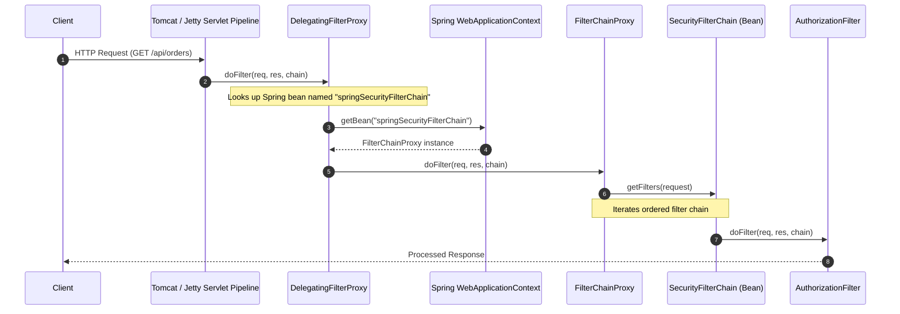
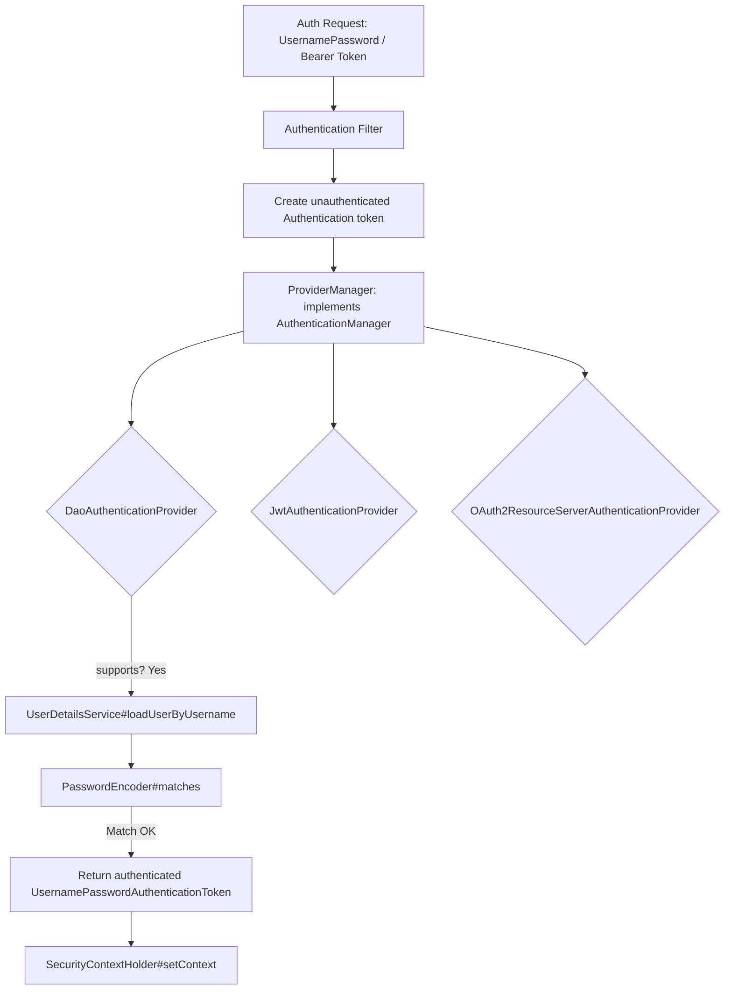
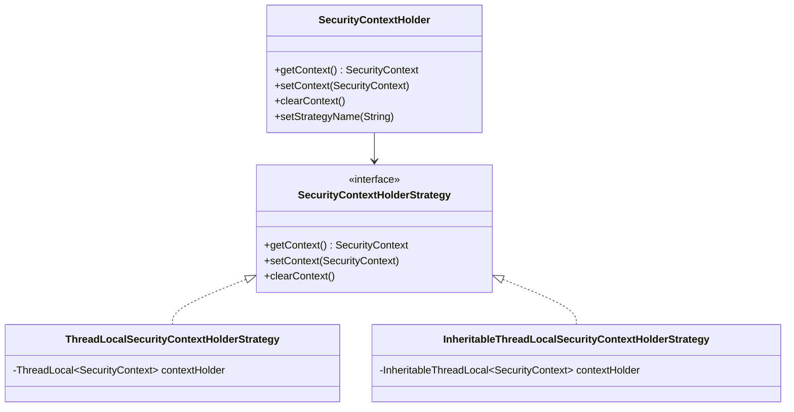
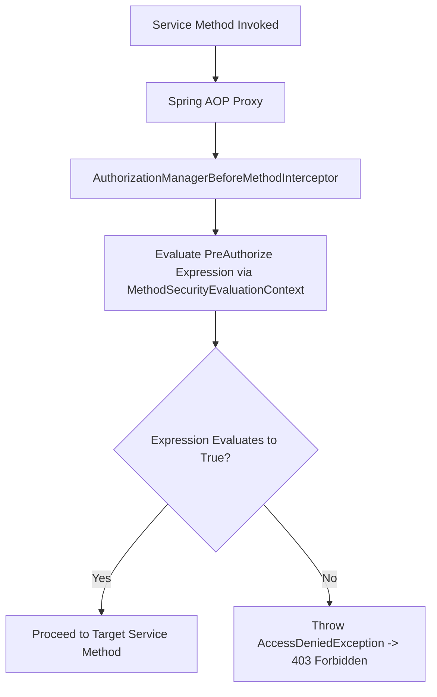

# Spring Security Internals & Pipeline Architecture

## 1. The Delegation Chain: `DelegatingFilterProxy` to `FilterChainProxy`

Spring Security intercepts HTTP traffic by bridging the Servlet Container's native filter lifecycle to the Spring `ApplicationContext`.

---

## 2. Authentication Architecture: `AuthenticationManager` & `ProviderManager`

Authentication uses a strategy pattern where `AuthenticationManager` delegates to a list of registered `AuthenticationProvider` instances.

---

## 3. `SecurityContextHolder` Architecture & Storage Strategies

Spring Security stores the current `Authentication` object inside a `SecurityContext`.

### Storage Strategies
- **`MODE_THREADLOCAL` (Default)**: Bound to the executing OS thread. Safe for standard blocking Servlet containers.
- **`MODE_INHERITABLETHREADLOCAL`**: Spawns copy to child threads. Caution: dangerous on pooled executor threads where threads are reused.
- **`MODE_GLOBAL`**: Single JVM-wide static context (used in standalone desktop apps).

---

## 4. Method Security Pipeline: `AuthorizationManagerBeforeMethodInterceptor`

Spring Security 6+ uses AOP interceptors (`AuthorizationManagerBeforeMethodInterceptor`) to evaluate method-level annotations (`@PreAuthorize`, `@PostAuthorize`, `@Secured`, `@RolesAllowed`).

