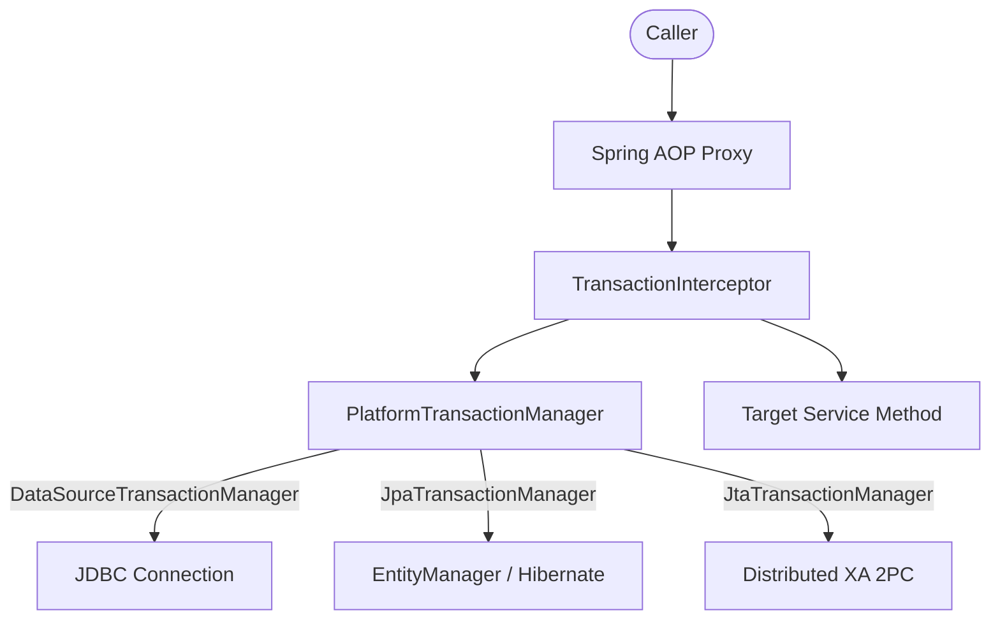
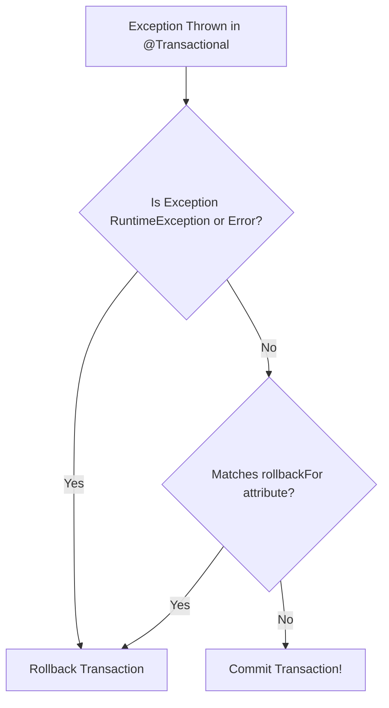

# Spring Transactions Concepts

Understanding Spring transaction abstractions, proxy boundaries, propagation levels, isolation guarantees, and connection pool interactions is essential for building robust backend services.

## 1. Transaction Abstraction & Architecture

Spring decouples transaction management from underlying persistence technologies (JDBC, JPA, Hibernate, JTA) via the `PlatformTransactionManager` SPI:

### Core Abstractions
- **`PlatformTransactionManager`**: The core strategy interface with methods `getTransaction()`, `commit()`, and `rollback()`.
- **`TransactionDefinition`**: Defines propagation behavior, isolation level, timeout, and read-only status.
- **`TransactionStatus`**: Represents current transaction state (new transaction vs participating, rollback-only flag, savepoints).
- **`TransactionSynchronizationManager`**: Manages `ThreadLocal` storage of bound database connections and lifecycle callbacks (`beforeCommit`, `afterCommit`, `afterCompletion`).

---

## 2. Transaction Propagation Behaviors

Propagation defines how transaction boundaries behave when a transactional method calls another transactional method:

| Propagation | Behavior | Use Case |
|---|---|---|
| `REQUIRED` (Default) | Joins active transaction if one exists; creates a new one if none exists. | Standard CRUD service operations. |
| `REQUIRES_NEW` | Suspends active transaction and starts a completely independent new transaction with a new DB connection. | Audit logging, autonomous event dispatching. |
| `SUPPORTS` | Executes within active transaction if present; executes non-transactionally if none exists. | Read-only query helpers. |
| `MANDATORY` | Requires an active transaction; throws `IllegalTransactionStateException` if none exists. | Critical updates that must never run uncommitted. |
| `NOT_SUPPORTED` | Suspends active transaction and executes non-transactionally. | Long-running operations outside database locks. |
| `NEVER` | Throws exception if an active transaction exists. | Operations that cannot tolerate uncommitted locks. |
| `NESTED` | Executes within a nested transaction using JDBC Savepoints; rolls back inner failure without aborting outer transaction. | Partial retry or optional batch sub-tasks. |

---

## 3. Isolation Levels & Concurrency Anomalies

Isolation controls the degree to which transactional operations are isolated from concurrent transactions:

| Isolation Level | Dirty Reads | Non-Repeatable Reads | Phantom Reads |
|---|---|---|---|
| `READ_UNCOMMITTED` | Allowed | Allowed | Allowed |
| `READ_COMMITTED` (PostgreSQL / Oracle default) | Prevented | Allowed | Allowed |
| `REPEATABLE_READ` (MySQL default) | Prevented | Prevented | Allowed (InnoDB prevents via MVCC/Gap Locks) |
| `SERIALIZABLE` | Prevented | Prevented | Prevented |

---

## 4. Rollback Rules & Checked Exceptions

A common source of bugs is Spring's default rollback policy:

- **Unchecked Exceptions** (`RuntimeException`, `Error`): Trigger automatic transaction rollback.
- **Checked Exceptions** (`java.lang.Exception`, `IOException`): **Do NOT trigger rollback by default**; Spring commits the transaction.
- **Explicit Declaration**: To roll back on checked exceptions, specify `@Transactional(rollbackFor = Exception.class)`.

---

## 5. HikariCP Connection Pool Lifecycle & Sizing

HikariCP is the default high-performance JDBC connection pool in Spring Boot.

### The Pool Exhaustion Anti-Pattern
When a method annotated with `@Transactional` invokes a slow remote HTTP API:
1. Spring acquires a connection from the Hikari pool upon entering the method.
2. The thread performs the slow HTTP network call (2–5 seconds) while holding the database connection idle.
3. Under concurrent user traffic, all pool connections become occupied by waiting threads.
4. Unrelated services fail with `HikariPool-1 - Connection is not available, request timed out after 30000ms`.

### Pool Sizing Formula
According to PostgreSQL and HikariCP guidelines:

$$\text{Pool Size} = (\text{CPU Cores} \times 2) + \text{Effective Spindle Count}$$

---

## 6. `@TransactionalEventListener` and Transaction Synchronization

When domain events must trigger external side effects (e.g. sending emails, publishing Kafka messages):
- Normal `@EventListener` or `@Async` fires **immediately**, before the database transaction commits. If the transaction rolls back, the email has already been sent.
- `@TransactionalEventListener(phase = TransactionPhase.AFTER_COMMIT)` defers event processing until the physical database transaction has successfully committed.
