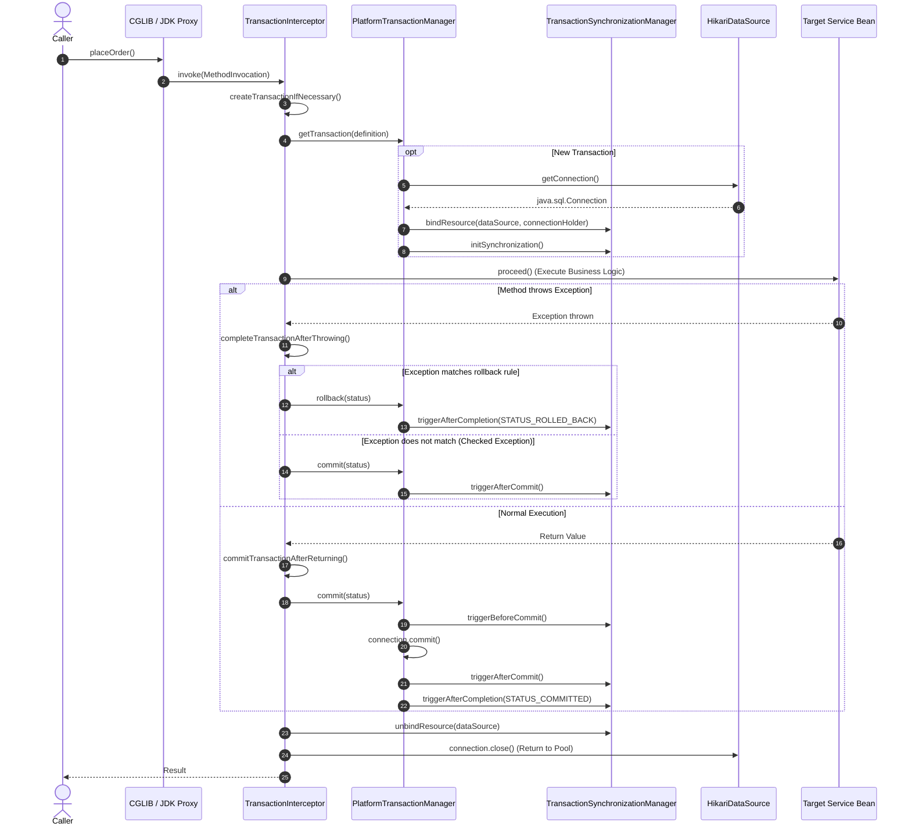
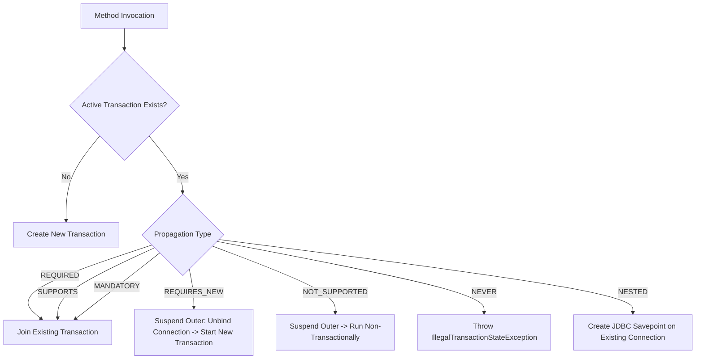

# Spring Transactions Internals

A deep dive into the internal execution mechanics of Spring's transaction interceptor, connection binding in `TransactionSynchronizationManager`, proxy generation, and commit/rollback sequence.

## 1. Transaction Interception Pipeline

When a client invokes a method on a transactional Spring bean, the call enters the `TransactionInterceptor`:

---

## 2. `TransactionSynchronizationManager` and `ThreadLocal` State

Spring manages transaction resources per-thread using `ThreadLocal` storage in `TransactionSynchronizationManager`:

- **`resources`** (`ThreadLocal<Map<Object, Object>>`): Maps `DataSource` or `EntityManagerFactory` to `ConnectionHolder` or `EntityManagerHolder`.
- **`synchronizations`** (`ThreadLocal<Set<TransactionSynchronization>>`): Ordered set of callbacks (`beforeCommit`, `afterCommit`, `afterCompletion`).
- **`currentTransactionName`** (`ThreadLocal<String>`): Method signature or transaction qualifier name.
- **`currentTransactionReadOnly`** (`ThreadLocal<Boolean>`): Flag for read-only optimization.
- **`actualTransactionActive`** (`ThreadLocal<Boolean>`): True when a physical transaction is active.

---

## 3. Propagation Resolution & Suspension

When an inner method executes with different propagation:

### Suspension Mechanics in `REQUIRES_NEW`
1. `TransactionSynchronizationManager.unbindResource(dataSource)` removes the outer `ConnectionHolder` from `ThreadLocal`.
2. A `SuspendedResourcesHolder` preserves the outer connection, synchronizations, and transaction name.
3. The inner transaction acquires a **second physical connection** from HikariCP and binds it to `ThreadLocal`.
4. When the inner transaction completes, it commits, closes the second connection, and restores the suspended outer connection.

---

## 4. Why `UnexpectedRollbackException` Occurs

When two methods participate in the same physical transaction (`Propagation.REQUIRED`):

1. Outer `ServiceA` calls inner `ServiceB`.
2. `ServiceB` throws a `RuntimeException`.
3. `TransactionInterceptor` catches the exception in `ServiceB` and marks the physical `TransactionStatus` as **`rollback-only`**.
4. If `ServiceA` catches `ServiceB`'s exception in a `try-catch` block and attempts to complete normally, `TransactionInterceptor` attempts to commit.
5. The `PlatformTransactionManager` detects the `rollback-only` flag on the physical transaction.
6. It rolls back the database transaction and throws `UnexpectedRollbackException` to notify `ServiceA` that its requested commit was denied.
