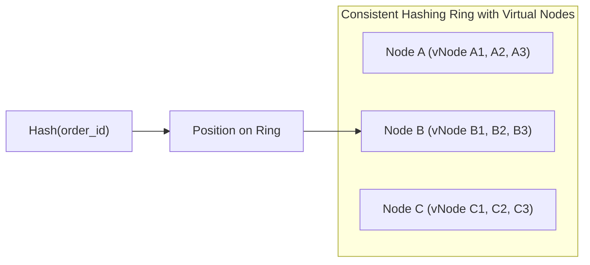

# System Design Concepts for Senior Backend Engineers

Senior system design evaluates how distributed storage primitives, caching layers, messaging backbones, and network boundaries compose into scalable, fault-tolerant architectures.

---

## 1. Distributed Foundations: CAP, PACELC, and Consistency Models

### The CAP Theorem vs PACELC Theorem
- **CAP Theorem**: In any distributed data store, network partitions ($P$) are inevitable. When a partition occurs, a system must trade off between:
  - **Consistency ($C$)**: Every read receives the most recent write or an error.
  - **Availability ($A$)**: Every non-failing node returns a non-error response, but without guarantee it contains the latest write.
- **PACELC Theorem**: Extends CAP to normal (non-partitioned) operations:
  $$\text{If } \mathbf{P} \text{ (Partition)} \rightarrow \mathbf{A} \lor \mathbf{C}, \quad \text{ELSE} \rightarrow \mathbf{L} \text{ (Latency)} \lor \mathbf{C} \text{ (Consistency)}$$
  - Even when the network is healthy, a system must choose between low latency ($L$) or strong consistency ($C$). For example, MongoDB and DynamoDB default to PA/EL (high availability and low latency, trading off strong consistency for eventual consistency).

### Strong Consistency vs Eventual Consistency
- **Linearizability (Strong Consistency)**: Operations appear to take effect instantaneously on a single virtual copy of data at some point between their invocation and completion.
- **Eventual Consistency**: Replicas converge to identical values given sufficient time without new updates ($t \rightarrow \infty$). Used in DNS, DynamoDB, and asynchronous read replicas.
- **Causal Consistency**: Writes that are causally related must be observed by every node in the same order; concurrent operations without causal relationship may be observed in different orders.

---

## 2. Storage Selection: Relational vs NoSQL vs NewSQL

| Technology | Data Model | Write Storage Engine | Concurrency Model | Best Suited For |
|---|---|---|---|---|
| **PostgreSQL / Aurora** | Relational / Tables | **B-Tree** (in-place updates + WAL) | ACID Transactions, MVCC, Strict constraints | Financial ledgers, order state, complex relational joins. |
| **Redis** | Key-Value / In-Memory | In-memory RAM (RDB/AOF persistence) | Single-threaded atomic execution, Lua scripts | Caching, session stores, rate limiters, flash sale inventory pre-allocation. |
| **Apache Cassandra / ScyllaDB** | Wide-Column / Distributed | **LSM-Tree** (Append-only MemTable $\rightarrow$ SSTables) | Tunable consistency ($W + R > N$), masterless | High-throughput write streams, telemetry, messaging history, activity feeds. |
| **Amazon DynamoDB** | Document / Key-Value | Distributed B-Tree / SSD | Strong or Eventual Consistency, single-partition ACID | Global user profiles, shopping carts, metadata lookups with predictable single-digit ms SLA. |
| **CockroachDB / Spanner** | Distributed SQL (NewSQL) | LSM-Tree / RocksDB | Distributed ACID, Raft consensus, TrueTime | Multi-region strongly consistent relational data without sharding middleware. |

### B-Trees vs LSM-Trees
- **B-Trees (PostgreSQL/MySQL)**: Optimized for **read-heavy workloads**. Data is organized into fixed-size pages on disk. Reads require $O(\log N)$ page traversals. Writes incur random I/O when updating pages in-place, mitigated by write-ahead logging (WAL).
- **Log-Structured Merge-Trees / LSM-Trees (Cassandra/RocksDB)**: Optimized for **write-heavy workloads**. Writes append sequentially to an in-memory `MemTable` and a commit log ($O(1)$ write throughput). When full, the `MemTable` flushes to immutable on-disk `SSTables`. Background compaction processes merge SSTables.

---

## 3. Sharding & Partitioning Strategies

When data volume exceeds the capacity of a single database host, data must be partitioned:

### 1. Range-Based Partitioning
- Partitions data by continuous ranges of a key (e.g. User IDs $1-1,000,000$ on Shard 1, $1,000,001-2,000,000$ on Shard 2).
- *Problem*: Creates severe write hot spots if new records are sequential (e.g., auto-incrementing IDs or timestamps all write to the newest shard).

### 2. Hash-Based Partitioning
- Computes `hash(shard_key) % num_shards` to distribute writes uniformly across nodes.
- *Problem*: Adding or removing a shard node requires rehashing and moving almost 100% of data across the cluster ($O(N)$ redistribution).

### 3. Consistent Hashing with Virtual Nodes
- Maps both nodes and keys to a $2^{32} - 1$ circular hash ring.
- A key is stored on the first node encountered moving clockwise around the ring.
- When a node is added or removed, only $K/N$ keys must be relocated (where $K$ is total keys and $N$ is total nodes).
- **Virtual Nodes (vNodes)**: Assigns 100–250 virtual positions per physical server across the ring, preventing hot spots and ensuring uniform balance across heterogeneous physical hardware.

---

## 4. Advanced Caching Topologies & Failure Modes

### Caching Topologies
- **Cache-Aside (Lazy Loading)**: Application reads from cache; on miss, reads from DB and populates cache. Application writes directly to DB and evicts cache key (`@CacheEvict`).
- **Write-Through**: Application writes to cache; cache synchronously writes to DB before returning.
- **Write-Behind (Write-Back)**: Application writes to cache; cache acknowledges immediately and writes to DB asynchronously in batches. High write throughput, but risks data loss on cache crash.

### The Three Critical Caching Failure Modes
1. **Cache Penetration**: Clients request non-existent keys (e.g. `order_id = -9999` or random UUID attacks). Because keys never exist in cache, every request queries the primary DB.
   - *Mitigation*: Cache sentinel `null` values with short TTL ($30-60\text{s}$), or evaluate keys through a **Bloom Filter** before querying the cache or database.
2. **Cache Breakdown (Stampede / Thundering Herd)**: A single high-traffic "hot key" expires while receiving 10,000 requests/sec. All 10,000 requests miss the cache simultaneously and query the database concurrently, crashing the database.
   - *Mitigation*: Mutex locking (e.g. Redisson distributed lock or Spring `sync = true`), or **Probabilistic Early Expiration (XFetch algorithm)** where background threads refresh the key before it expires.
3. **Cache Avalanche**: Hundreds of thousands of cache keys are initialized with the exact same TTL (e.g. 1 hour). When the hour elapses, all keys expire simultaneously, flooding the database.
   - *Mitigation*: Add uniform random jitter to TTLs:
     $$\text{TTL} = \text{base\_ttl} + \text{random\_jitter}(0, 300\text{ seconds})$$

---

## 5. Overview of the 8 Canonical System Design Blueprints

| System | Primary Challenges | Key Architectural Primitives |
|---|---|---|
| **1. URL Shortener** | $100:1$ Read-to-Write ratio, Base62 encoding, hash collisions, 301 vs 302 redirects. | Pre-generated unique ID range allocation (Zookeeper / Snowflake), Redis Cache-Aside, Base62. |
| **2. Payment System** | Absolute zero double-charging, distributed ledger consistency, external PSP timeouts. | Idempotency keys, Transactional Outbox, Double-entry bookkeeping, asynchronous reconciliation engine. |
| **3. Order Management** | Multi-step workflows, distributed rollback, eventual consistency across inventory/shipping. | Saga Pattern (Orchestrator vs Choreography), Dead-Letter Queues, CQRS read views. |
| **4. Notification Engine** | Multi-channel routing (APNs, FCM, SMS, Email), user preference filtering, high throughput. | Priority SQS/Kafka queues, Rate limiting per recipient, Circuit breakers for third-party gateways. |
| **5. Flash Sale Inventory** | 100,000 req/sec peak, single hot inventory row, strict zero-overselling guarantee. | Redis Lua atomic pre-allocation (`DECRBY`), Kafka write buffer, temporary reservation timeouts. |
| **6. Distributed Rate Limiter** | Microsecond evaluation latency, window boundary burst prevention, cluster failure resilience. | Redis Sliding Window Log / Token Bucket via atomic Lua script, fail-open circuit breakers. |
| **7. Large File Processing** | Multi-gigabyte uploads, unreliable client networks, asynchronous video transcoding/indexing. | S3 Presigned URLs, S3 Multipart Upload, S3 EventBridge triggers, distributed worker pools. |
| **8. Hotel / Ticket Booking** | Seat/room contention, temporary holding locks (10 min checkout timer), payment abandonment. | Optimistic locking with version counters, Redis TTL reservation keys, background expiration reapers. |
