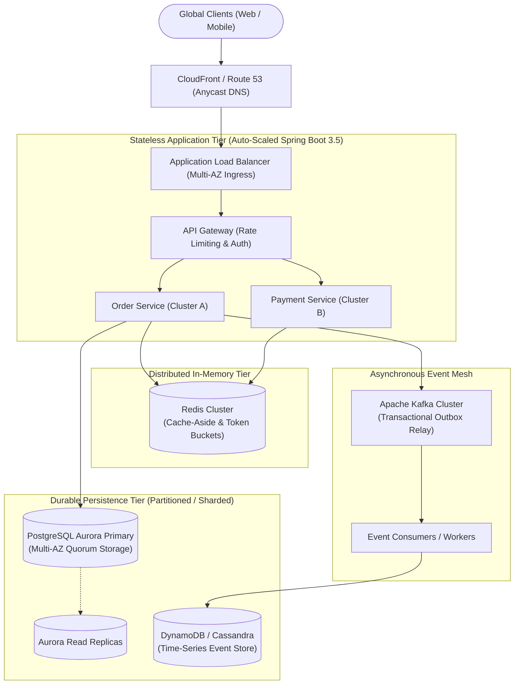

# System Design for Senior Backend Engineers

This module covers large-scale distributed system design for Senior Java / Spring Boot Backend Engineers. Rather than drawing abstract boxes and hand-wavy diagrams, this module focuses on senior-level production engineering: formal requirements scoping, rigorous back-of-the-envelope capacity estimations, data modeling and storage selection (SQL vs NoSQL vs NewSQL), concurrency control (optimistic vs pessimistic vs distributed locks), caching topologies, asynchronous event pipelines, resilience patterns, and operational failure modes.

---

## The 4-Step Senior System Design Framework

| Phase | Time | Senior Engineering Actions | Key Deliverables |
|---|---|---|---|
| **1. Scope & Estimation** | 5–8 min | Clarify Functional Requirements (FRs) and Non-Functional Requirements (NFRs). Quantify DAU, write/read QPS, bandwidth, and storage growth over 5 years. | Clean list of 3–4 core FRs, target p99 latency SLOs, availability target (e.g. 99.99%), and storage scale calculations. |
| **2. High-Level Design** | 10–15 min | Define API contracts (REST / gRPC), data model, entity relationships, and core end-to-end read and write request flows. | Architectural component diagram (clients, gateways, services, primary database, cache) and API request/response JSON schemas. |
| **3. Deep Dive & Scaling** | 15–20 min | Deep-dive into 2–3 complex bottlenecks: database sharding/partitioning keys, concurrency control, caching invalidation, and queue backpressure. | Sharding key selection rationale, cache-aside vs write-through choice, and transaction isolation boundaries. |
| **4. Failure Modes & Resiliency** | 8–10 min | Address single points of failure, network partitions, cascading failures, idempotency guarantees, and disaster recovery. | Circuit breakers, dead-letter queues, outbox pattern, rate limiters, and reconciliation engines. |

---

## Core Production Invariants

| Invariant | Operational Rationale | Senior Production Standard |
|---|---|---|
| **End-to-End Idempotency** | Prevent duplicate mutations (charges, orders) caused by automated network retries. | Pass unique client `Idempotency-Key` headers; enforce `UNIQUE` constraints in database or atomic Redis reservation keys. |
| **Connection Isolation** | Prevent HikariCP pool exhaustion and cascading service starvation. | Never hold database transactions open across remote HTTP/REST network calls or external payment gateway invocations. |
| **Dual-Write Elimination** | Prevent permanent data drift between database records and message brokers. | Use the **Transactional Outbox Pattern** with Debezium CDC or background relay workers; avoid dual synchronous writes. |
| **Asynchronous Spike Buffering** | Protect relational databases from collapse during traffic spikes (flash sales). | Decouple writes via in-memory pre-allocation (Redis Lua) and durable message queues (Kafka / SQS) with rate-limited ingestion. |
| **Defensive Rate Limiting** | Protect downstream microservices from denial of service and noisy-neighbor tenants. | Implement distributed sliding-window or token-bucket rate limiters at the API Gateway with fail-open circuit breakers. |

---

## Module Overview

| Resource | Purpose |
|---|---|
| [Concepts](concepts.md) | Architectural foundations: CAP theorem, PACELC, consistency models, sharding, caching, and 8 canonical system blueprints |
| [Internals](internals.md) | Distributed transactions (Saga vs 2PC), consistent hashing rings, LSM-trees vs B-trees, and Raft consensus mechanics |
| [Interview Questions](questions.md) | 23 questions across Basic, Intermediate, Senior, and Production Incident Scenarios |
| [Code Review](code-review.md) | 3 flawed system design proposals (2PC payment, naive Redis limiter, flash sale lock) with collapsible reveals |
| [Solutions](solutions.md) | Production-grade architectures: Outbox payment processing, atomic sliding-window rate limiting, and multi-tier flash sales |
| [Production](production.md) | Incident postmortems (The Microservice 2PC Hang, The Flash Sale Database Crash), capacity math, and design checklist |
| [Exercises](exercises.md) | Hands-on system design exercises: Complete design blueprints for URL Shortener, Booking System, and File Pipeline |

---

## Related

- [Distributed Systems](../distributed-systems/index.md) — Consensus algorithms, CAP theorem, and partition tolerance
- [Distributed Data Patterns](../distributed-data-patterns/index.md) — Saga, Transactional Outbox, CQRS, and Event Sourcing
- [Performance](../performance/index.md) — Latency percentiles, queueing theory, and Little's Law
- [AWS](../aws/index.md) — Amazon ECS, RDS Multi-AZ, SQS/SNS, and Aurora distributed storage
- [Curriculum spec](../../spec/curriculum.md)
