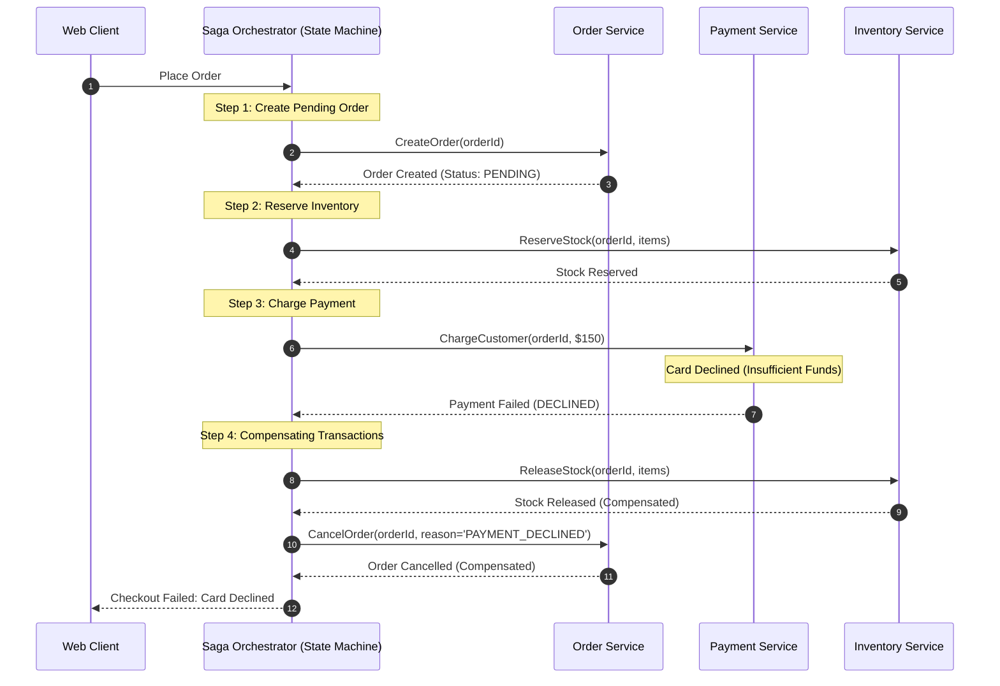

# System Design Internals for Senior Backend Engineers

Deep dive into the operational algorithms, consensus protocols, ID generation mechanics, and mathematical invariants powering production distributed systems.

---

## 1. Distributed Transactions: Saga Orchestration vs Two-Phase Commit (2PC)

Why do modern cloud-native architectures abandon Two-Phase Commit (2PC) in favor of Saga Orchestration?



### The Fatal Flaws of Two-Phase Commit (2PC)
1. **Synchronous Blocking Protocol**: In 2PC, all participating microservices acquire local database row locks during Phase 1 (Prepare) and **hold those locks open across network boundaries** until the coordinator issues Phase 2 (Commit or Abort).
2. **Coordinator Failure (Single Point of Failure)**: If the coordinator crashes during Phase 2 after nodes vote "Yes", all participants remain locked indefinitely, blocking other transactions and causing connection pool exhaustion.
3. **Incompatibility with External APIs**: Asynchronous cloud services, third-party payment gateways (Stripe/PayPal), and third-party SaaS APIs do not support 2PC or XA prepare phases.

### Saga Pattern Architecture
Instead of global ACID isolation, a Saga executes a sequence of local transactions:
- **Forward Steps**: Each step updates a local service database and publishes an event or response to the orchestrator.
- **Compensating Transactions**: If a step fails, the orchestrator executes a series of backward compensating transactions to undo preceding mutations (e.g., releasing reserved inventory).
- **The Idempotent Compensation Invariant**: Compensating actions must be **strictly idempotent**. If a network timeout occurs while releasing inventory, the orchestrator retries `ReleaseStock`. The inventory service must handle repeated compensation calls safely without double-releasing stock.

---

## 2. Distributed Unique ID Generation: Snowflake Algorithm Internals

Generating globally unique, 64-bit, time-ordered IDs at a rate of millions per second without database bottlenecks is a cornerstone of distributed design.

```text
 1 bit   41 bits (Millisecond Timestamp)      10 bits (Machine ID)   12 bits (Sequence)
┌─────┬─────────────────────────────────────┬──────────────────────┬───────────────────┐
│  0  │ 01101010101001010101110101010101010 │      0010101101      │   000000000001    │
└─────┴─────────────────────────────────────┴──────────────────────┴───────────────────┘
```

### Bit Allocation Breakdown
1. **1-bit Sign Bit**: Unused (always 0) to ensure positive 64-bit signed integers in languages like Java (`long`).
2. **41-bit Epoch Timestamp**:
   - Represents milliseconds elapsed since a custom system epoch (e.g., `2026-01-01T00:00:00Z`).
   - Range: $2^{41} \text{ ms} \approx 2,199,023,255,552\text{ ms} \approx 69.7\text{ years}$ of unique timestamps.
3. **10-bit Node / Machine Identifier**:
   - Allows up to $2^{10} = 1,024$ distinct worker nodes or container instances across multiple datacenters.
4. **12-bit Auto-Incrementing Sequence**:
   - Increments per ID generated within the exact same millisecond on that specific machine.
   - Allows $2^{12} = 4,096$ unique IDs **per millisecond per node** ($\approx 4.096\text{ million IDs/sec per node}$).

### Clock Drift & NTP Backwards Jump Handling
What happens if the system clock synchronizes via NTP and steps backwards by 5 milliseconds?
- Generating an ID with a backwards timestamp would produce duplicate IDs previously generated!
- **Senior Production Mitigation**:
  - The Snowflake generator checks `currentTimestamp < lastTimestamp`.
  - If drift is small ($< 10\text{ms}$), the generator sleeps until `lastTimestamp` is reached.
  - If drift is large ($> 10\text{ms}$), the generator throws an exception or rejects generation, alerting on-call engineers of system clock anomalies.

---

## 3. Database Sharding Internals: Consistent Hashing Mechanics

### The Hash Ring Algorithm
Consistent hashing maps keys and physical nodes to a circular hash space $[0, 2^{32} - 1]$ using a uniform 32-bit hash function (such as Murmur3):
1. Each physical database server is hashed by its hostname/IP to find its location on the ring.
2. When a record (e.g. `order_id`) is stored, `murmur3(order_id)` is evaluated to place the key on the ring.
3. Moving clockwise from the key position, the record is stored on the first server encountered.

### Virtual Nodes (vNodes) and Balance Mathematics
- In a naive consistent hashing ring with 3 physical nodes, server positions are unevenly clustered, leading to severe load imbalance where one node may handle 60% of all traffic.
- **Virtual Nodes**: Each physical server is assigned $V$ virtual positions on the ring (e.g. $V = 200$ points per server: `nodeA-v1`, `nodeA-v2`, ..., `nodeA-v200`).
- This distributes partitions uniformly across the hash space:
  $$\text{Standard Deviation of Load} \approx \frac{1}{\sqrt{V}}$$
- When a new physical node is added, it inherits virtual partitions evenly from all existing nodes across the cluster, requiring only $\frac{1}{N+1}$ of total cluster data to be transferred.

---

## 4. Double-Entry Bookkeeping Ledger Mechanics

In financial payment systems, balance fields must never be stored as simple mutable numbers (`UPDATE accounts SET balance = balance - 50`).

### The Double-Entry Invariant
1. Every financial transaction consists of at least two balanced entries: a **Debit** and a **Credit**.
2. **The Fundamental Accounting Equation**:
   $$\sum \text{Debits} \equiv \sum \text{Credits}$$
3. An account balance is **never updated in place**; it is the derived sum of all historical immutable ledger entries.

### Ledger Schema & Minor Currency Units
- Never store monetary amounts using floating-point types (`FLOAT`, `DOUBLE`), which introduce binary rounding inaccuracies (e.g. $0.1 + 0.2 = 0.30000000000000004$).
- Store currency as 64-bit integer minor units (e.g. cents for USD, yen for JPY) using `BIGINT` in SQL or `java.math.BigDecimal` / `Long` in Java.

```sql
CREATE TABLE ledger_entries (
    id UUID PRIMARY KEY,
    transaction_id UUID NOT NULL,
    account_id UUID NOT NULL,
    entry_type VARCHAR(10) NOT NULL CHECK (entry_type IN ('DEBIT', 'CREDIT')),
    amount_cents BIGINT NOT NULL CHECK (amount_cents > 0),
    currency VARCHAR(3) NOT NULL,
    created_at TIMESTAMP WITH TIME ZONE NOT NULL DEFAULT NOW()
);

-- Integrity check: Debits must balance Credits per transaction
CREATE OR REPLACE FUNCTION verify_transaction_balance() RETURNS TRIGGER AS $$
DECLARE
    balance_diff BIGINT;
BEGIN
    SELECT COALESCE(SUM(CASE WHEN entry_type = 'DEBIT' THEN amount_cents ELSE -amount_cents END), 0)
    INTO balance_diff
    FROM ledger_entries
    WHERE transaction_id = NEW.transaction_id;

    IF balance_diff <> 0 THEN
        RAISE EXCEPTION 'Transaction % is unbalanced: debit/credit difference is %', NEW.transaction_id, balance_diff;
    END IF;
    RETURN NEW;
END;
$$ LANGUAGE plpgsql;
```
