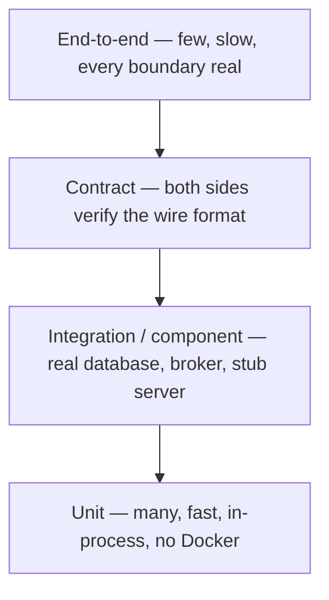
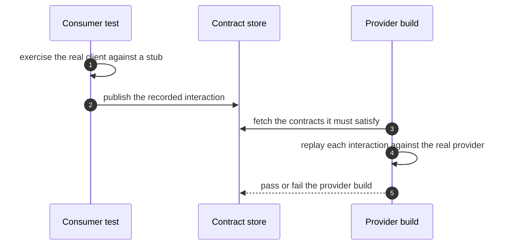

# Testing Concepts

## 1. The testing pyramid is a statement about cost, not frameworks

The pyramid prescribes *distribution*: many fast in-process tests, fewer tests that cross a process
boundary, very few end-to-end tests. The shape exists because each level pays a startup cost and a
per-test cost, and because a failure at a higher level is harder to localise.



| Level | Crosses a process boundary | Typical share | Feedback | What it can catch |
|---|---|---|---|---|
| Unit | No | ~86 % | milliseconds | Logic, arithmetic, validation, edge cases |
| Component / slice | Maybe (DB, HTTP) | ~10 % | seconds | Wiring, mapping, persistence semantics |
| Contract | Yes | ~3 % | seconds | Wire-format drift between consumer and provider |
| End-to-end | Yes, all of them | ~1 % | minutes | Deployment, configuration, cross-service flow |

```java title="Q01TestingPyramidAndLevels.java"
--8<-- "modules/12-testing/src/examples/java/lab/testing/questions/Q01TestingPyramidAndLevels.java"
```

The same 486 tests arranged as an inverted pyramid take roughly four times as long to give an answer.
That is the whole argument: the shape buys *fast feedback*, not moral superiority.

!!! warning "Failure"
    An inverted pyramid — hundreds of `@SpringBootTest` classes, six unit tests — turns a one-minute
    change into a twenty-minute wait, so engineers stop running the suite locally and CI becomes the
    only signal.

**Fix:** push each assertion to the lowest level that can observe it; keep one or two end-to-end tests
for the critical path. **Trade-off:** some defects (transaction boundaries, container configuration,
cross-service routing) are only observable above the unit level, so the pyramid is a default, not a law.

??? question "Interview question"
    Why does the pyramid exist if a slow test catches the same defect as a fast one? What does a test's
    position in the pyramid actually predict about the defect it can observe?

---

## 2. Test levels: unit, component, contract, E2E

| Level | Subject | Collaborators | Fails when |
|---|---|---|---|
| Unit | One class or one pure function | All replaced except pure value collaborators | The logic is wrong |
| Component / slice | One layer of the application | Real framework wiring, one real dependency | The layer is mis-wired or mis-mapped |
| Contract | The boundary between two services | A stub server or a contract broker | The two sides disagree on the wire format |
| End-to-end | The deployed system | Everything real | Configuration, deployment or integration is wrong |

A component test asserts that the layer is wired the way production wires it; a unit test asserts the
rule. Confusing the two produces suites that are simultaneously slow and blind: a mocked repository
makes a service test fast but proves nothing about the constraint the database enforces.

```java title="Q02UnitVsIntegrationVsComponentVsE2e.java"
--8<-- "modules/12-testing/src/examples/java/lab/testing/questions/Q02UnitVsIntegrationVsComponentVsE2e.java"
```

!!! warning "Failure"
    A repository test that runs against an in-memory substitute is labelled "integration" but never
    crosses a boundary — it verifies the substitute's semantics. See
    [exercise 5](code-review.md#embedded-substitute-hides-postgres-semantics).

**Fix:** name each test for what it actually crosses, and choose the level by the *risk* being covered.
**Trade-off:** the higher the level, the more realistic and the slower and more brittle it is.

??? question "Interview question"
    You need confidence that a new `NOT NULL` column will not break registration. Which level do you
    test it at, and why is a mocked repository the wrong answer?

---

## 3. Assert behaviour, not implementation

A behaviour assertion describes what a caller can observe; an implementation assertion describes how
the result was produced. Both pass today; only the first survives a behaviour-preserving refactor.

=== "Broken — asserts the call structure"

    ```java
    --8<-- "modules/12-testing/broken-examples/asserting-implementation-not-behaviour/CheckoutServiceTest.java"
    ```

=== "Correct — asserts the observable amount"

    ```java
    --8<-- "modules/12-testing/src/test/java/lab/testing/pricing/CheckoutServiceBehaviourTest.java"
    ```

The broken test mocks the pure `PricingCalculator`, so the pricing rule under test never runs. It
verifies argument lists, call counts and `InOrder`, so it fails on any refactor and passes even when
the discount is wrong. The correct test exercises the real calculator, doubles only the remote
`PaymentGateway` boundary, and asserts the amount returned *and* the amount charged.

```java title="Q03BehaviourVsImplementationAssertions.java"
--8<-- "modules/12-testing/src/examples/java/lab/testing/questions/Q03BehaviourVsImplementationAssertions.java"
```

!!! warning "Failure"
    Assertions coupled to internal call structure fail on refactors and stay green on real defects —
    a false negative that is worse than no test, because the suite is trusted.

**Fix:** assert returned values and observable side effects; verify interactions only where the
interaction *is* the contract (an outbound call at a boundary). **Trade-off:** a behaviour assertion
needs an observable result, so a service with no return value and no observable effect must be
redesigned before it can be tested honestly.

??? question "Interview question"
    A test mocks the collaborator that owns the business rule. What has it stopped testing, and how
    would you notice?

---

## 4. Test doubles: dummy, stub, spy, mock, fake

| Double | Purpose | Fails when |
|---|---|---|
| Dummy | Fills a required parameter, never used | It is used |
| Stub | Returns canned answers to calls made during the test | The stubbed answer drifts from reality |
| Spy | Records how it was called, real behaviour by default | The recording is asserted as if it were behaviour |
| Mock | Pre-programmed expectations, verified after the fact | It replaces a collaborator whose behaviour *is* the subject |
| Fake | A working but simplified implementation | Its semantics diverge from production (see exercise 5) |

The rule that keeps suites honest: double only at *boundaries you cannot run locally* (remote HTTP,
clock, randomness, third-party SDKs). Replace a collaborator that owns the rule under test and the
test proves nothing.

!!! warning "Failure"
    A hand-written `Map`-backed fake repository is a *working* implementation, so it silently supplies
    case-insensitive matching, insertion-order results and no constraint enforcement — none of which
    PostgreSQL provides.

**Fix:** keep fakes for pure, well-specified collaborators; use a real container for anything whose
semantics you are actually asserting. **Trade-off:** fakes make tests fast and deterministic but are a
second implementation that must be maintained and can drift.

??? question "Interview question"
    When is a fake the right double and when does it become a liability? What is the difference between
    a fake and a stub that returns a hard-coded list?

---

## 5. Mockito strictness and argument captors

`MockitoExtension` opens a `MockitoSession` with `STRICT_STUBS` before each test and calls
`finishMocking()` after it. An unused stub then fails the test with `UnnecessaryStubbingException`,
and an argument mismatch is reported immediately instead of quietly returning `null`.

| Strictness | Detects | Cost |
|---|---|---|
| `STRICT_STUBS` (extension default) | Unused stubs, argument mismatch, stubbing misuse | A shared stub in `@BeforeEach` that one test does not use must be `lenient()` |
| `LENIENT` | Nothing extra | Dead stubs accumulate silently |
| `WARN` | Reports without failing | Easy to ignore |

The mechanism — the bytecode proxy, the invocation container and the `finishMocking()` check — is
traced with a worked example in [Internals §2](internals.md#2-mockito-bytecode-proxies-and-strict-stub-detection).

An `ArgumentCaptor` captures the argument a collaborator received so the test can assert on it after
the call — useful when the collaborator returns `void` and the value passed *is* the observable effect.

!!! warning "Failure"
    Capturing every argument and asserting call counts turns a captor into an implementation assertion
    in disguise: the test breaks when the collaborator's API changes, not when behaviour changes.

**Fix:** prefer an observable return value; use a captor for a genuine side effect at a boundary;
use `verify(mock, timeout(...))` or Awaitility for asynchronous interactions. **Trade-off:** captors
couple the test to the collaborator's method signature; keeping them at the boundary limits the blast
radius.

??? question "Interview question"
    Why does an unused stub fail the test rather than being ignored? What does that tell you about the
    stub, and when is `LENIENT` the honest answer?

---

## 6. AssertJ: assertions that explain the failure

AssertJ's fluent assertions carry the actual and expected values into the failure message, and the
collection/exception families remove the hand-rolled loops that hide what was checked.

| Need | Assertion |
|---|---|
| Equality with a diff | `assertThat(actual).isEqualTo(expected)` |
| Exception contract | `assertThatThrownBy(() -> ...).isInstanceOf(X.class).hasMessageContaining("...")` |
| Collection content | `containsExactly(...)`, `containsExactlyInAnyOrder(...)`, `extracting(...)` |
| Several checks, all reported | `assertSoftly(softly -> { ... })` |
| Domain-specific | `satisfies(...)`, `usingRecursiveComparison()` |

```java title="OrderTotalsTest.java (correct)"
--8<-- "modules/12-testing/src/test/java/lab/testing/orders/OrderTotalsTest.java"
```

!!! warning "Failure"
    `assertThat(list).hasSize(3)` proves a count, not the content or the order. `isEqualTo` on a
    collection that is compared by identity passes for the wrong reason.

**Fix:** assert content and order explicitly (`containsExactly`), and assert the exception type *and*
message. **Trade-off:** `usingRecursiveComparison` is convenient but can hide an unintended change to
the object graph.

??? question "Interview question"
    What does `containsExactlyInAnyOrder` assert that `containsExactly` does not, and which one do you
    want when the production code returns a `Set`?

---

## 7. JUnit 5: parameterized tests, nesting and extensions

| Mechanism | What it does |
|---|---|
| `@ParameterizedTest` | A `TestTemplate` extended by `ParameterizedTestExtension`; each row becomes one invocation with its own lifecycle |
| `@Nested` | Groups tests under an outer instance, sharing the outer lifecycle and adding its own `@BeforeEach`/`@AfterEach` |
| `@ExtendWith` | Registers an `Extension` the engine calls back at each lifecycle point it implements |
| `@TestInstance(PER_CLASS)` | One instance per class instead of per method — needed for non-static `@BeforeAll` |

```java title="Q10Junit5ExtensionsAndParameterizedTests.java"
--8<-- "modules/12-testing/src/examples/java/lab/testing/questions/Q10Junit5ExtensionsAndParameterizedTests.java"
```

JUnit creates a fresh test instance per method by default, which is why instance fields are per-test
state. The extension callback model is how Mockito, Spring and Testcontainers hook in without the test
doing anything — traced in [Internals §1](internals.md#1-junit-platform-engines-discovery-and-the-extension-callback-flow).

!!! warning "Failure"
    A static field (or a `PER_CLASS` instance) used as per-test state leaks between invocations, and a
    parameterized test that mutates shared data fails only on some rows.

**Fix:** keep per-test state in instance fields, use `@MethodSource` for non-trivial rows, and assert
the row's own expectation. **Trade-off:** nesting and parameterization improve diagnosis but multiply
the number of test invocations to read in a report.

??? question "Interview question"
    Why is `@ParameterizedTest` not a kind of `@Test`? What does each row of `@CsvSource` actually
    produce, and why does the default per-method instance matter?

---

## 8. Spring test slices: `@WebMvcTest`, `@DataJpaTest`, `@SpringBootTest`

A slice is a narrowed application context: Spring Boot applies a fixed list of auto-configurations and
excludes everything else, so the test starts in a fraction of the time of a full context.

| Slice | Loads | Does not load | Use for |
|---|---|---|---|
| `@WebMvcTest` | MVC infrastructure, `@Controller`/`@RestControllerAdvice`, JSON | `@Service`, `@Repository` | Request mapping, validation, error contract |
| `@DataJpaTest` | JPA/Hibernate, repositories, an embedded or real `DataSource` | Web layer, other services | Mapping, derived queries, persistence semantics |
| `@JsonTest` | Jackson and the configured `ObjectMapper` | Everything else | Serialization contract |
| `@RestClientTest` | The client under test plus a `MockRestServiceServer` | Server side | Client-side request/response mapping |
| `@SpringBootTest` | The whole application context | Nothing | Cross-layer flows, end-to-end-in-JVM |

```java title="Q07SpringBootTestVsSliceTests.java"
--8<-- "modules/12-testing/src/examples/java/lab/testing/questions/Q07SpringBootTestVsSliceTests.java"
```

!!! warning "Failure"
    `@DataJpaTest` replaces the configured `DataSource` with an embedded one by default, so a test that
    believes it runs against PostgreSQL is actually running against H2 — the divergence is invisible
    until production. A slice that excludes the bean under test fails at startup instead.

**Fix:** `@AutoConfigureTestDatabase(replace = Replace.NONE)` plus a real container (see §9), and
`@Import` the beans the slice does not scan. **Trade-off:** every distinct context configuration is a
new entry in the context cache; a bespoke `@MockitoBean` combination costs a full context rebuild.

??? question "Interview question"
    Which auto-configurations does `@DataJpaTest` apply, and which does it exclude? Why does a slice
    sometimes need `@Import`, and what does that do to the context cache?

---

## 9. Testcontainers: real infrastructure with a managed lifecycle

Testcontainers starts a real dependency (PostgreSQL, Kafka, RabbitMQ, Redis) in Docker for the
duration of a test. The lifecycle choice decides the CI bill:

| Lifecycle | Declaration | Container starts |
|---|---|---|
| Per test method | instance `@Container` field | Once per test method — the most expensive |
| Per test class | `static @Container` field | Once per class |
| Per JVM (singleton) | hand-started, published as a `@ServiceConnection` bean | Once for the whole suite |

```java title="Q12TestcontainersLifecycleAndServiceConnection.java"
--8<-- "modules/12-testing/src/examples/java/lab/testing/questions/Q12TestcontainersLifecycleAndServiceConnection.java"
```

`@ServiceConnection` is the second half: Spring Boot reads the running container's JDBC URL,
credentials and driver and configures the `DataSource`, so no test hand-writes
`@DynamicPropertySource`. The shared singleton and the configuration that publishes it are traced in
[Internals §6](internals.md#6-testcontainers-lifecycle-and-ryuk).

!!! warning "Failure"
    Starting a container per test method turns a 30-second suite into minutes; an embedded substitute
    instead of a container hides collation, constraint and ordering semantics (exercise 5). Annotating
    a hand-started singleton with `@Testcontainers` tries to manage a second lifecycle and breaks it.

**Fix:** one singleton container per JVM, published as a `@ServiceConnection` bean; keep
`./gradlew build` Docker-free and put container tests in `integrationTest`. **Trade-off:** Docker
becomes a build prerequisite for integration tests, and the singleton means tests must not assume a
clean database unless they clean it themselves.

??? question "Interview question"
    Compare per-method, per-class and per-JVM container lifecycles. What does `@ServiceConnection`
    remove from the test, and what does it not cover?

---

## 10. Contract tests with WireMock

Mocking the HTTP client removes the contract from the suite: the request path, the `Accept` header and
the JSON field names are never exercised, so a provider change keeps the suite green. A stub server
replaces the *provider*, not the client, and lets the test assert both sides.

=== "Broken — mocks the client away"

    ```java
    --8<-- "modules/12-testing/broken-examples/mocking-away-the-integration/OrderFulfilmentServiceTest.java"
    ```

=== "Correct — a real client against a stub server"

    ```java
    --8<-- "modules/12-testing/src/integrationTest/java/lab/testing/fulfilment/OrderFulfilmentWireMockIT.java"
    ```

| WireMock concept | Meaning |
|---|---|
| Stub (`stubFor`) | A matching rule — method, URL pattern, headers, body — plus the response to return |
| Near miss | A request matching no stub gets `404` with "Request was not matched", so a wrong path fails loudly |
| Verify (`verify(getRequestedFor(...))`) | Counts the recorded requests that match a request pattern |
| Dynamic port | `dynamicPort()` avoids a fixed port that collides in parallel CI |

!!! warning "Failure"
    A mocked `InventoryClient` returns a hand-written map, so a renamed endpoint and a renamed JSON
    field both stay green — the defect ships and surfaces as a production 404 or a `null` field.

**Fix:** test the boundary against a stub server and verify the request path, headers and body;
configure explicit connect/read timeouts on the real client. **Trade-off:** the stub must track the
provider's real schema, which is exactly the problem consumer-driven contracts (§17) formalise.

??? question "Interview question"
    What does mocking the HTTP client stop the suite from verifying? How would you detect provider
    drift without a shared stub definition?

---

## 11. Awaitility: bounded polling instead of sleeps

`Thread.sleep` encodes an assumption about machine speed: too short and the test is flaky, too long and
the suite is slow, and neither tells the difference between "not finished yet" and "failed". Awaitility
polls the condition you actually assert and stops as soon as it holds.

| Option | Meaning |
|---|---|
| `atMost(Duration)` | The ceiling; the wait is not a delay |
| `pollInterval(Duration)` | Gap between evaluations (100 ms by default) |
| `pollDelay(Duration)` | Wait before the first evaluation |
| `untilAsserted(...)` | Re-runs the assertion chain, swallowing `AssertionError` between polls |
| `ignoreExceptions()` | Tolerates a named exception during polling |
| `failFast(...)` | Aborts early on a condition that can no longer become true |

=== "Broken — a fixed delay and an unbounded loop"

    ```java
    --8<-- "modules/12-testing/broken-examples/sleep-based-async-assertions/AsyncReportJobTest.java"
    ```

=== "Correct — bounded polling on the asserted condition"

    ```java
    --8<-- "modules/12-testing/src/test/java/lab/testing/async/AsyncReportJobTest.java"
    ```

!!! warning "Failure"
    `Thread.sleep(500)` passes on a laptop and fails on a loaded CI box; a `while` loop with no deadline
    hangs the build instead of reporting a failure; neither test ever exercises the failure path.

**Fix:** `await().atMost(...).pollInterval(...).untilAsserted(...)` on the exact condition, plus a test
for the failing state. **Trade-off:** polling adds a little latency on the fast path and requires the
state being polled to be observable.

??? question "Interview question"
    Why is `atMost` a ceiling rather than a delay? What does `untilAsserted` swallow, and which
    exceptions abort the wait?

---

## 12. Database integration tests

A persistence test is worth running only if it asserts the *database's* semantics: constraints,
collation, default values, transaction isolation and row ordering. An in-memory substitute reproduces
none of these.

=== "Broken — an in-memory substitute"

    ```java
    --8<-- "modules/12-testing/broken-examples/embedded-substitute-hides-postgres-semantics/InMemoryAccountRepository.java"
    ```

=== "Correct — the real store, through a slice and a container"

    ```java
    --8<-- "modules/12-testing/src/integrationTest/java/lab/testing/accounts/AccountRepositoryIT.java"
    ```

What the correct test proves that the substitute cannot: the unique index is *case-sensitive*, so two
addresses differing only by case both persist and case-insensitive uniqueness is an application rule
that `AccountService` must state explicitly; `findByEmail` is case-sensitive; row order is only defined
when a `Sort` asks for it; and `balance` reflects persisted state across a flush/clear boundary.

!!! warning "Failure"
    A `Map`-backed repository makes the suite fast and green while the production database rejects a
    duplicate the application logic did not expect, or returns rows in a different order.

**Fix:** `@DataJpaTest` + `@AutoConfigureTestDatabase(replace = Replace.NONE)` + a real container; use
`@TestConstructor` for constructor injection and flush/clear when asserting persisted state.
**Trade-off:** Docker in the integration suite, and container startup amortised with a singleton.

??? question "Interview question"
    Name three PostgreSQL semantics an in-memory substitute cannot reproduce. Which of them is the
    application's job to enforce, and where should that be asserted?

---

## 13. Messaging integration tests

A broker is a boundary like any other: mock it and you test the mock. The same rules apply — a real
broker (Testcontainers Kafka/RabbitMQ), a bounded wait for the consumer, and assertions on the effect
rather than on internal calls.

| Risk | How it is tested |
|---|---|
| Serialization contract | Publish a real record and assert the consumer's mapped value |
| Consumer idempotency | Deliver the same message twice and assert one effect |
| Ordering / partitioning | Assert per-key ordering, not global ordering |
| Poison message | Deliver a malformed payload and assert the dead-letter/retry path |
| Consumer lag | Await the effect with a bounded timeout, never a sleep |

The mechanics of Kafka and RabbitMQ belong to their own modules; this module fixes the testing pattern —
real broker, bounded wait, effect assertion, no mocked producer or consumer. The broker failure modes
are catalogued in the [messaging issues](../../issues/messaging.md).

!!! warning "Failure"
    A mocked `KafkaTemplate` verifies that `send` was called with a topic and a payload the test itself
    constructed; it never exercises serialization, partitioning, retry or the consumer.

**Fix:** run the broker in a container, publish through the real template, and await the consumer's
observable effect. **Trade-off:** broker containers are the slowest to start, so they are shared per
JVM like the database container.

??? question "Interview question"
    How do you test consumer idempotency without depending on a fixed delivery count? Why is asserting
    a call on a mocked `KafkaTemplate` not a test of the messaging contract?

---

## 14. Determinism and flaky tests

A test is deterministic when its result depends only on the code under test, not on the clock, the
machine, the execution order or another test's residue.

| Symptom | Cause | Fix |
|---|---|---|
| Passes locally, fails in CI | Fixed delay tuned to a fast machine | Awaitility with a bounded ceiling |
| Fails only in a full run | Shared static fixture or order dependence | Per-test builders, instance state |
| Fails on some days | `LocalDate.now()`, `UUID.randomUUID()`, locale, default time zone | `Clock.fixed`, injected `Clock`, explicit locale/zone |
| Fails under parallel execution | A shared database row, a fixed port, a shared directory | Unique data per test, dynamic ports, isolated resources |
| Fails once, then passes on retry | A real race or resource leak | Reproduce with repetition and thread dumps; fix the race |

=== "Broken — order dependence hidden by @TestMethodOrder"

    ```java
    --8<-- "modules/12-testing/broken-examples/order-dependent-test-suite/SequenceAllocatorTest.java"
    ```

=== "Correct — each test owns its allocator"

    ```java
    --8<-- "modules/12-testing/src/test/java/lab/testing/sequence/SequenceAllocatorTest.java"
    ```

!!! warning "Failure"
    `@TestMethodOrder` documents an order but does not create the state the assertions depend on; the
    suite passes in the declared order, fails when a method runs alone, and cannot run in parallel.

**Fix:** construct the subject per test, assert relative rather than absolute values, and fix the
clock/randomness at the boundary. **Trade-off:** deterministic tests need seams (an injected `Clock`,
an injected executor) that a small service may not otherwise have.

??? question "Interview question"
    A suite is green locally and red in CI twice a week. What is your triage order, and why is retrying
    the job the wrong first response?

---

## 15. Fixtures and test data builders

A builder is the whole fixture: `anOrder("ORD-1001").withLine(...).build()` hands each test its own
data, so no test can observe or change another test's input and no order is required.

=== "Broken — a static mutable fixture"

    ```java
    --8<-- "modules/12-testing/broken-examples/shared-mutable-test-fixtures/OrderFixture.java"
    ```

=== "Correct — a fresh builder per test"

    ```java
    --8<-- "modules/12-testing/src/test/java/lab/testing/orders/OrderTestData.java"
    ```

The correct suite has no `@TestMethodOrder`, no static state and no shared fixture: each test builds the
order it needs through `OrderTestData`, and `Order` copies its line list so a shared *value* is safe
where a shared *builder* is not.

!!! warning "Failure"
    A shared static fixture that one test mutates makes every other test's input depend on execution
    order; the failure appears as an unrelated test breaking after a new test is added.

**Fix:** a builder per test, immutable value types, and a naming convention that makes the input
visible in the test. **Trade-off:** builders add test-only code, and an over-abstracted fixture can hide
what a test actually asserts on.

??? question "Interview question"
    Why is a shared immutable value safe but a shared builder not? What does the failure look like when
    a fixture leaks between tests?

---

## 16. ArchUnit: architecture as executable rules

Behavioural tests cannot see an import. ArchUnit imports the compiled classes and evaluates rules over
the dependency graph, so a rule reads as a sentence: "no classes that reside in a package `..pricing..`
should depend on classes that reside in a package `..accounts..`".

| Rule family | Catches |
|---|---|
| `noClasses().that()...should().dependOnClassesThat()...` | An import that quietly couples two packages |
| `layeredArchitecture()` | A dependency in the wrong direction across layers |
| `slices()` | Cycles between feature slices |
| `classes().that()...should().beAnnotatedWith(...)` | A missing boundary annotation |
| `FreezingArchRule.freeze(rule)` | Records today's violations so a legacy codebase fails only on new ones |

How the import and the rule evaluation work is traced in
[Internals §9](internals.md#9-archunit-bytecode-import-and-rule-evaluation).

!!! warning "Failure"
    Architecture decays one import at a time; no behavioural test notices, and by the time the coupling
    is visible it is expensive to unwind. A rule that is too broad fails on intentional change and gets
    deleted.

**Fix:** a small set of rules that encode real decisions, `FreezingArchRule` for adoption, and rules
that fail with a package and a class name. **Trade-off:** structural rules are assertions about design,
so they need review when the design intentionally changes.

??? question "Interview question"
    How does ArchUnit know about a dependency that no test exercises? What does `FreezingArchRule`
    store, and why is that a pragmatic compromise?

---

## 17. Mutation testing: coverage's honest counterpart

Coverage says a line was executed; a mutation score says the suite *noticed* when the line's behaviour
changed. PIT mutates the bytecode — flipping conditionals, changing return values, removing calls — and
counts how many mutants the tests kill.

| Metric | Question it answers | Failure mode |
|---|---|---|
| Line/branch coverage | Was this code executed? | A test that runs code and asserts nothing |
| Mutation score | Would the suite catch a defect here? | Weak assertions; equivalent mutants as noise |

```java title="Q20MutationTestingWithPit.java"
--8<-- "modules/12-testing/src/examples/java/lab/testing/questions/Q20MutationTestingWithPit.java"
```

!!! warning "Failure"
    A method with 100 % coverage and no assertion on its result scores near zero: the mutation is
    executed and survives. Coverage as a target rewards tests that exist, not tests that check.

**Fix:** use mutation testing on the critical, small modules — a pricing or authorisation class — and
treat surviving mutants as missing assertions. **Trade-off:** mutation testing is computationally
expensive, so it is a targeted gate, not a whole-repository CI step.

??? question "Interview question"
    What does a surviving mutant tell you that a missed branch does not? Why is a mutation score a poor
    whole-repository gate?

---

## 18. Consumer-driven contracts

A consumer-driven contract is generated from the consumer's expectations and verified against the
provider, so a breaking change fails the provider's build instead of the consumer's production traffic.



| Approach | Who defines the contract | Detects drift when |
|---|---|---|
| Hand-written stub (WireMock) | The consumer, privately | The consumer's own stub is updated |
| Consumer-driven contract | The consumer, published | The provider's build verifies it |
| Provider schema (OpenAPI) | The provider | The consumer regenerates its client |

```java title="Q21ConsumerDrivenContractsInMicroservices.java"
--8<-- "modules/12-testing/src/examples/java/lab/testing/questions/Q21ConsumerDrivenContractsInMicroservices.java"
```

!!! warning "Failure"
    Each consumer keeps a private WireMock stub that drifts from the provider's real schema; every
    suite is green and the fleet is not contract-checked at all.

**Fix:** publish the consumer's expectations and verify them in the provider's build, with a versioned
contract store. **Trade-off:** contracts add a broker or contract store to maintain and require
provider-side buy-in; they verify structure, not business semantics.

??? question "Interview question"
    What does a consumer-driven contract detect that a shared OpenAPI schema does not? Who owns the
    contract, and what breaks when the provider changes a field?

---

## Related

- [Testing internals](internals.md)
- [Testing overview](index.md)
- [Code review](code-review.md)
- [Solutions](solutions.md)
- [Production](production.md)
- [Reliability issues](../../issues/reliability.md)
- [Database and JPA issues](../../issues/database.md)
- [Maintainability issues](../../issues/maintainability.md)
