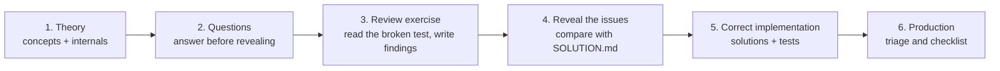

# Automated Testing

## Why this matters

Production code is only as changeable as its test suite is trustworthy. A suite that asserts *how* a
method is implemented fails on every refactor while missing the pricing defect that shipped; a suite
that mocks the HTTP boundary stays green while the provider renames its endpoint; a suite that waits
with `Thread.sleep` passes on a laptop and fails in CI; a suite that runs against an in-memory
substitute proves the substitute's semantics, not PostgreSQL's. Every one of these failures looks like
a green build and only surfaces in production — as a defect the safety net was supposed to catch.

Senior engineers are expected to choose the level of a test deliberately, know what a green suite
actually proves, and diagnose a flaky or lying suite under delivery pressure. This module builds that
judgement on the repository's real stack — JUnit 5, Mockito, AssertJ, Spring test slices,
Testcontainers, WireMock, Awaitility and ArchUnit — instead of on toy snippets.

## What this module covers

| Page | What it gives you |
|---|---|
| [Concepts](concepts.md) | The testing pyramid and test levels, test doubles, JUnit 5, AssertJ, Spring slices, Testcontainers, WireMock, Awaitility, database and messaging integration tests, determinism, fixtures and builders, ArchUnit, mutation testing and consumer-driven contracts |
| [Internals](internals.md) | JUnit Platform engines and extension callbacks, Mockito proxies and strict-stub detection, the Spring `TestContext` cache and its key, slice auto-configuration, `@ServiceConnection` property resolution, Testcontainers lifecycle and Ryuk, WireMock stub matching, the Awaitility polling loop, ArchUnit's bytecode import |
| [Questions](questions.md) | 23 interview questions — 8 basic, 8 intermediate, 5 senior, 2 scenarios — each with a hidden answer and its own dedicated example class |
| [Code review](code-review.md) | The six broken review targets, embedded clean, with the dimensions to consider and a collapsed reveal |
| [Solutions](solutions.md) | The correct implementation for each exercise, why it fixes the issue, and the trade-off it introduces |
| [Tests](tests.md) | What the module's unit, slice and container-backed tests prove, and how to run them |
| [Production](production.md) | Flaky-suite triage, mock-only suites hiding contract drift, container cost, and a production checklist |
| [Exercises](exercises.md) | Hands-on tasks with collapsed solutions |

## How to study this module

Work the six exercises in the order below. Each one is a test that *lies about what it proves*, and
each has a tested, production-grade counterpart. Read the review target, write your findings down
before expanding the reveal, then study the corrected suite and its tests.

## The six review exercises

| # | Exercise | What the broken suite proves instead | Correct counterpart | Code review |
|---|---|---|---|---|
| 1 | Asserting implementation instead of behaviour | That `CheckoutService` calls a mocked `PricingCalculator` in order — never that the customer is charged the right amount | `lab.testing.pricing` + `CheckoutServiceBehaviourTest` | [Review](code-review.md#asserting-implementation-not-behaviour) |
| 2 | Mocking away the integration | That a mocked `InventoryClient` returns a hand-written map — never the request path, the `Accept` header or the JSON field names | `lab.testing.fulfilment` + `OrderFulfilmentWireMockIT` | [Review](code-review.md#mocking-away-the-integration) |
| 3 | Shared mutable test fixtures | That one static fixture happens to hold what each test expects after the previous test mutated it | `lab.testing.orders` + `OrderTestData` builders | [Review](code-review.md#shared-mutable-test-fixtures) |
| 4 | Sleep-based async assertions | That the background work finished within a fixed delay on this machine, and never that a failure is distinguishable from a slow run | `lab.testing.async` + Awaitility-based tests | [Review](code-review.md#sleep-based-async-assertions) |
| 5 | Embedded substitute hides PostgreSQL semantics | That a case-insensitive map behaves like a case-sensitive unique index on PostgreSQL | `lab.testing.accounts` + `AccountRepositoryIT` on Testcontainers | [Review](code-review.md#embedded-substitute-hides-postgres-semantics) |
| 6 | Order-dependent test suite | That the method's position in the class matches the absolute value it asserts | `lab.testing.sequence` + independent tests | [Review](code-review.md#order-dependent-test-suite) |

## Correct implementations

Each exercise maps to a package under `modules/12-testing/src/main/java/lab/testing/` with tests in
`src/test` or `src/integrationTest`:

- `pricing` — a pure `PricingCalculator` used for real, an injectable `PaymentGateway` boundary, and a
  `CheckoutService` that returns the amount charged so a caller can assert on it.
- `fulfilment` — a typed `InventoryClient` over an injected `RestClient`, covered by a WireMock
  contract test instead of a mocked client.
- `orders` — immutable `Order`/`OrderLine` values and a stateless `OrderTotals`, with per-test
  builders in `OrderTestData`.
- `async` — `AsyncReportJob` with an injected executor and a `QUEUED`/`RUNNING`/`COMPLETED`/`FAILED`
  lifecycle, asserted with bounded Awaitility waits.
- `accounts` — an `AccountService` that normalises the email explicitly, tested against a real
  PostgreSQL container through a `@ServiceConnection` bean.
- `sequence` — `SequenceAllocator` with instance state, so each test constructs its own.

## Study progress

The canonical module table is in [Progress](../../progress.md); this page tracks the reading path.

| Step | Pages | State |
|---|---|---|
| Theory | [Concepts](concepts.md) · [Internals](internals.md) | ✅ |
| Interview questions | [Questions](questions.md) | 🟨 |
| Review exercises | [Code review](code-review.md) | 🟨 |
| Correct implementations | [Solutions](solutions.md) · [Tests](tests.md) | 🟨 |
| Production | [Production](production.md) | 🟨 |
| Practice | [Exercises](exercises.md) | 🟨 |

## Related

- [Testing concepts](concepts.md)
- [Testing internals](internals.md)
- [Testing interview questions](questions.md)
- [Progress](../../progress.md)
- [Interview checklist](../../interview-checklist.md)
- [Reliability issues](../../issues/reliability.md)
- [Database and JPA issues](../../issues/database.md)
- [Maintainability issues](../../issues/maintainability.md)
