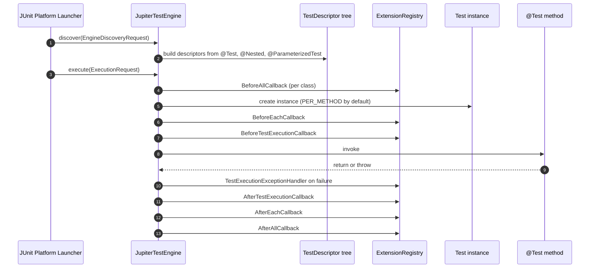
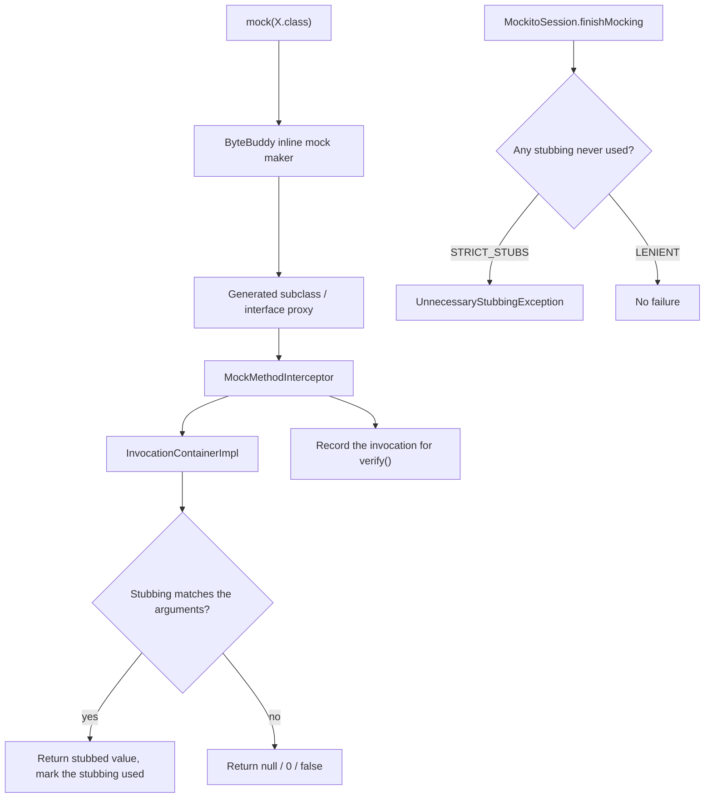
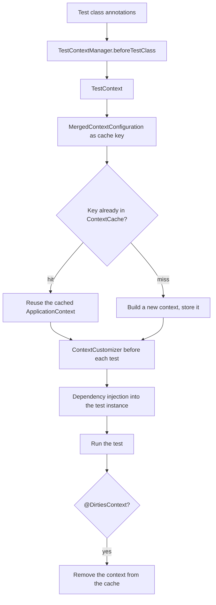
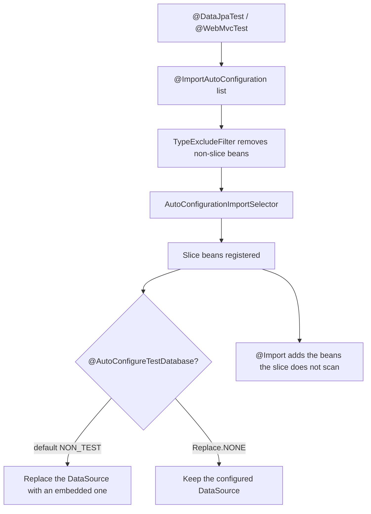
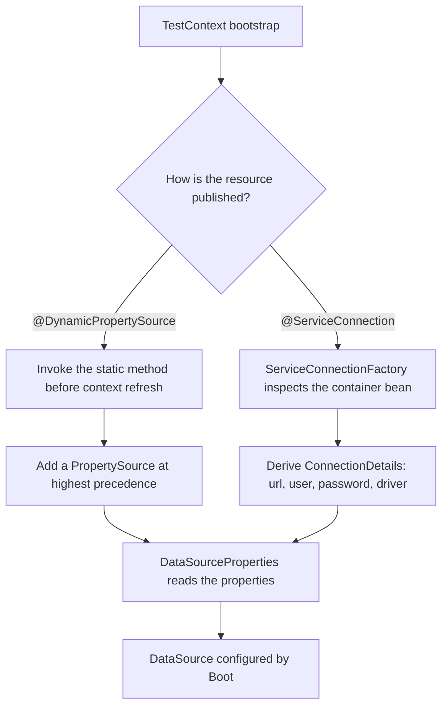
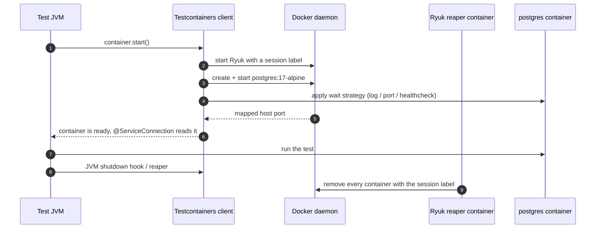
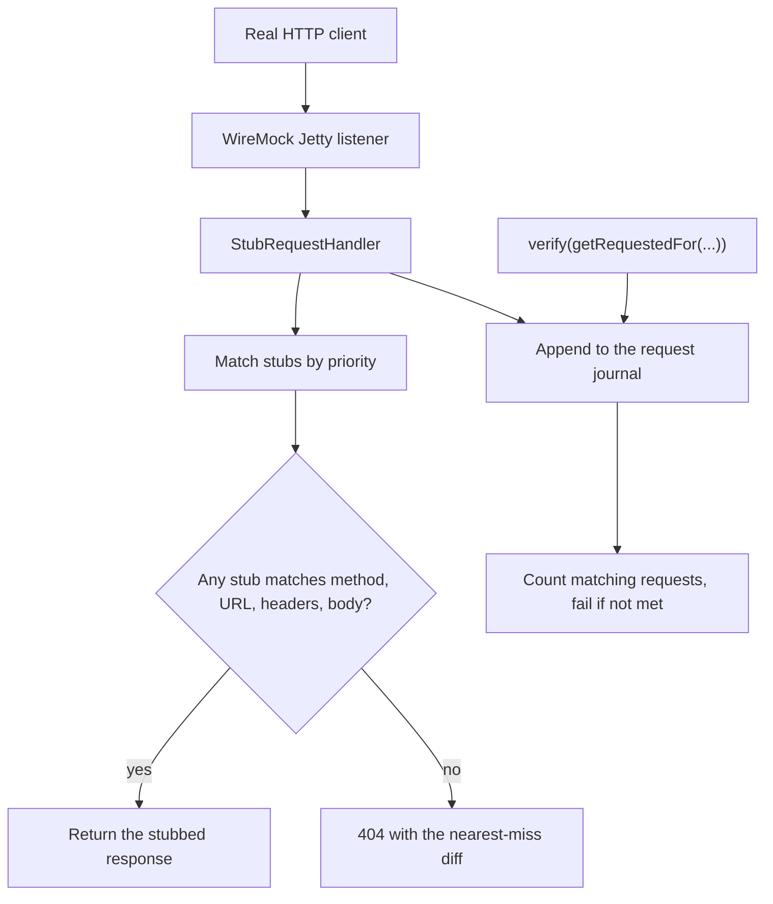
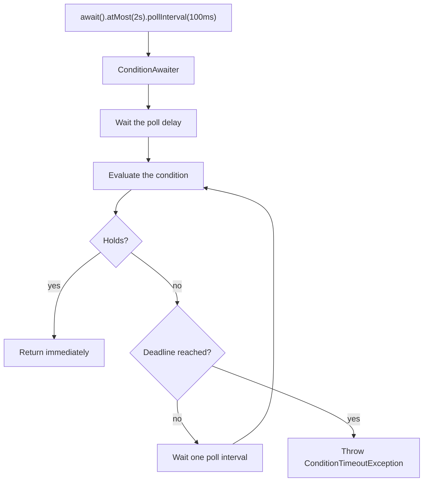
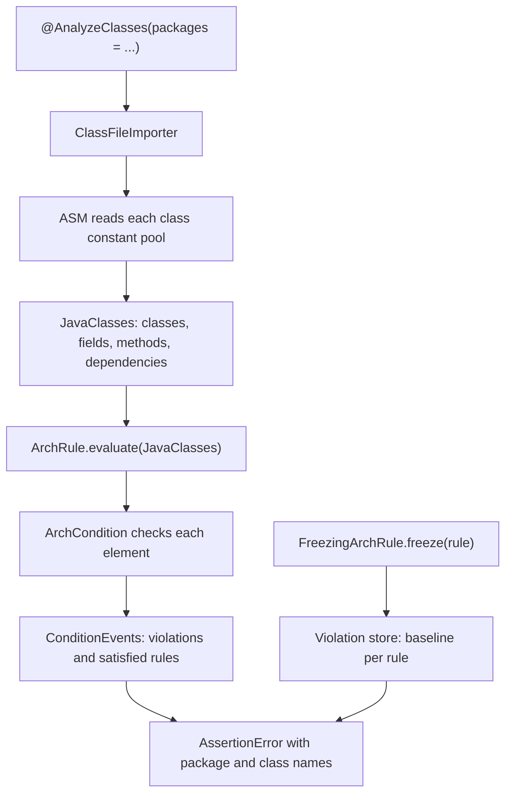

# Testing Internals

This page traces the machinery behind the libraries the module uses. Each section answers "what is
actually running when this annotation or assertion executes?", because that is the level at which a
green suite can be lying.

## 1. JUnit Platform: engines, discovery and the extension callback flow

JUnit 5 is three layers: the **Platform** (launcher, engines, discovery), the **Jupiter** engine that
runs `@Test` methods, and the **extensions** the engine calls back. A test class is never "run by
JUnit"; the launcher asks each registered engine to discover descriptors, then executes the tree.



| Extension callback | Fires | Used by |
|---|---|---|
| `BeforeAllCallback` / `AfterAllCallback` | Once per class | `@Testcontainers` starting a static container |
| `BeforeEachCallback` / `AfterEachCallback` | Around every test | `MockitoExtension` opening and finishing a `MockitoSession` |
| `BeforeTestExecutionCallback` / `AfterTestExecutionCallback` | Inside `@BeforeEach` | Timing, logging |
| `TestExecutionExceptionHandler` | On a thrown exception | Retry, exception translation |
| `TestInstancePostProcessor` | After the test instance is created | `MockitoExtension` injecting `@Mock` fields |
| `ParameterResolver` | Before each parameter is injected | `@Mock` method parameters, Spring's `@Autowired` in tests |
| `TestTemplateInvocationContextProvider` | Once per template | `ParameterizedTestExtension` producing one invocation per row |
| `InvocationInterceptor` | Around the invocation | Spring's `@Transactional` test support |
| `ExecutionCondition` | Before anything runs | `@EnabledIf`, `@Disabled` |

`@ParameterizedTest` is not a kind of `@Test`: it is annotated `@TestTemplate` and extended by
`ParameterizedTestExtension`, which implements `TestTemplateInvocationContextProvider`. Each row of a
`@CsvSource` or `@MethodSource` becomes its own dynamic descriptor with its own lifecycle, which is why
a fresh instance is created per invocation. `MockitoExtension` is a `TestInstancePostProcessor` (it
injects `@Mock` fields), a `ParameterResolver` (it injects `@Mock` parameters) and a
`BeforeEachCallback`/`AfterEachCallback` (it opens and finishes the session).

The extension and parameterized shapes are worked through in
[Concepts §7](concepts.md#7-junit-5-parameterized-tests-nesting-and-extensions).

??? question "Interview question"
    Where does `@Mock` get its value, and which extension callback finishes the `MockitoSession`? Why
    does each `@ParameterizedTest` row get its own instance?

---

## 2. Mockito: bytecode proxies and strict-stub detection

`mock(X.class)` does not create a Java proxy: the inline mock maker uses ByteBuddy to generate a
subclass (or an interface implementation) whose every method routes through a `MockMethodInterceptor`.
That interceptor records the invocation, looks up a matching stubbing, and returns the stubbed value or
the type's default.



| Strictness | What it checks | When it fails |
|---|---|---|
| `STRICT_STUBS` (extension default) | Unused stubbings, argument mismatch, stubbing misuse | `finishMocking()` after the test |
| `WARN` | Same checks, reported as warnings | Never fails |
| `LENIENT` | Nothing | Never fails |

Two consequences follow from the mechanism. First, a stubbing is *used* only if a call reaches it, so a
stub set up in `@BeforeEach` and needed by only one test fails the others. Second, because the proxy
returns the type's default when nothing matches, a typo in an argument matcher silently returns `null`
under `LENIENT` — the argument-mismatch detection is what makes it loud under `STRICT_STUBS`. A `spy`
is the same proxy wrapping a real instance: unmatched calls are delegated to the real object, which is
why a spy's real method still runs.

```java title="Q06MockitoStrictStubs.java"
--8<-- "modules/12-testing/src/examples/java/lab/testing/questions/Q06MockitoStrictStubs.java"
```

??? question "Interview question"
    Why does Mockito generate a subclass instead of using `java.lang.reflect.Proxy`? What makes a
    stubbing count as "used", and when does an argument mismatch become a failure rather than `null`?

---

## 3. Spring `TestContext` framework: caching and the context key

Spring does not start an application context per test class by accident — it caches contexts keyed by
their configuration. `TestContextManager` drives each phase, and `TestContext` looks the configuration
up in the `ContextCache`.



| Cache key component | Changed by |
|---|---|
| `locations` / `classes` | `@ContextConfiguration`, `@SpringBootTest(classes = ...)` |
| `activeProfiles` | `@ActiveProfiles` |
| `propertySourceLocations` / `propertySourceProperties` | `@TestPropertySource`, `properties = ...` |
| `contextInitializerClasses` | `@ContextConfiguration(initializers = ...)` |
| `contextCustomizers` | `@MockitoBean`/`@MockBean`, `@DynamicPropertySource`, `@Import`ed test configurations, slice annotations |
| `parent` | A `@Nested` class reusing the outer context |

The cache is bounded (32 contexts by default) and keyed by *equality* of that merged configuration.
Two test classes that declare the same annotations share one context; add a single `@MockitoBean` to
one of them and the key differs, so a second full context is built. `@DirtiesContext` evicts the entry,
and a cached context keeps whatever state the previous test left behind — which is why a test that
mutates the context is both slow and order-dependent.

```java title="Q11SliceTestContentsAndAutoConfiguration.java"
--8<-- "modules/12-testing/src/examples/java/lab/testing/questions/Q11SliceTestContentsAndAutoConfiguration.java"
```

??? question "Interview question"
    What exactly is the context cache key? Why does adding one `@MockitoBean` to a test class build a
    second context, and what does `@DirtiesContext` cost?

---

## 4. Slice auto-configuration: how a slice decides what to load

A slice is an annotation that declares a fixed list of auto-configurations and excludes the rest.
`@DataJpaTest`, for example, imports `@AutoConfigureDataJpa`, `@AutoConfigureTestDatabase` and
`@AutoConfigureTestEntityManager`, and the `@ImportAutoConfiguration` mechanism applies only those.



| Slice | Auto-configurations that matter | Excluded |
|---|---|---|
| `@WebMvcTest` | MVC, Jackson, `@ControllerAdvice`, security filters | `@Service`, `@Repository`, JPA |
| `@DataJpaTest` | DataSource, JPA/Hibernate, Spring Data repositories, transaction manager | Web layer, services |
| `@JsonTest` | Jackson auto-configuration and `JacksonTester` | Everything else |
| `@RestClientTest` | `RestTemplate`/`RestClient` builder, `MockRestServiceServer` | Server side |
| `@SpringBootTest` | Every auto-configuration; the slice's `@ImportAutoConfiguration` narrowing is not applied | Nothing |

Two details decide whether a slice test is honest. `@DataJpaTest` defaults to
`@AutoConfigureTestDatabase(replace = Replace.NON_TEST)`, which swaps the configured `DataSource` for
an embedded one — a test that believes it runs on PostgreSQL must set `Replace.NONE` and supply a real
container. And a slice does not component-scan the application, so the service under test must be
`@Import`ed; each such import changes the context key and can cost a context rebuild.

??? question "Interview question"
    Which annotation narrows the auto-configurations a slice applies? Why does `@DataJpaTest` replace
    the `DataSource` by default, and what do you add to keep the real one?

---

## 5. Property resolution: `@DynamicPropertySource` vs `@ServiceConnection`

Both make a test's configuration depend on a running resource, but at different points and with
different amounts of glue.



| Aspect | `@DynamicPropertySource` | `@ServiceConnection` |
|---|---|---|
| Invocation | A static method, called before the context refreshes | A bean post-processor on the container bean |
| What the test writes | Every property key and value by hand | Nothing — Boot derives them from the container |
| Supported resources | Anything | Containers with a registered `ConnectionDetailsFactory` (JDBC, Kafka, RabbitMQ, Redis) |
| Effect on the context key | Adds a `ContextCustomizer` | Adds a `ContextCustomizer` |

The module's container is hand-started as a JVM singleton (so its lifecycle is not managed by
`@Testcontainers`) and published as a `@ServiceConnection` bean, which is why the test never writes a
JDBC URL:

```java title="SharedPostgresContainer.java"
--8<-- "modules/test-support/src/main/java/lab/testsupport/SharedPostgresContainer.java"
```

```java title="TestingJpaConfiguration.java"
--8<-- "modules/12-testing/src/integrationTest/java/lab/testing/accounts/TestingJpaConfiguration.java"
```

??? question "Interview question"
    What does `@ServiceConnection` derive that `@DynamicPropertySource` makes the test write? Why must a
    hand-started singleton *not* carry `@Testcontainers`?

---

## 6. Testcontainers lifecycle and Ryuk

`new PostgreSQLContainer<>(...)` constructs an object; `start()` contacts the Docker daemon, creates
and starts the container, waits for the configured wait strategy, and reads the mapped ports. Ryuk, a
small reaper container started by the Testcontainers client, removes every labelled container when the
JVM's session ends — including when the JVM is killed.



| Lifecycle | Declared by | Container started | Cost |
|---|---|---|---|
| Per test method | instance `@Container` field + `@Testcontainers` | Once per method | Highest; a container per test |
| Per test class | `static @Container` field + `@Testcontainers` | Once per class | Moderate |
| Per JVM (singleton) | Hand-started, published as a bean | Once per JVM | Lowest; shared by every class |

Container startup dominates a Docker-backed suite, so the module uses the singleton: one
`postgres:17-alpine` for the whole JVM, with `start()` guarded by a `synchronized` accessor so parallel
classes cannot start two. The trade-off is that tests share database state, so each test must own the
data it asserts on.

```java title="Q19TestcontainersInCiAtScale.java"
--8<-- "modules/12-testing/src/examples/java/lab/testing/questions/Q19TestcontainersInCiAtScale.java"
```

??? question "Interview question"
    What does Ryuk do, and what happens to the containers if the test JVM is killed with `kill -9`?
    Why is a per-JVM singleton cheaper than a per-class container, and what does it cost you?

---

## 7. WireMock: stub matching and verification

WireMock is a real HTTP server: a request arrives at its Jetty listener, the stub request handler walks
the registered stub mappings in priority order, and the first mapping whose request pattern matches
produces the response. Every request is also appended to a journal, which is what `verify` counts.



A stub is a *matching rule*, not a function call: `get(urlEqualTo("/inventory/A-1"))` matches the
method and the exact path, `withHeader("Accept", equalTo(...))` adds a header condition, and the body
is compared only when a body matcher is supplied. A near miss — a case-different path, a missing
header — matches nothing and returns `404 Request was not matched`, which is why a wrong endpoint fails
the test loudly instead of returning an empty body. Verification is the mirror image: it counts the
journal entries matching a request pattern, so
`verify(getRequestedFor(urlEqualTo(...)).withHeader("Accept", equalTo(...)))` is what proves the client
sent the request the contract describes.

```java title="Q14WiremockStubbingAndVerification.java"
--8<-- "modules/12-testing/src/examples/java/lab/testing/questions/Q14WiremockStubbingAndVerification.java"
```

??? question "Interview question"
    How does WireMock decide which stub answers a request, and what happens when none matches? What
    does `verify` read, and why does that make it a contract assertion rather than a mock interaction?

---

## 8. Awaitility: the polling loop and condition evaluation

`await()` returns a `ConditionFactory`, and a terminal condition turns it into a `ConditionAwaiter`
that polls until the condition holds or the ceiling is reached.



`untilAsserted(...)` wraps the whole assertion chain in a `ThrowingRunnable`: between polls an
`AssertionError` is swallowed and the wait continues, while any other exception aborts the wait
immediately unless `ignoreExceptions()` names it. That is why a failing assertion is re-evaluated
rather than reported on the first poll, and why `atMost` is a ceiling — the fast path costs one poll
delay plus a poll interval, not the full two seconds. `pollDelay` defaults to the poll interval
(100 ms) and `pollInterval` defaults to 100 ms; `failFast(...)` short-circuits when the condition can
no longer become true.

```java title="Q13AwaitilityPollingMechanics.java"
--8<-- "modules/12-testing/src/examples/java/lab/testing/questions/Q13AwaitilityPollingMechanics.java"
```

??? question "Interview question"
    Why is `atMost` not a delay? What does `untilAsserted` swallow between polls, and which exceptions
    abort the wait?

---

## 9. ArchUnit: bytecode import and rule evaluation

ArchUnit never runs the application: it imports the compiled `.class` files with ASM, builds a graph of
`JavaClass` nodes and their dependencies, and evaluates a rule over that graph.



Because the dependency graph comes from the constant pool, ArchUnit sees a dependency that no test
exercises — an unused import, a field type, a method signature. A rule is a sentence built from
`noClasses().that()...should().dependOnClassesThat()...`, `layeredArchitecture()` for a direction
between layers, or `slices()` for cycles between feature slices. `FreezingArchRule` records the
violations a rule produces today in a store and fails only on *new* ones, which lets a legacy codebase
adopt a rule without a big-bang fix.

```java title="Q16ArchunitRulesAndPackageDependencies.java"
--8<-- "modules/12-testing/src/examples/java/lab/testing/questions/Q16ArchunitRulesAndPackageDependencies.java"
```

??? question "Interview question"
    Where does ArchUnit get the dependency information, and why can it catch a coupling that no
    behavioural test exercises? What does `FreezingArchRule` store between runs?

---

## Related

- [Testing concepts](concepts.md)
- [Testing overview](index.md)
- [Code review](code-review.md)
- [Solutions](solutions.md)
- [Production](production.md)
- [Reliability issues](../../issues/reliability.md)
- [Maintainability issues](../../issues/maintainability.md)
