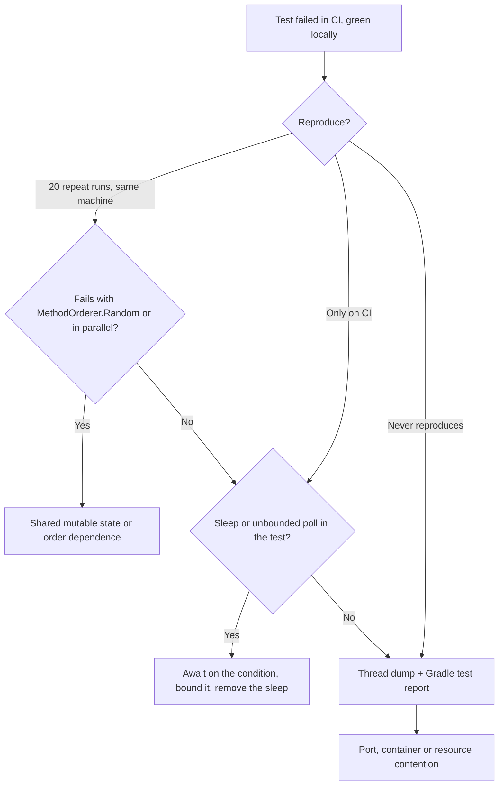

# Testing in Production

A green suite is an operational asset only while it tells the truth. This page covers the production
failures a test suite itself causes — flakes, contract drift, container cost — how to diagnose each
one, and the checklist that keeps a suite trustworthy as it grows.

## 1. Triaging a flaky suite

A flake is a test whose result depends on something other than the code under test: execution order,
wall-clock timing, shared state, machine speed, or a port. The first job is to classify it, because
"flaky" is a symptom and the fix depends on the cause.



### Repeat the exact test, not the suite

```bash
# Isolate first: run only the suspect class, forcing a fresh execution.
./gradlew :modules:12-testing:test --tests 'lab.testing.async.AsyncReportJobTest' --rerun-tasks

# One method, to prove it passes alone (an order-dependent test fails here).
./gradlew :modules:12-testing:test --tests 'lab.testing.orders.OrderTotalsTest.total_multipleLines_sumsEveryLine' --rerun-tasks

# Repeat: 20 forced runs surface a race that a single run hides.
for i in $(seq 1 20); do
  ./gradlew :modules:12-testing:test --tests 'lab.testing.async.AsyncReportJobTest' --rerun-tasks -q \
    || echo "FAILED on run $i"
done
```

`--rerun-tasks` matters: without it Gradle reports `UP-TO-DATE` and the flake never gets a chance to
recur. Replacing the orderer or enabling parallelism turns an order-dependent class red immediately:

```bash
./gradlew :modules:12-testing:test -Djunit.jupiter.testmethod.order.default=org.junit.jupiter.api.MethodOrderer\$Random
./gradlew :modules:12-testing:test -Djunit.jupiter.execution.parallel.enabled=true
```

### Thread dumps for a hang

A test that never returns produces no assertion message — the build dies on the CI timeout. Take a
thread dump of the test worker before killing it and look for the state the test was waiting on:

```bash
jps -l | grep -i 'GradleWorkerMain'          # find the test worker
jstack <pid> > /tmp/test-worker.txt          # dump every thread
grep -A 15 'lab.testing' /tmp/test-worker.txt # the test's own frame and what it holds
```

A worker parked in `Thread.sleep` or an unbounded `while` loop is a synchronisation bug in the test,
not an infrastructure flake; a worker blocked in `SocketInputStream.read` or
`PostgreSQLContainer.start` is a resource or container problem. The JUnit XML under
`modules/12-testing/build/test-results/` records the last state and the timeout, which is the cheapest
signal to read first.

### Order dependence

- Run the class with `MethodOrderer.Random` for a handful of runs and run each method with
  `--tests 'Class.method'`. A class that only passes whole and in order is order-dependent — see
  [order-dependent test suite](code-review.md#order-dependent-test-suite).
- Grep for the two patterns that cause it: `@TestMethodOrder`/`@Order` on a class that shares no
  started resource, and `static` fields of a mutable type in test or production sources.
- Never "fix" order dependence by adding an orderer; remove the shared state, or make the genuinely
  shared resource explicit with `@BeforeAll` or an extension.

## 2. Mock-only suites hide contract drift

The most expensive suite failure is the one that never happens. A test that mocks the outbound client
proves that the service agrees with the test's own stub — not with the provider. When the provider
renames an endpoint or a field, the suite stays green and the defect ships.

Symptoms and detection:

- A `@Mock` on a class whose name ends in `Client`, `Gateway`, `Repository` or `Api` and whose method
  performs I/O.
- Ask of every mocked boundary: **"if the remote contract changed, which test would fail?"** If the
  answer is "none", the boundary is mocked away.
- The production symptom is a wave of 404s, 406s or deserialization `NullPointerException`s right
  after a provider release, with a fully green pipeline.

Remediation: replace the boundary with a stub server (WireMock) and assert the recorded request — path
and headers — while Jackson binds a real payload. Keep the client thin and reserve mocks for
collaborators that perform no I/O. The worked example is
[mocking away the integration](code-review.md#mocking-away-the-integration).

## 3. Sleep-based waits

`Thread.sleep` and unbounded polling loops are the largest single source of CI flakes:

| Pattern | What fails in production CI | Fix |
|---|---|---|
| `Thread.sleep(n)` before an assertion | Passes locally, fails on a loaded runner because the worker lost the race; also passes if the work ran synchronously, so the async contract is never verified | Awaitility `await().atMost(...).pollInterval(...).untilAsserted(...)` on the state under test |
| `while (status != EXPECTED) { Thread.sleep(50); }` | A `FAILED` or stuck report keeps the loop spinning until the CI job timeout kills the build, with no assertion message | A bounded `await().atMost(...)`, which fails with the last observed status |
| A sleep literal copied from a production constant | Change the production timing and the tests fail; shorten it and the sleeps stay behind | Wait on the condition, or release a latch where the transition itself is the subject |

Detection: grep the test sources for `Thread.sleep`, `TimeUnit.*.sleep`, `LockSupport.park` and
`Thread.yield`, and for `while` loops with no counter or deadline. Sum the sleep arguments and compare
that with the suite's runtime — a suite dominated by sleeps is paying for its own flakiness. Do not
raise `atMost` to make a failure go away: the first `ConditionTimeoutException` in CI is a real defect
until proven otherwise. See [sleep-based async assertions](code-review.md#sleep-based-async-assertions).

## 4. Fixture leakage

Shared mutable fixtures make one test's output another test's input, so the suite's result depends on
what ran before it and a failure is attributed to the wrong test.

- **Symptom.** The class is green as a whole, red when a single method runs or when the orderer
  changes; a failure message points at a test that never touched the data.
- **Detection.** List every `static` mutable field in the test sources and answer "who resets this, and
  when?" — a fixture class of only static mutable members and a private constructor is the pattern. Run
  the class twice in the same JVM and with `MethodOrderer.Random`.
- **Fix.** Build the data a test asserts on inside that test (a fluent builder that returns a fresh
  value), make the value types copy defensively, and share only immutable values or genuinely expensive
  started resources. A shared container is legitimate; a shared *mutable* list of test data is not. See
  [shared mutable test fixtures](code-review.md#shared-mutable-test-fixtures).

## 5. Embedded-substitute divergence

An in-memory repository (or H2 in `MODE=PostgreSQL`) substitutes a different engine's semantics for the
ones the service ships against: matching, collation, constraints, ordering, type coercion, isolation.
The suite then proves the service works against the substitute, and defects in the real store's
semantics are invisible.

- **Symptom.** A lookup that the suite answers returns nothing in production; two rows exist for one
  business key; a query "proven" by the suite fails on PostgreSQL.
- **Detection.** For every hand-written repository double, list the guarantees of the real repository
  and ask which the double reproduces "for free". Compare assumptions about matching, ordering and
  constraints with the schema, the index definition and the query.
- **Fix.** Test persistence semantics — constraints, collation, ordering, transaction boundaries —
  against the real engine through Testcontainers, with `@AutoConfigureTestDatabase(replace =
  Replace.NONE)` so Boot cannot swap the DataSource for an embedded one. The repository's uniqueness
  rule belongs in a database constraint, not in a read-then-write check. See
  [embedded substitute hides Postgres semantics](code-review.md#embedded-substitute-hides-postgres-semantics).

## 6. Container startup cost and Ryuk

Docker-backed tests trade speed for fidelity. The costs and the levers:

| Cost | Symptom | Lever |
|---|---|---|
| Container start per test class | `integrationTest` takes minutes; most of it is container start-up | Share one started container per JVM through `modules/test-support` (`SharedPostgresContainer.instance()`) |
| Container left running after the JVM | Containers accumulate on the runner; the next job is slow or the daemon runs out of resources | Testcontainers' Ryuk reaper removes them on JVM exit — the runner must allow the Ryuk connection, or use a JVM shutdown-hook strategy where Ryuk is unavailable |
| Wrong engine version | Semantics asserted against an image that differs from production | Pin the image (`postgres:17-alpine`) and the Testcontainers Docker API version |
| A stuck container start | The test hangs before any assertion | Give the start a bounded wait and read the JUnit XML / thread dump; a hang is not an assertion failure |
| A test that assumes an empty database | Green in isolation, red when a class shares the container | Use `create-drop` for the slice and write assertions for the rows each test inserts |

Ryuk is a sidecar container that watches the JVM's connection and reaps the containers when the JVM
dies, including on a crash. Where the CI environment forbids the extra container, Testcontainers can
fall back to a JVM shutdown hook (`TESTCONTAINERS_RYUK_DISABLED=true`) — but then a killed job can
leak containers, so the runner must clean up itself. Keeping `build` Docker-free means the common
development loop never pays any of these costs.

## 7. Production checklist

- [ ] `./gradlew build` (unit tests + `compileExamples` + `compileBrokenExamples`) passes with no Docker
      daemon available.
- [ ] `./gradlew :modules:12-testing:integrationTest` passes with a Docker daemon and Ryuk reachable.
- [ ] No `Thread.sleep`, `TimeUnit.*.sleep`, `LockSupport.park` or unbounded `while` poll in any test.
- [ ] Every asynchronous assertion uses Awaitility with an explicit `atMost` bound and polls the state
      under test, not a proxy.
- [ ] Every asynchronous state machine has a test that reaches each terminal state, including the
      failure state.
- [ ] Every outbound HTTP boundary has a contract test against a stub server that asserts the request
      path and headers, and binds a real payload.
- [ ] Every persistence test that asserts matching, collation, ordering or constraints runs against
      PostgreSQL (Testcontainers), never H2 or a hand-written map.
- [ ] No `static` mutable field in test or fixture sources; every test builds the data it asserts on.
- [ ] No `@TestMethodOrder`/`@Order` on a class that shares no started resource; the suite passes with
      `MethodOrderer.Random` and with JUnit parallel execution enabled.
- [ ] The suite is run repeatedly (`--rerun-tasks`, ≥ 20 iterations) before a flaky test is written off
      as infrastructure.
- [ ] Container images and the Testcontainers Docker API version are pinned, and the shared container
      is published as a `@ServiceConnection` bean with `replace = Replace.NONE` on the slice.

## Related

- [Tests](tests.md)
- [Solutions](solutions.md)
- [Code review](code-review.md)
- [Reliability issues](../../issues/reliability.md)
- [Maintainability issues](../../issues/maintainability.md)
- [Database and JPA issues](../../issues/database.md)
- [Interview questions: CI intermittent failure scenario](questions.md#22-a-test-class-is-green-locally-but-red-in-3-of-20-ci-runs-always-with-address-already-in-use-how-do-you-diagnose-and-fix-it)
