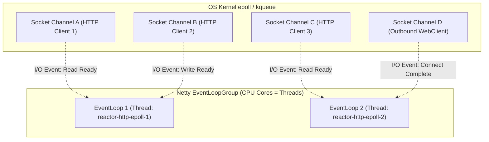
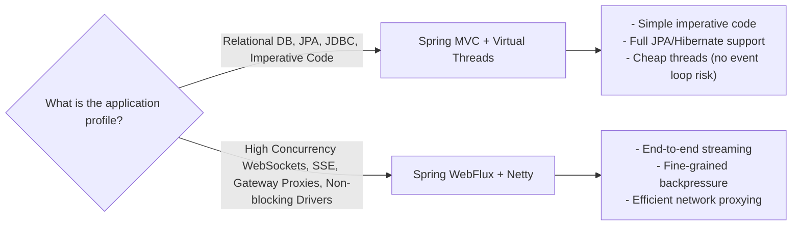

# WebClient & WebFlux Concepts

## 1. Blocking vs Non-Blocking I/O

Traditional Java web servers (e.g., standard Tomcat running Spring MVC) assign a dedicated operating system thread to each incoming HTTP request. When the application performs I/O—such as querying a relational database via JDBC or calling an external microservice via HTTP—the thread executes a blocking socket read:

```text
Thread state: RUNNABLE ──(Socket read)──> TIMED_WAITING / BLOCKED (Idle in OS kernel)
```

While waiting for downstream packets, the OS thread cannot perform any other useful work. Operating system threads carry significant overhead:
- **Stack memory**: Each JVM thread allocates between 512 KB and 1 MB of native stack memory. 10,000 idle threads consume 5–10 GB of RAM solely for thread stacks.
- **Context switching**: The OS scheduler incurs high CPU cache thrashing when descheduling and resuming thousands of blocked threads.

Non-blocking I/O (NIO) inverts this relationship. Using operating system multiplexers (`epoll` on Linux, `kqueue` on macOS), a single event loop thread monitors thousands of open sockets simultaneously. The thread only executes application code when an OS readiness event signals that bytes have arrived in the socket buffer.

## 2. Netty Event Loop Architecture

Spring WebFlux runs by default on an embedded Netty runtime:



In Netty:
- Each incoming TCP connection is bound to a single `EventLoop` channel for its entire lifetime.
- The `EventLoop` runs in a continuous loop: polling OS selector events, executing non-blocking channel pipeline handlers, and running queued tasks.
- Because there are typically only 1 thread per CPU core (e.g. 8 threads on an 8-core CPU), **blocking an event loop thread freezes an entire slice of the application**.

## 3. The Reactive Streams Specification

Reactive Streams is an initiative providing a standard for asynchronous stream processing with non-blocking backpressure. It defines four core interfaces:

1. **`Publisher<T>`**: Emits a sequence of items to registered subscribers:
   ```java
   public interface Publisher<T> {
       void subscribe(Subscriber<? super T> s);
   }
   ```
2. **`Subscriber<T>`**: Receives stream events and backpressure signals:
   ```java
   public interface Subscriber<T> {
       void onSubscribe(Subscription s);
       void onNext(T t);
       void onError(Throwable t);
       void onComplete();
   }
   ```
3. **`Subscription`**: Represents the 1-to-1 link between a `Publisher` and a `Subscriber`:
   ```java
   public interface Subscription {
       void request(long n); // Downstream demands n elements (backpressure)
       void cancel();        // Downstream stops listening
   }
   ```
4. **`Processor<T, R>`**: Combines both `Subscriber<T>` and `Publisher<R>` to serve as a transformation stage.

## 4. Project Reactor: Mono and Flux

Project Reactor is the default reactive library underpinning Spring WebFlux. It implements Reactive Streams via two primary publishers:

- **`Mono<T>`**: Emits **0 or 1** element, followed by either an `onComplete` or `onError` signal. Used for single-value operations (HTTP request/response, database entity fetch by ID).
- **`Flux<T>`**: Emits **0 to N** elements, followed by a terminal `onComplete` or `onError` signal. Used for streaming collections, pagination, message queues, and SSE.

### The Three Pipeline Phases

1. **Assembly Time**: Operators are chained together (`flux.filter(...).map(...)`). No computation runs; Reactor merely constructs a graph of wrapper publisher objects.
2. **Subscription Time**: A terminal subscriber calls `.subscribe()` (or Spring WebFlux subscribes on behalf of an incoming HTTP request). The subscription signal traverses upstream through the publisher chain via `onSubscribe()`.
3. **Execution / Runtime**: The subscriber requests items via `subscription.request(n)`. Upstream publishers emit elements downstream via `onNext()`.

## 5. Backpressure and Overflow Strategies

Backpressure prevents a fast publisher from overwhelming a slow subscriber. The subscriber controls flow rate by invoking `request(n)`. If upstream generates items independently of downstream demand (such as real-time market feeds or message queues), Reactor provides explicit overflow strategies:

| Strategy | Operator | Behavior | Trade-off |
|---|---|---|---|
| **Buffer** | `.onBackpressureBuffer(maxSize)` | Queues unrequested items in memory | Absorbs bursts; risks `OutOfMemoryError` if consumer permanently lags |
| **Drop** | `.onBackpressureDrop(consumer)` | Discards items that exceed current demand | Zero memory growth; leads to data loss for discarded items |
| **Latest** | `.onBackpressureLatest()` | Retains only the single most recently emitted item | Subscriber always receives freshest state; drops intermediate history |
| **Error** | `.onBackpressureError()` | Emits an `Exceptions.failWithOverflow()` error | Fails fast; terminates the stream on saturation |

## 6. WebClient: Non-Blocking Reactive HTTP

`WebClient` is Spring's modern non-blocking alternative to `RestTemplate`. Built on Reactor Netty, it multiplexes outbound HTTP/1.1 and HTTP/2 requests over asynchronous TCP channels without holding thread resources while waiting for responses.

### Critical WebClient Invariants

1. **Reactor Netty HttpClient Configuration**: Never rely on default `WebClient.builder()` in production without explicitly configuring `ReactorClientHttpConnector`. Default Netty `HttpClient` instances have unbounded response timeouts and default 30-second connection timeouts.
2. **Connection Pool Limits**: Netty's default connection pool allows 500 connections per remote host. Under high concurrent load, unconstrained `flatMap` fan-out can easily exceed this limit, leading to `PoolAcquireTimeoutException`.

## 7. Reactor Threading Model and Schedulers

While reactive pipelines default to executing on the calling thread (or Netty event loops for I/O), computational and blocking workloads must be explicitly directed to specialized thread pools using `Schedulers`:

- **`Schedulers.parallel()`**: A fixed-size thread pool sized to available CPU cores (`Runtime.getRuntime().availableProcessors()`). Intended for CPU-intensive computation (JSON parsing, cryptography, sorting).
- **`Schedulers.boundedElastic()`**: An elastic, dynamically sized worker pool (defaulting to $10 \times \text{CPU cores}$ with a maximum queue cap of 100,000 tasks). Designed specifically for wrapping legacy blocking operations (JDBC queries, file I/O, synchronous SDKs).
- **`Schedulers.single()`**: A single, reusable background thread for serialized or periodic operations.
- **`Schedulers.immediate()`**: Executes tasks immediately on the calling thread without initiating a context switch.

### `subscribeOn` vs `publishOn`

- **`subscribeOn(Scheduler)`**: Directs the *entire upstream pipeline* (from initial source generation up to the subscriber) to execute on the specified scheduler, regardless of where `subscribeOn` is placed in the assembly chain.
- **`publishOn(Scheduler)`**: Switches execution thread for all *subsequent downstream operators* in the pipeline starting from that point forward.

## 8. Detecting Blocking Calls: BlockHound

Because Netty event loops must never block, accidental synchronous calls (`Thread.sleep()`, synchronous logging, JDBC queries, `UUID.randomUUID()` secure socket reads) degrade system throughput.

[BlockHound](https://github.com/reactor/BlockHound) is a Java agent developed by the Reactor team. It uses ByteBuddy at JVM initialization to instrument known blocking methods across the JDK (such as `SocketInputStream.read()`, `FileInputStream.read()`, and `Thread.sleep()`). When any instrumented method is invoked from a thread implementing `reactor.core.scheduler.NonBlocking` (such as Netty event loop threads), BlockHound immediately throws:

```text
reactor.blockhound.BlockingOperationError: Blocking call! java.lang.Thread.sleep
    at java.base/java.lang.Thread.sleep(Thread.java)
    at lab.webflux.MyService.badMethod(MyService.java:24)
    at reactor.core.publisher.MonoCallable.call(MonoCallable.java:92)
```

Integrating BlockHound into unit and integration test suites guarantees that blocking code paths are caught before shipping to production.

## 9. R2DBC vs JDBC: The Persistence Trade-Off

Traditional Relational Database Management Systems (PostgreSQL, MySQL, Oracle) were designed around synchronous client-server wire protocols. Standard JDBC drivers use synchronous socket reads.

**R2DBC (Reactive Relational Database Connectivity)** is an open specification for non-blocking database drivers:

| Feature | JDBC / JPA (Hibernate) | R2DBC (Spring Data R2DBC) |
|---|---|---|
| **I/O Model** | Blocking socket reads per query | Fully non-blocking event-driven (Netty) |
| **Concurrency Model** | Requires 1 OS thread per checked-out connection | Thousands of queries multiplexed over small connection pool |
| **ORM Capabilities** | Entity graphs, lazy loading, dirty checking, caching | Simple tabular mapping (`DatabaseClient`, records); no ORM |
| **Transaction Boundary** | `@Transactional` bound to `ThreadLocal` connection | Reactive `@Transactional` bound to Reactor `Context` |
| **Ecosystem Maturity** | Decades of battle-tested tooling, Flyway, Liquibase | Smaller driver ecosystem; no Hibernate support |

## 10. Spring WebFlux vs Spring MVC with Virtual Threads (Java 21+)

With the release of Java 21 and Project Loom, developers have two distinct paradigms for scalable backend architectures:



### When to Choose Spring MVC + Virtual Threads
- The application relies heavily on relational databases via JPA/Hibernate.
- The business logic is complex, procedural, and difficult to model as a reactive stream.
- The engineering team wants to retain traditional imperative debugging (straightforward stack traces and thread dumps).

### When to Choose Spring WebFlux
- Building high-throughput API gateways or edge proxies (e.g., Spring Cloud Gateway) that multiplex tens of thousands of connections.
- Streaming real-time updates to browsers or clients via Server-Sent Events (SSE) or WebSockets.
- Orchestrating multiple external non-blocking microservices where backpressure and complex reactive operators (`zip`, `combineLatest`, `window`) are required.

## Related

- [Internals](internals.md) — Netty channel pipeline and Reactor execution graph internals
- [Code Review](code-review.md) — Real-world anti-patterns in reactive Spring pipelines
- [Solutions](solutions.md) — Production-grade non-blocking implementations
- [Questions](questions.md) — Senior interview questions on WebFlux and reactive systems
