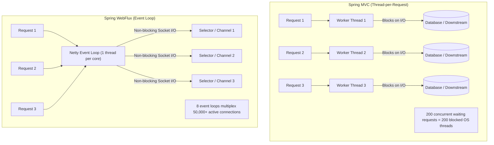

# WebClient / WebFlux

In traditional Servlet-based applications (Spring MVC), concurrency is managed via a thread-per-request model. While simple to reason about, allocating an operating system thread per connection becomes prohibitive when handling tens of thousands of concurrent long-lived connections, high-frequency microservice orchestration, or Server-Sent Events (SSE).

Spring WebFlux and Project Reactor provide an asynchronous, fully non-blocking reactive foundation built on the Reactive Streams specification and Netty's event loop architecture.

## Architectural Overview

The core difference between the Spring MVC thread-per-request model and the Spring WebFlux event loop:

## Key Invariants

1. **The Cardinal Rule: Never Block the Event Loop**: Netty allocates a tiny fixed pool of event loop worker threads (typically 1 per CPU core). A single blocking call (`.block()`, `Thread.sleep()`, synchronous JDBC) freezes that core, halting request processing for thousands of multiplexed sockets.
2. **Assembly vs Subscription**: In Project Reactor, "nothing happens until you subscribe". Declaring a reactive chain only builds the assembly execution graph. Execution begins only when a subscriber demands elements.
3. **Reactive Streams Backpressure Contract**: Consumers signal demand to upstream publishers via `Subscription.request(n)`. Publishers must never emit more items than requested, preventing out-of-memory buffer blowups.
4. **Explicit Concurrency Limits on `flatMap`**: The default `Flux.flatMap` operator eagerly launches 256 parallel inner publishers (`Queues.SMALL_BUFFER_SIZE`). Unbounded fan-out saturates downstream connection pools and triggers `PoolAcquireTimeoutException`. Always supply an explicit concurrency bound.
5. **Multi-Layer Timeout Enforcement**: Reactive clients require both transport-level channel timeouts (connect and response timeouts on Netty `HttpClient`) and stream-level operator deadlines (`.timeout(Duration)`).
6. **Error Isolation in Stream Composition**: In Reactive Streams, `onError` is terminal. Combining multiple parallel publishers with `Mono.zip()` aborts the entire stream if any single branch fails without an explicit fallback (`.onErrorReturn()`, `.onErrorResume()`).

## Module Sections

| Section | Focus |
|---|---|
| [Concepts](concepts.md) | Event loops, Reactive Streams, Mono/Flux, backpressure, Schedulers, BlockHound, R2DBC vs JDBC, WebFlux vs Virtual Threads |
| [Internals](internals.md) | Netty event loop polling, Reactor operator assembly, `subscribeOn` vs `publishOn` pipelines, connection pool state machines |
| [Interview Questions](questions.md) | 23 interview questions across Basic, Intermediate, Senior, and Production Incident tiers |
| [Code Review](code-review.md) | 5 realistic broken review targets: `.block()` in request flow, blocking JDBC, uncontrolled flatMap, missing timeouts, and unhandled errors |
| [Solutions](solutions.md) | Correct non-blocking implementations, trade-offs, and failure mode analyses |
| [Tests](tests.md) | Testing reactive streams with `StepVerifier`, virtual time manipulation, and WireMock integration tests |
| [Production](production.md) | Production diagnostic runbooks: event loop starvation, Netty connection pool exhaustion, memory leak triage |
| [Exercises](exercises.md) | Hands-on engineering challenges: resilient multi-source aggregator and legacy blocking repository adapter |

## Related

- [Spring MVC](../spring-mvc/index.md) — Thread-per-request architecture and RestClient synchronous semantics
- [Concurrency](../concurrency/index.md) — Java memory model, thread pools, and Virtual Threads
- [Resilience](../resilience/index.md) — Circuit breakers, rate limiters, and bulkhead patterns
- [Testing](../testing/index.md) — Mocking strategies, contract testing, and Testcontainers
