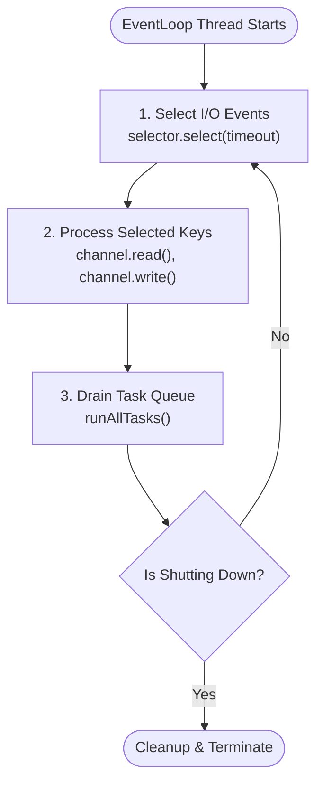
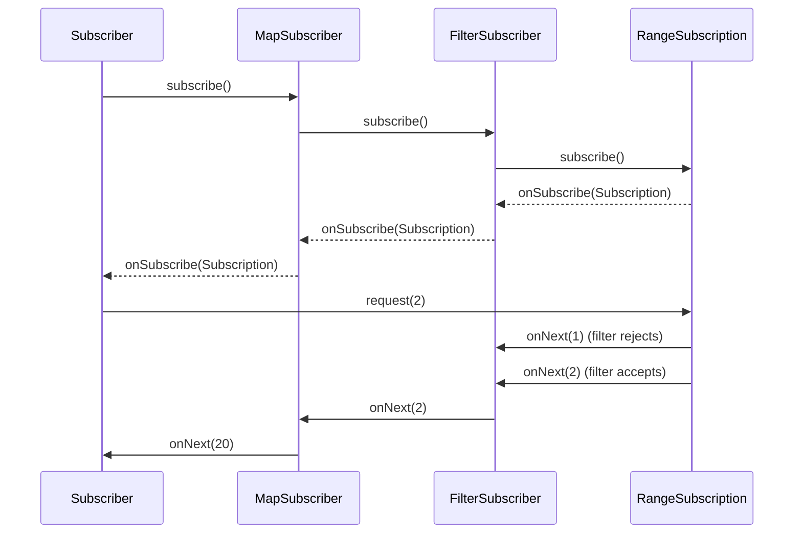
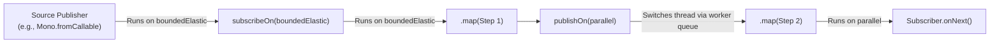
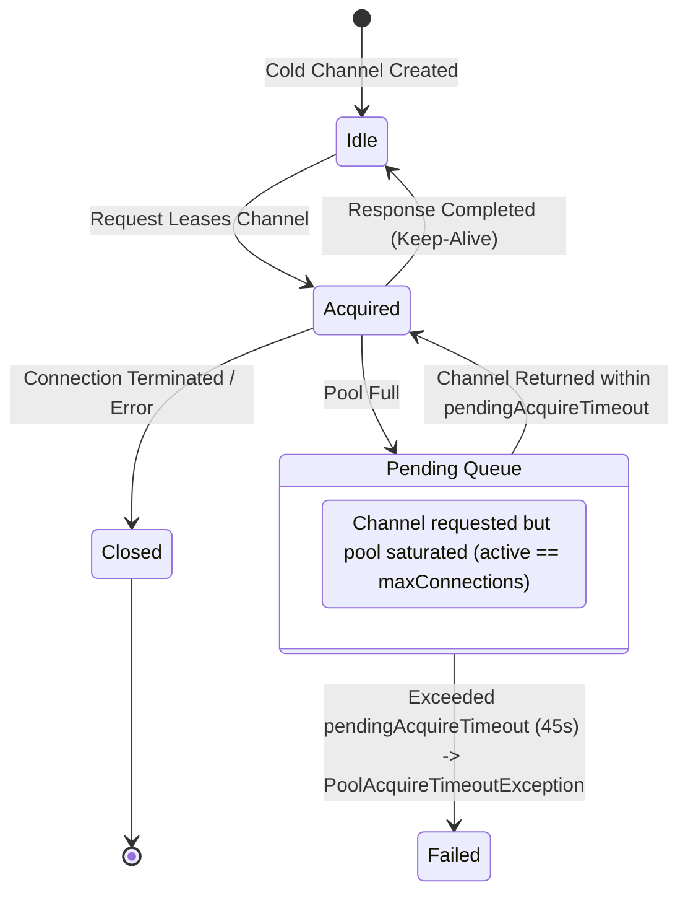

# WebClient & WebFlux Internals

## 1. Netty EventLoop Execution Engine

Spring WebFlux delegates low-level networking to Netty's `NioEventLoopGroup` or `EpollEventLoopGroup`. An `EventLoop` is an endless single-threaded loop that multiplexes I/O events and task execution:



### The EventLoop Run Loop
At its core, Netty's `SingleThreadEventLoop.run()` executes the following logic:

1. **`selector.select(timeout)`**: The OS kernel blocks the thread until at least one registered socket channel becomes ready for read/write operations or the task execution deadline expires.
2. **`processSelectedKeys()`**: Dispatches network data to Netty's `ChannelPipeline`. Incoming bytes are parsed into HTTP headers, frames, and payloads by channel handlers.
3. **`runAllTasks()`**: Executes runnable tasks submitted via `eventLoop.execute(Runnable)` or scheduled via timers.

Because both network packet handling and queued application callbacks share this single thread, any operation that calls `Thread.sleep()` or blocks on a synchronous lock inside `processSelectedKeys()` or `runAllTasks()` stalls the selector, freezing all channels registered to that loop.

## 2. Reactor Operator Assembly Chain

In Project Reactor, operator chaining builds an inverted linked-list of Publisher decorators.

Consider the following pipeline:

```java
Flux.range(1, 10)
    .filter(i -> i % 2 == 0)
    .map(i -> i * 10)
    .subscribe(subscriber);
```

### Assembly Phase (Bottom-Up)
When declared, Reactor constructs nested `Publisher` wrappers:
1. `FluxRange` is wrapped by `FluxFilter`.
2. `FluxFilter` is wrapped by `FluxMap`.

### Subscription Phase (Top-Down to Bottom-Up)
When `.subscribe(subscriber)` is called on the outermost `FluxMap`:
1. `FluxMap.subscribe(subscriber)` creates a `MapSubscriber` decorator wrapping `subscriber` and passes it to `FluxFilter.subscribe(...)`.
2. `FluxFilter.subscribe(...)` creates a `FilterSubscriber` wrapping `MapSubscriber` and passes it to `FluxRange.subscribe(...)`.
3. `FluxRange.subscribe(...)` creates a `RangeSubscription` that implements `Subscription` and calls `subscriber.onSubscribe(subscription)`.

### Execution Phase (Downstream Demand & Upstream Emission)
The downstream subscriber invokes `subscription.request(n)`. The request signal travels down to `RangeSubscription`, which begins emitting values via `onNext(1)`, `onNext(2)`:



## 3. `subscribeOn` vs `publishOn` Execution Flow

Understanding the exact threading mechanics of `subscribeOn` and `publishOn` is essential for diagnosing concurrency bottlenecks.

### `subscribeOn(Scheduler)`
- **Mechanism**: Modifies the thread that invokes `Publisher.subscribe()`.
- **Direction**: Propagates **upstream** all the way to the source publisher.
- Regardless of where `subscribeOn` appears in the pipeline, the initial source emission runs on the designated scheduler's worker thread.

### `publishOn(Scheduler)`
- **Mechanism**: Inserts an internal queue and worker task into the operator chain.
- **Direction**: Switches execution for all **downstream** operators following `publishOn`.
- When upstream calls `onNext(item)`, the `PublishOnSubscriber` enqueues the item and schedules a worker runnable on the target scheduler, decoupling upstream emission from downstream consumption:



## 4. Reactor Netty Connection Pool State Machine

`WebClient` routes outbound HTTP traffic through Reactor Netty's `ConnectionProvider`. The connection pool manages leased, idle, and pending connections using an asynchronous queue:



### Pool Invariants and Configuration
- **`maxConnections`**: Upper bound of active TCP channels to a remote host (default 500).
- **`pendingAcquireMaxCount`**: Maximum number of HTTP requests allowed to wait in the queue when the pool is fully leased ($2 \times \text{maxConnections}$).
- **`pendingAcquireTimeout`**: Time a request waits in the queue before throwing `PoolAcquireTimeoutException` (default 45 seconds).

When an unconstrained `flatMap` issues 10,000 parallel requests against an endpoint with `maxConnections=500`, the pending acquire queue fills instantly. Requests at the back of the queue wait until the 45-second deadline expires, producing widespread cascading failures.

## 5. Reactor Context Internals

Because asynchronous reactive pipelines jump between threads (Netty event loops, `Schedulers.parallel`, `Schedulers.boundedElastic`), standard `java.lang.ThreadLocal` storage loses context between operators.

Reactor solves this via **Reactor Context** (`reactor.util.context.Context`):

### How Context Works
1. **Immutable Key-Value Map**: A `Context` is an immutable, copy-on-write data structure (`CoreContext`). Modifying context creates a new instance.
2. **Upstream Flow**: Context is attached to the `Subscriber` at the **bottom** of the pipeline using `.contextWrite(Context.of(key, value))`.
3. **Lazy Upstream Discovery**: During the subscription phase, each subscriber queries its downstream subscriber for `currentContext()`. The context is available to upstream operators via `Mono.deferContextual()` or `Mono.defer()`:

```java
Mono.deferContextual(ctx -> {
    String traceId = ctx.getOrDefault("traceId", "UNKNOWN");
    return callExternalService(traceId);
}).contextWrite(Context.of("traceId", "tr-abc-123"));
```

## 6. BlockHound Bytecode Instrumentation

BlockHound ensures non-blocking safety by dynamically rewriting class bytecode at JVM startup.

### Interception Mechanism
1. **Agent Registration**: BlockHound installs a Java Instrumentation Agent via ByteBuddy before application classes are loaded.
2. **Bytecode Weaving**: It scans loaded classes for blocking methods:
   - `java.lang.Thread.sleep(long)`
   - `java.net.SocketInputStream.socketRead(...)`
   - `java.io.FileInputStream.read(...)`
   - `java.lang.Process.waitFor(...)`
3. **Thread Inspection**: When an intercepted method is invoked, BlockHound checks:
   ```java
   if (Thread.currentThread() instanceof reactor.core.scheduler.NonBlocking) {
       throw new BlockingOperationError("Blocking call! " + methodName);
   }
   ```
4. **Integration with Schedulers**: Netty event loop threads and `Schedulers.parallel()` threads implement the `NonBlocking` marker interface. Conversely, `Schedulers.boundedElastic()` threads do not implement `NonBlocking`, allowing blocking calls to execute safely without triggering BlockHound.

## Related

- [Concepts](concepts.md) — Fundamental theory of reactive streams and non-blocking I/O
- [Code Review](code-review.md) — Identifying anti-patterns and performance traps in code
- [Solutions](solutions.md) — Production solutions for connection pool sizing and error handling
- [Production](production.md) — Diagnosing Netty socket leaks and event loop stalls under load
