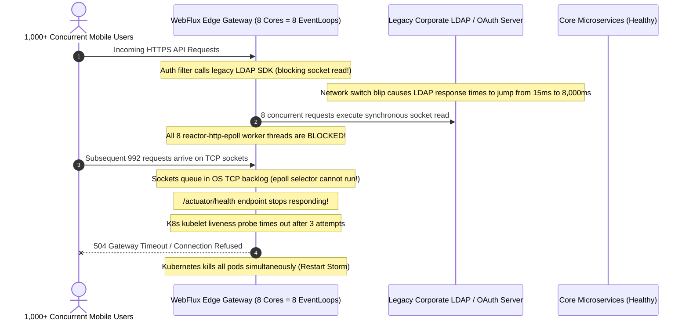

# WebClient & WebFlux in Production

Operating reactive systems in production requires specialized telemetry, event loop monitoring, and leak detection runbooks. When an event loop stalls or a connection pool fills, symptoms appear across completely unrelated routes.

## 1. Incident Walkthrough: The Event Loop Freeze

### Incident Profile
- **Severity**: P1 Major Outage
- **Duration**: 45 minutes
- **Impact**: API Gateway unresponsive; 100% of incoming HTTP requests returning 504 Gateway Timeout; Kubernetes liveness probes failing, causing pod restart storms.

### The Trigger & Cascading Failure



### Root Cause Analysis
1. **Accidental Blocking Call in Filter**: An authorization filter invoked a legacy third-party identity SDK that performed synchronous `SocketInputStream.socketRead0()` calls directly on the incoming Netty worker thread.
2. **Event Loop Starvation**: Because the gateway was provisioned on 8-core nodes, exactly 8 `reactor-http-epoll` threads serviced all traffic. Once 8 requests were stalled waiting for the slow LDAP server, the entire process became deaf to OS network events.
3. **No Liveness Probe Isolation**: Health check endpoints were multiplexed over the same Netty event loops as business traffic, causing Kubernetes to trigger aggressive container restarts that worsened the outage.

### Remediation & Post-Mortem Actions
- Offloaded all calls to the legacy identity SDK onto `Schedulers.boundedElastic()`.
- Configured hard connect and response timeouts (800ms max) on identity lookups.
- Integrated **BlockHound** into all build pipelines (`BlockHound.install()`) to fail CI builds immediately if any blocking call executes on a `NonBlocking` thread.
- Dedicated a separate management port (`management.server.port=8081`) for Actuator health checks.

---

## 2. Incident Walkthrough: Netty Connection Pool Exhaustion

### Incident Profile
- **Severity**: P2 Service Degradation
- **Duration**: 2 hours
- **Impact**: Batch notification dispatcher dropping 85% of messages; log files flooded with `PoolAcquireTimeoutException`.

### Root Cause Analysis
- A batch push service used `Flux.fromIterable(batch).flatMap(pushClient::send)`.
- With batches of 5,000 items and multiple background workers running simultaneously, thousands of outbound HTTP requests flooded Netty's connection pool.
- The pool's default ceiling (500 connections per host) was saturated instantly. Over 3,000 requests queued in `PendingAcquireQueue`, waiting until the default 45-second `pendingAcquireTimeout` expired.

### Remediation
- Restated the pipeline with explicit concurrency bounds: `flatMap(pushClient::send, 32)`.
- Attached `.onErrorResume()` to each message publisher so downstream HTTP 429 errors did not cancel the entire batch.

---

## 3. Production Telemetry & Metrics

Monitor the following Micrometer and Netty metrics in Prometheus and Grafana:

### Critical Connection Pool Metrics

| Metric | Type | Purpose | Alert Condition |
|---|---|---|---|
| `reactor.netty.connection.provider.active.connections` | Gauge | Currently leased active TCP sockets | $> 80\%$ of `maxConnections` |
| `reactor.netty.connection.provider.pending.connections` | Gauge | Requests queued waiting for an available channel | $> 0$ sustained for $> 10\text{s}$ |
| `reactor.netty.connection.provider.idle.connections` | Gauge | Channels kept alive in pool ready for reuse | Plummets to 0 under load |
| `reactor.netty.connection.provider.max.connections` | Gauge | Maximum configured pool capacity | Static threshold reference |

### Prometheus Alerting Rules

```yaml
groups:
  - name: webflux-operational-alerts
    rules:
      - alert: NettyConnectionPoolSaturated
        expr: reactor_netty_connection_provider_pending_connections > 50
        for: 30s
        labels:
          severity: critical
        annotations:
          summary: "WebClient connection pool saturated; requests queuing in pending acquire queue"

      - alert: EventLoopThreadStarvation
        expr: rate(reactor_netty_eventloop_pending_tasks_total[1m]) > 500
        for: 1m
        labels:
          severity: critical
        annotations:
          summary: "Netty event loop task queue accumulating; check for blocking calls or heavy CPU work"
```

---

## 4. Netty Native Memory Leak Diagnostics

Netty uses off-heap `ByteBuf` instances allocated via `sun.misc.Unsafe`. Native memory leaks do not appear in standard JVM heap dumps.

### Diagnostic Flags
Add the following JVM flag to test or canary environments:

```bash
# Level options: DISABLED, SIMPLE, ADVANCED, PARANOID
-Dio.netty.leakDetection.level=ADVANCED
```

When a `ByteBuf` is garbage collected without having its reference count decremented to zero via `buf.release()`, Netty logs an explicit error report:

```text
ERROR io.netty.util.ResourceLeakDetector - LEAK: ByteBuf.release() was not called before it's garbage-collected.
Recent access records:
#1:
    io.netty.buffer.AdvancedLeakAwareByteBuf.readBytes(AdvancedLeakAwareByteBuf.java:482)
    lab.webflux.custom.CustomPayloadDecoder.decode(CustomPayloadDecoder.java:31)
```

---

## 5. Production Readiness Checklist

Before deploying a Spring WebFlux application to production, verify each of the following controls:

- [ ] **No Blocking Calls on Event Loops**: BlockHound verified in CI/CD pipeline; no `.block()`, `toFuture().get()`, or un-offloaded JDBC.
- [ ] **Explicit Scheduler Offloading**: All legacy blocking libraries (JDBC, JPA, synchronous REST clients) wrapped in `subscribeOn(Schedulers.boundedElastic())`.
- [ ] **Multi-Layer WebClient Timeouts**: Netty `connectTimeout` configured ($\le 1000\text{ms}$); `responseTimeout` configured ($\le 5000\text{ms}$); stream `.timeout()` declared.
- [ ] **Bounded `flatMap` Concurrency**: All `Flux.flatMap` operators processing user input or collections provide an explicit `concurrency` argument.
- [ ] **Error Isolation in Stream Combinations**: All publishers combined via `Mono.zip()` or `Flux.merge()` decorate optional branches with `.onErrorReturn()` or `.onErrorResume()`.
- [ ] **Connection Pool Capacity Sized**: Netty `maxConnections` and `pendingAcquireTimeout` configured based on downstream capacity.
- [ ] **Resilience Decorators Active**: Circuit breakers and bulkheads wrapped around external HTTP dependencies.
- [ ] **Context Propagation Configured**: Micrometer Observation and tracing context enabled without deprecated `Hooks.onOperatorDebug()`.

---

## Related

- [Concepts](concepts.md) — Fundamental reactive streams architecture
- [Internals](internals.md) — Deep dive into Netty and Reactor execution mechanics
- [Code Review](code-review.md) — Reviewing broken examples for production hazards
- [Solutions](solutions.md) — Production-grade non-blocking implementations
