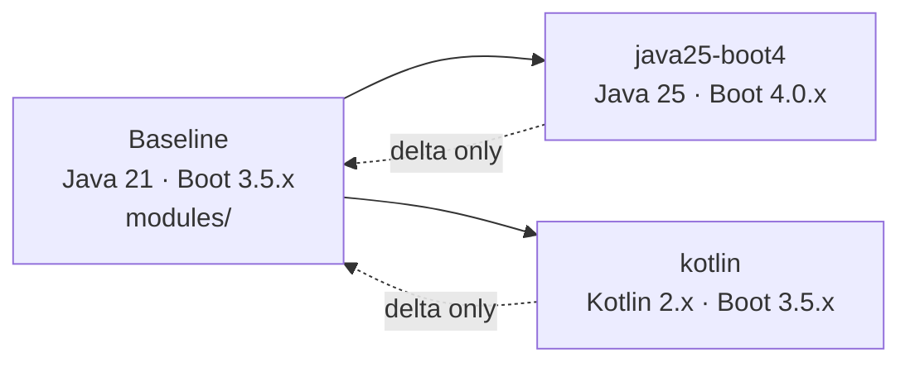

# Version and Language Tracks

The baseline (`modules/`, Java 21 + Spring Boot 3.5.x) is the canonical implementation of all 30
topics. A **track** is an isolated Gradle build that teaches only the **delta** on another
language, runtime or framework combination: what changes, what breaks during an upgrade, and what
you gain.

Tracks never replace the baseline. Every concept is explained once, under `docs/topics/`. A track
page opens with a *Delta from baseline* admonition and links back instead of repeating the theory.



## Comparison matrix

| Dimension | Baseline | `java25-boot4` | `kotlin` |
|---|---|---|---|
| Language | Java 21 | Java 25 LTS | Kotlin 2.x |
| Runtime | JDK 21 | JDK 25 | JDK 21 (baseline JDK) |
| Framework | Spring Boot 3.5.x | Spring Boot 4.0.x / Spring Framework 7 | Spring Boot 3.5.x |
| Package root | `lab.<topic>` | `lab.java25boot4.<topic>` | `lab.kotlin.<topic>` |
| Location | `modules/` | `tracks/java25-boot4/` | `tracks/kotlin/` |
| Build command | `./gradlew build` | `./gradlew buildTrack-java25-boot4` | `./gradlew buildTrack-kotlin` |
| Primary question | reference implementation | what breaks when you upgrade? | what changes when you switch language? |
| Status | 30 modules complete | `01-core-java` delta | not started |

## How to choose a track

- **Preparing for an upgrade** — read the track's `migration.md` first, then the per-topic delta
  pages. The migration questions are the ones an interviewer asks about a Boot 3 → 4 project.
- **Learning a new language** — start with the track's language overview page
  (`whats-new-java.md`, `kotlin-for-java-engineers.md`), then the topic deltas.
- **Studying a concept, not a version** — use the baseline topic pages. Tracks link into them; they
  never restate them.

## Build and verify a track

Tracks are Gradle **included builds**: their toolchain, BOM and version catalog are isolated, so a
track can never change what the baseline compiles against.

```bash
./gradlew buildTrack-java25-boot4   # one track: build + compileBrokenExamples
./gradlew buildTracks               # every track
./gradlew build                     # baseline only — must stay green regardless of track state
```

Inside the track directory the same tasks are available directly:

```bash
cd tracks/java25-boot4
../../gradlew build compileBrokenExamples compileExamples
```

## Tracks

- [Java 25 / Spring Boot 4](java25-boot4/index.md) — language and framework upgrade delta
- Kotlin — planned, see [`tracks.md` §6](../spec/tracks.md)

## Related

- [Tracks specification](../spec/tracks.md)
- [Module conventions](../spec/module-conventions.md)
- [Progress](../progress.md)
