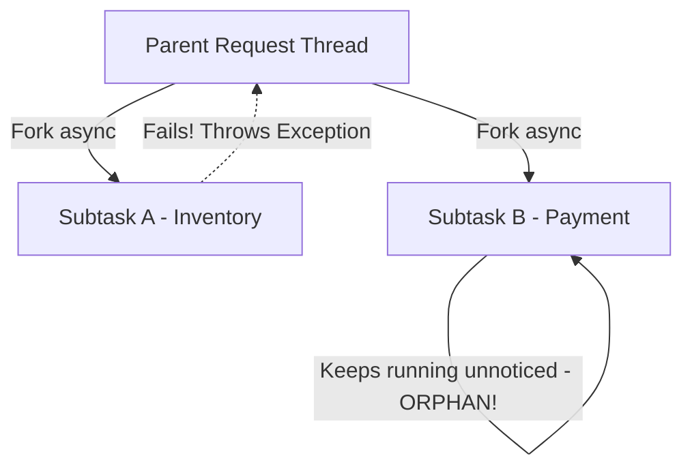
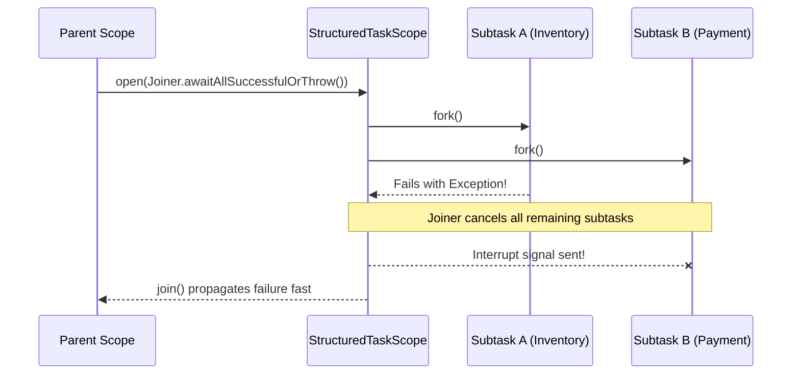

# Concepts: Concurrency Evolution in Java 25

!!! info "Delta from baseline"
    Baseline concepts in [`docs/topics/concurrency/concepts.md`](../../../topics/concurrency/concepts.md) cover Threads, Race Conditions, Thread Pools, and Java 21 Virtual Thread basics.
    This page details the **Java 25 Concurrency mechanisms**: Structured Concurrency, Scoped Values, and ObjectMonitor unmounting.

---

## 1. Structured Concurrency (`StructuredTaskScope`)

In unstructured concurrency (e.g. `CompletableFuture.supplyAsync()` or thread pools), concurrent subtasks have completely decoupled lifecycles:



If Subtask A throws an exception, Subtask B continues running in the background unaware of the failure, consuming database connections, thread capacity, and computing resources.

### Structured Task Scope Lifetime

Java 25 Structured Concurrency treats parent and child tasks as a single, coordinated lexical scope:



### Key Joiners

1. **`Joiner.awaitAllSuccessfulOrThrow()`**: All subtasks must succeed. If any subtask fails, remaining subtasks are immediately cancelled and the failure is thrown from `join()`.
2. **`Joiner.anySuccessfulResultOrThrow()`**: Short-circuits on the first successful result. Cancels all slower subtasks and returns the winning value.
3. **`Joiner.awaitAll()`**: Waits for all subtasks to terminate regardless of whether they succeed or fail.

---

## 2. Scoped Values (`ScopedValue`)

While `ThreadLocal` allows attaching contextual state to a thread, it has severe drawbacks with virtual threads:
- **Unbounded Lifetime**: Must be manually removed via `try ... finally { tl.remove(); }` or context leaks across requests.
- **Heavy Memory Footprint**: `InheritableThreadLocal` clones hash tables into every child thread. Under 100,000 virtual threads, this causes multi-gigabyte heap bloat.
- **Mutability**: Any code in the call stack can mutate the `ThreadLocal` value.

### ScopedValue Semantics

`ScopedValue` binds an immutable value to the current dynamic execution scope:

```java
ScopedValue.where(CORRELATION_ID, "req-1234").run(() -> {
    // CORRELATION_ID is accessible here
    processOrder();
});
// Automatically unbound and cleaned up upon exit of the block!
```

Key features:
- **Immutable**: Values cannot be mutated once bound.
- **Stack-Bounded**: The value ceases to exist the moment the enclosing `run` or `call` completes.
- **Zero Cleanup Boilerplate**: No `try-finally` or `remove()` required.
- **Inherited Across Virtual Threads**: Subtasks forked inside a `StructuredTaskScope` automatically inherit enclosing scoped values with zero map-cloning overhead.

---

## 3. Virtual Thread ObjectMonitor Unpinning

In Java 21, when a virtual thread executed a `synchronized` block or method and encountered a blocking operation (e.g., socket read, `LockSupport.park()`, `Thread.sleep()`), the virtual thread could not unmount from its underlying OS carrier thread. This was known as **carrier thread pinning**:

- In Java 21, widespread `synchronized` blocks in third-party libraries (e.g., database drivers, connection pools) caused carrier thread pool exhaustion.
- In Java 25, the JVM ObjectMonitor implementation has been redesigned to support virtual thread unmounting during blocking monitor acquisition and synchronization.

!!! note "Remaining Pinning Cases in Java 25"
    Virtual threads still pin carrier threads when:
    1. Executing inside a **native method or JNI frame**.
    2. Executing inside a class initializer `<clinit>`.
