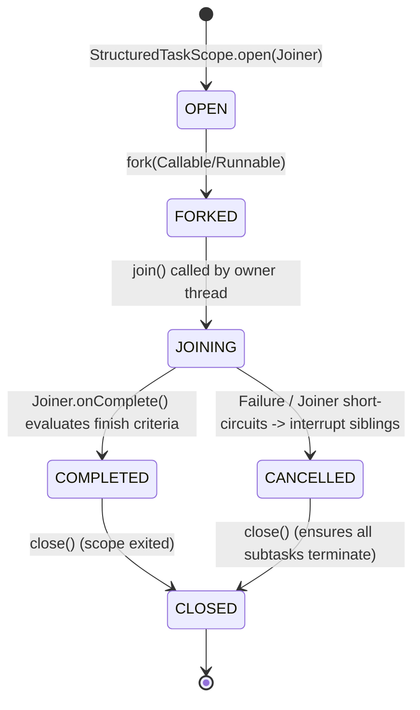

# Internals: Virtual Threads, Loom Continuation & Structured Scope

!!! info "Delta from baseline"
    Baseline internals in [`docs/topics/concurrency/internals.md`](../../../topics/concurrency/internals.md) explain the Java 21 Loom ForkJoinPool carrier architecture and parking mechanism.
    This page covers the **Java 25 internal state transitions**: `StructuredTaskScope` coordination, `ScopedValueCache`, and the redesigned `ObjectMonitor` lock unmounting.

---

## 1. `StructuredTaskScope` Internal State & Joiner Lifecycle

`StructuredTaskScope` implements `AutoCloseable`. When child tasks are spawned via `scope.fork(...)`, they run as virtual threads tied directly to the parent scope's coordinate lifecycle:

### Joiner Hook Mechanics

Every `fork()` or subtask state transition triggers hooks in the active `Joiner`:

1. `onFork(Subtask)`: Called when a subtask is scheduled.
2. `onComplete(Subtask)`: Returns `boolean` (`true` if joining is satisfied and remaining tasks should be cancelled, `false` to continue waiting).
3. `result()`: Invoked upon completion of `join()` to supply the final result value or throw a `FailedException`.

---

## 2. `ScopedValue` Cache & Frame Representation

Unlike `ThreadLocal`, which attaches a `ThreadLocalMap` to every `Thread` object instance:

- `ScopedValue` bindings are held in an immutable linked carrier list (`ScopedValue.Carrier`) associated with the current execution slice.
- When calling `ScopedValue.where(KEY, value).run(...)`, a new lightweight stack frame snapshot is pushed.
- Upon scope return, the previous pointer is restored immediately—**eliminating all risk of memory retention or thread-local leaks across reused threads**.
- When `scope.fork(...)` is invoked within a `ScopedValue` block, child virtual threads share the parent snapshot with zero copy allocation.

---

## 3. The Java 25 ObjectMonitor Unpinning Architecture

In Java 21, the HotSpot JVM's `ObjectMonitor` was tightly coupled to OS threads:
- Acquiring `synchronized` entered `ObjectMonitor::enter`.
- If blocking occurred (contention or `wait()`), the underlying native thread was parked, preventing the virtual thread scheduler from detaching the continuation.

In Java 25:
- HotSpot `ObjectMonitor` has been refactored to support lightweight virtual thread unmounting:
  - If a virtual thread blocks on a monitor, it yields its continuation back to the carrier's `ForkJoinPool` work-stealing queue.
  - Another virtual thread immediately mounts onto the carrier.
  - When the monitor lock becomes available, the virtual thread is re-queued and resumes on any available carrier.
- **JNI Native Frame Barrier**: Native C/C++ frames on the call stack still cannot be captured or restored by Loom continuations, which is why JNI operations remain the sole source of carrier pinning.
