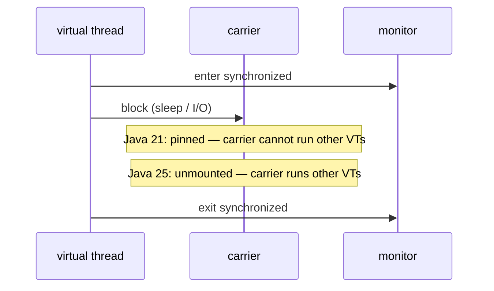

# Core Java Delta — Internals

!!! info "Delta from baseline"
    Unchanged: HashMap internals, type erasure, string pool, lazy stream evaluation →
    [baseline Core Java internals](../../../topics/core-java/internals.md)
    Changed: how a virtual thread unmounts while holding a monitor
    New: the gatherer protocol, constructor-body compilation, exact primitive conversions

## How a gatherer plugs into a stream

A `Gatherer<T, A, R>` has four parts:

```text
initializer  () -> A                 per-stream private state
integrator   (A, T, Downstream<R>)   consume one element, push zero or more downstream
combiner     (A, A) -> A             merge state for parallel streams
finisher     (A, Downstream<R>)      emit trailing state when the stream ends
```

`Gatherers.windowFixed(3)` keeps a list in `A`, pushes it downstream whenever it reaches three
elements, and its **finisher** pushes the final partial window. That finisher is what a hand-written
loop usually gets wrong.

`Stream::gather` is a normal intermediate operation: lazy, and it preserves encounter order unless
the gatherer is explicitly concurrent. `mapConcurrent` is the exception — it runs the mapping
function on virtual threads while keeping order.

## How flexible constructor bodies compile

The pre-25 rule ("`super(...)` first") existed so the JVM could guarantee the superclass was
initialised before subclass code ran. Java 25 relaxes it *without* changing that guarantee:

- Statements before `super(...)` may **not** read the instance being constructed — no `this` field
  reads, no instance method calls.
- They may compute values, validate arguments and throw.
- The verifier treats the object as uninitialised until `super(...)` completes, so an exception
  thrown before it cannot publish a half-built object.

That is why the example can normalise an id and reject a bad email **before** the parent
constructor runs, yet cannot accidentally use `this.email`.

## Exact conversions in primitive patterns

A primitive pattern matches only when the conversion from the matched value to the pattern type is
**exact**: unboxing plus identity or widening. `Integer` matches `int`; `Long` matches `long`.

Narrowing is never exact, so it never happens implicitly at the pattern — which is precisely why the
cast *after* the match is dangerous. The pattern proved the value is an `int`; it proved nothing
about the range.

```text
Integer 300  --matches-->  int i        (exact)
   (byte) i  ----------->  byte 44       (narrowing, unchecked, silent)
```

Guarding the pattern moves the range check into the language:

```java
case Integer i when i >= Byte.MIN_VALUE && i <= Byte.MAX_VALUE -> i;
```

## How `synchronized` stops pinning

A virtual thread runs on a **carrier** (a platform thread). When it blocks, it *unmounts*: its
stack is copied to the heap and the carrier is released to run another virtual thread.

Monitors (`synchronized`) were the exception, because the monitor is owned by the thread that
entered it. Java 21 could not unmount a virtual thread that owned a monitor, so it pinned the
carrier for the duration of the block. Java 24 reworked `ObjectMonitor` so ownership follows the
*virtual* thread, allowing unmount while blocked.



The consequence is a rule change, not a new API: **reverting pinning workarounds is part of the
upgrade**, and a leaked `ReentrantLock` is now a worse failure than the pinning it avoided.

## Scoped value inheritance

`ScopedValue.where(k, v).run(...)` binds `k` for the dynamic extent of the lambda. A child task
started by structured concurrency inherits the binding without copying mutable state, and the
binding disappears when the scope exits — there is nothing to `remove()`.

That structural lifetime is why scoped values do not leak across pooled threads the way
`ThreadLocal` does.

## Related

- [Concepts](concepts.md)
- [Code review](code-review.md)
- [Baseline Core Java internals](../../../topics/core-java/internals.md)
- [Java internals: virtual threads](../../../topics/concurrency/concepts.md)
