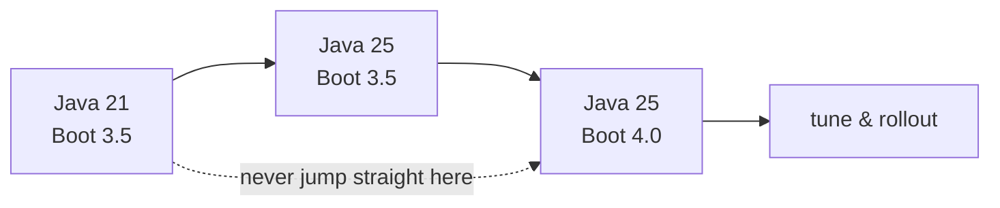

# Migration Guide: Java 21 / Boot 3.5 → Java 25 / Boot 4

A repeatable upgrade path for a production service, plus the pitfalls that turn a mechanical
version bump into an incident. This is the page to read before touching a real repository.

!!! info "Delta from baseline"
    Unchanged: the application architecture, transaction boundaries, repository contracts
    Changed: JDK, framework major, Jakarta EE baseline, security DSL, test tooling
    New: API versioning, core retry, JSpecify nullness, `RestTestClient`

## Upgrade one axis at a time

Two major changes at once make a regression impossible to attribute. Move the **runtime** first
(it is mostly mechanical), verify, then move the **framework**.

### Phase 1 — Java 21 → 25 on the current framework

1. Install a JDK 25 toolchain and pin it (`java.toolchain.languageVersion`). Do not rely on the
   developer's `JAVA_HOME`.
2. Compile and run the full test suite. Fix only what fails.
3. **Delete obsolete virtual-thread workarounds.** `synchronized` no longer pins carrier threads;
   a hand-rolled `ReentrantLock` without `try`/`finally` is now the risk, not the fix.
4. Re-check GC and JVM flags inherited from Java 21 (generational ZGC is the default mode).
5. Remove `SecurityManager` code and any `sun.misc.Unsafe` memory access — both are disabled or
   warning-only now.

### Phase 2 — Boot 3.5 → 4.0

1. Start the application with `--debug` and fix **every** "property is no longer valid" report.
   Removed auto-configurations fail silently in the other direction: a feature you relied on simply
   stops being configured.
2. Bump Jakarta EE 11 artifacts, Hibernate 7 / JPA 3.2 and Spring Data 4 together — they are a set.
3. Decide on Jackson: stay on 2 deliberately, or port to Jackson 3. Porting a custom `Module` is
   not a find-and-replace.
4. Rewrite Security configuration to the lambda-only DSL. Then re-run authorization tests; a
   matcher that silently stops applying is a security bug, not a compile error.
5. Replace hand-rolled API versioning with the framework mechanism where the version scheme allows.
6. Choose core `@Retryable` or keep Resilience4j — and say why in the PR description.
7. Migrate tests to `RestTestClient` and the new slices; keep Testcontainers tests as the source of
   truth for infrastructure semantics.

### Phase 3 — Verify before rollout

- Run the full integration suite (Testcontainers) — not just unit tests.
- Compare p50/p99 latency, GC pause distribution and connection-pool metrics against the baseline.
- Canary one instance; watch error rate and saturation, not just success rate.
- Keep the previous image deployable until the canary holds.

## Pitfalls

| Pitfall | Symptom | Prevention |
|---|---|---|
| Upgrading runtime and framework together | Cannot attribute a regression | One axis per PR |
| Trusting "it compiles" | Missing auto-configuration at runtime | Start with `--debug`; assert on bean presence in tests |
| Keeping pinning workarounds | Unnecessary locks, new deadlock risk | Delete workarounds after moving to Java 24+ |
| Silently dropped security matchers | Endpoint becomes reachable | Re-run authorization tests, not only compile |
| Copying custom Jackson modules | Wrong JSON shape | Port and re-test serialization contracts |
| Preview features in production | API may change on the next JDK | Keep preview usage inside the track/experiments |
| Ignoring deprecation warnings | Surprise removal next major | Treat new warnings as upgrade work |

## Trade-offs

| Decision | Stay | Move | Cost of moving |
|---|---|---|---|
| Jackson 2 vs 3 | Lower risk now | Future-proof serialization | Port custom modules and re-verify payloads |
| Resilience4j vs core retry | Full feature set (breaker, bulkhead) | One dependency fewer | Lose breaker/bulkhead unless re-implemented |
| Framework API versioning | Keep exotic public URL scheme | Standard mechanism | Public contract may need to change |
| Preview features | Wait for final | Use new APIs now | Recompile and re-verify on every JDK upgrade |

## Senior migration questions

1. You must move a service from Java 21 + Boot 3.5 to Java 25 + Boot 4. In what order do you do it,
   and what does each phase prove?
2. After the upgrade, p99 latency regressed but CPU and error rate are flat. How do you decide
   whether the cause is GC, the new HTTP client defaults, or Hibernate 7 fetch behaviour?
3. Which parts of this migration fail at **compile time**, which fail at **startup**, and which fail
   only under **production traffic**? Give one example of each.
4. A teammate proposes keeping every `ReentrantLock` rewrite from the Java 21 era "to be safe".
   What is your answer, and what would you check before reverting them?

## Related

- [What's new in Java 22 → 25](whats-new-java.md)
- [What's new in Spring Boot 3.5 → 4.0](whats-new-spring-boot.md)
- [Baseline Spring Transactions](../../topics/spring-transactions/index.md)
- [Tracks specification](../../spec/tracks.md)
