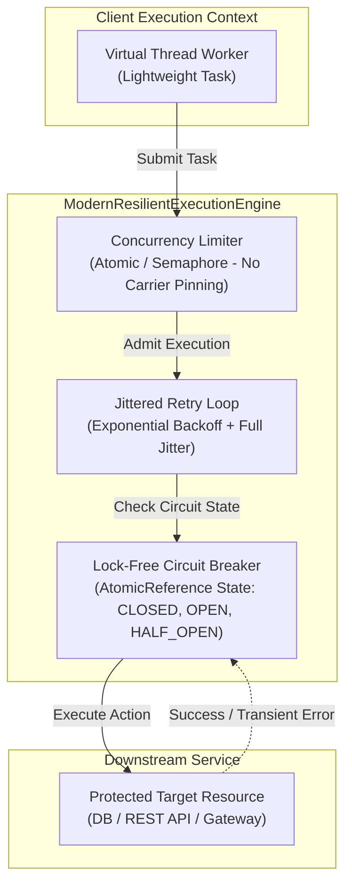

# Resilience Modernization in Spring Boot 4 / Spring Framework 7 & Java 25

!!! info "Delta from baseline"
    Baseline module [`modules/18-resilience`](../../../topics/resilience/index.md) covers resilience patterns with Resilience4j (Retry, CircuitBreaker, RateLimiter, Bulkhead) and Micrometer on Spring Boot 3.5 and Java 21.
    This track module teaches the **Spring Boot 4.0 / Spring Framework 7 & Java 25 delta**:
    
    - **Native Spring 7 Resilience vs External Resilience4j Decorators**: Modern Spring Framework 7 introduces lightweight, functional retry and circuit-breaking abstractions without requiring heavyweight CGLIB AOP proxies or external decorator libraries.
    - **Virtual-Thread-Friendly Concurrency Limits & Timeouts**: Replacing blocking `synchronized` monitors and fixed thread pool bulkheads with non-pinning `Semaphore` concurrency limiters, lock-free CAS state machines, and `CompletableFuture.orTimeout` pipelines that never pin carrier threads.
    - **Full Randomized Jitter Backoff**: Eliminating fixed-delay retry storms and thundering herd failures against recovering downstream dependencies using mathematical full jitter algorithms.

---

## 1. Modern Resilience Architecture

---

## 2. Feature Comparison Matrix

| Capability | Baseline (Boot 3.5 / Java 21) | Track (Boot 4.0 / Java 25) |
|---|---|---|
| **Resilience Model** | Heavy external Resilience4j decorators + CGLIB AOP proxies | Composable functional pipelines & native lightweight Spring 7 abstractions |
| **Bulkhead Pattern** | Fixed thread pool bulkhead (`ThreadPoolBulkhead`) or blocking semaphore | Non-blocking semaphore & atomic concurrency limiters without carrier thread pinning |
| **Retry Backoff** | Often configured with static fixed delay (`1000ms`) | Exponential backoff with Full Jitter uniformly dispersed over `[0, min(max, base * 2^attempt)]` |
| **Circuit Breaker State Machine** | Synchronized state transitions risking carrier thread pinning | Lock-free CAS state transitions (`AtomicReference<CircuitState>`) |
| **Timeout Execution** | Blocking `Future.get(timeout)` or thread interrupt signals | Non-blocking `CompletableFuture.orTimeout` or structured virtual thread timeouts |
| **Observability** | Resilience4j micrometer binder metrics | Unified Spring Observation & OpenTelemetry trace propagation across retries |

---

## 3. Module Roadmap

1. [Concepts](concepts.md) — Native retry pipelines, virtual thread concurrency limits, and jitter algorithms.
2. [Internals](internals.md) — Lock-free circuit breaker state transitions and carrier thread unpinning mechanics.
3. [Interview Questions](questions.md) — 13 senior and scenario questions with runnable demonstrations.
4. [Code Review](code-review.md) — Review targets exhibiting unbounded retry storms and carrier-pinning synchronized circuit breakers.
5. [Solutions](solutions.md) — Production refactoring guide with issue catalogue mappings.
6. [Testing Guide](tests.md) — Verifying circuit breaker trip/recovery and retry backoffs with Awaitility.
7. [Production Scenarios](production.md) — Diagnosing cascading payment gateway outages and carrier thread exhaustion.
8. [Exercises](exercises.md) — Hands-on resilience migration exercises.
