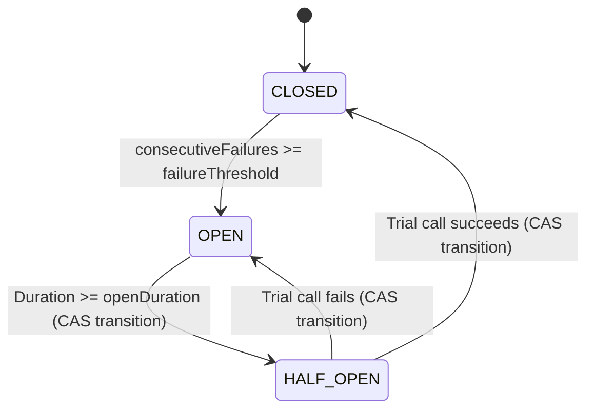

# Modern Resilience Internals: Spring Boot 4 & Java 25

!!! info "Delta from baseline"
    Baseline internals in [`modules/18-resilience`](../../../topics/resilience/internals.md) dissect Resilience4j sliding window arrays and ring buffer counters.
    This page examines the internal mechanics of lock-free circuit breaker state machines, carrier unpinning in concurrency limiters, and retry backoff scheduling.

---

## 1. Lock-Free Circuit Breaker State Transitions

A robust circuit breaker operates across three states:
- `CLOSED`: Normal operation; downstream calls execute and failures are recorded.
- `OPEN`: Failure threshold exceeded; downstream calls fail fast immediately.
- `HALF_OPEN`: Open duration elapsed; a single trial request is permitted to probe recovery.



In traditional implementations, state transitions and failure recording were protected with `synchronized (this)`:
```java
// Anti-pattern: carrier pinning monitor
public synchronized void recordFailure() {
    consecutiveFailures++;
    if (consecutiveFailures >= threshold) {
        state = State.OPEN;
    }
}
```

In modern high-concurrency environments, this is replaced by atomic compare-and-swap (`AtomicReference<CircuitState>`) and lock-free atomic counters:
```java
private void checkState() {
    while (true) {
        CircuitState current = state.get();
        if (current == CircuitState.CLOSED || current == CircuitState.HALF_OPEN) {
            return;
        }
        if (current == CircuitState.OPEN) {
            Instant lastChanged = lastStateChange.get();
            if (Duration.between(lastChanged, Instant.now()).compareTo(openDuration) >= 0) {
                if (state.compareAndSet(CircuitState.OPEN, CircuitState.HALF_OPEN)) {
                    lastStateChange.set(Instant.now());
                    return;
                } else {
                    continue; // Lost race to another virtual thread; re-evaluate
                }
            }
            throw new CircuitBreakerOpenException("Circuit breaker is currently OPEN");
        }
    }
}
```

This guarantees zero carrier thread pinning and minimal contention under thousands of concurrent virtual threads.

---

## 2. Virtual Thread Parking vs Carrier Pinning

When a virtual thread executes `Thread.sleep(millis)` during an exponential backoff retry:
- Under Java 21+ and Java 25, `Thread.sleep` unmounts the virtual thread from its carrier OS thread.
- The carrier thread immediately executes other waiting virtual threads.
- However, if the sleep occurs **inside a synchronized block**, the Java runtime is forced to pin the carrier thread, preventing unmounting.
- In `ModernResilientExecutionEngine`, retries execute outside synchronized scopes, allowing carrier threads to maintain 100% throughput even while hundreds of virtual threads are backing off.

---

## 3. Concurrency Limiter Mechanics: Atomic vs Queued Semaphore

To prevent downstream service saturation:
- **Atomic Execution Tracker**: Fast path using `AtomicInteger.incrementAndGet()` and `decrementAndGet()`. If `current > maxConcurrency`, it immediately throws `ConcurrencyLimitExceededException` (shedding load without queueing).
- **Fair/Non-fair Semaphore**: When queueing is desired, `Semaphore(permits, fair)` parks virtual threads in a wait queue until a permit is returned.
- Both mechanisms avoid allocating OS threads, making them orders of magnitude more resource-efficient than traditional `ThreadPoolExecutor` bulkheads.
