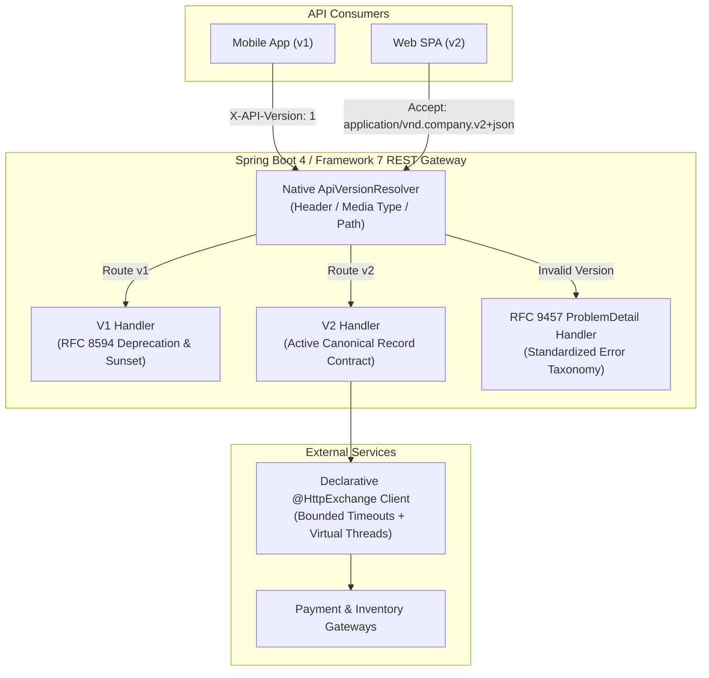

# REST API in Spring Boot 4 / Spring Framework 7

!!! info "Delta from baseline"
    Baseline module [`modules/10-rest-api`](../../../topics/rest-api/index.md) covers REST fundamentals: HTTP methods, safety, idempotency, status codes, RFC 9457 Problem Details, caching (`Cache-Control`, ETag), pagination, and manual versioning on Spring Boot 3.5.
    This track module teaches the **Spring Boot 4.0 / Spring Framework 7 & Java 25 delta**:
    
    - **Declarative HTTP Interfaces (`@HttpExchange`)**: Modern declarative HTTP clients in Spring Framework 7, replacing manual `HttpServiceProxyFactory` boilerplate, with strict timeout configuration, virtual thread safety, and seamless RFC 9457 `ProblemDetail` error decoding.
    - **Native REST API Versioning**: Spring Framework 7 native version routing across headers, path segments, and media types, coupled with RFC 8594 `Deprecation` and `Sunset` response headers for graceful API lifecycle evolution.
    - **Strict Contracts with JSpecify & Jackson 3**: Enforcing non-nullability across REST request and response records via JSpecify `@NullMarked`, ensuring clean API schemas without runtime surprises.

---

## 1. REST API Architecture Evolution

---

## 2. Feature Comparison Matrix

| Capability | Baseline (Boot 3.5 / Java 21) | Track (Boot 4.0 / Java 25) |
|---|---|---|
| **Declarative HTTP Clients** | Manual `HttpServiceProxyFactory` boilerplate wrapping `RestClientAdapter` | Modern declarative `@HttpExchange` registration with simplified factories and builders |
| **API Versioning** | Ad-hoc URL path manipulation or imperative `@RequestHeader` branching | First-class Framework 7 version routing & RFC 8594 `Deprecation` and `Sunset` headers |
| **Error Handling** | RFC 9457 `ProblemDetail` with legacy exception translation | Unified RFC 9457 `ProblemDetail` decoding on declarative clients and controllers |
| **DTO Null Safety** | JSR-305 / Spring annotations (`@NonNullApi`) or Bean Validation only | JSpecify `@NullMarked` static type contracts on immutable records |
| **Serialization** | Jackson 2 (`com.fasterxml.jackson.*`) | Jackson 3 (`tools.jackson.*`) with immutable design and enhanced record construction |

---

## 3. Module Roadmap

1. [Concepts](concepts.md) — Declarative `@HttpExchange`, native API versioning, RFC 8594 headers, and Jackson 3.
2. [Internals](internals.md) — Framework 7 version resolution mechanisms, HTTP interface proxies, and RFC 9457 error decoding.
3. [Interview Questions](questions.md) — 13 senior and scenario questions with runnable code snippets.
4. [Code Review](code-review.md) — Review targets exhibiting ad-hoc versioning traps and unbounded HTTP client leaks.
5. [Solutions](solutions.md) — Production refactoring guide with issue catalogue mappings.
6. [Testing Guide](tests.md) — Verifying version negotiation, sunset headers, and HTTP exchange proxies.
7. [Production Scenarios](production.md) — Graceful API version sunsetting and high-concurrency client timeouts.
8. [Exercises](exercises.md) — Hands-on migration exercises.
