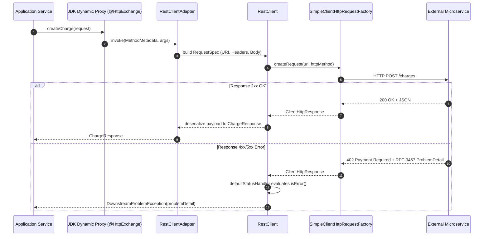

# REST API Internals in Spring Boot 4

!!! info "Delta from baseline"
    Baseline module [`modules/10-rest-api`](../../../topics/rest-api/internals.md) explains `DispatcherServlet` request lifecycle, `HandlerMapping`, `HttpMessageConverter` mechanics, and RFC 9457 serialization.
    This page covers the **Spring Boot 4.0 / Spring Framework 7 internals**: `HttpServiceProxyFactory` proxy invocation dynamics, `ApiVersionResolver` routing internals, and RFC 9457 error decoding pipelines.

---

## 1. `HttpServiceProxyFactory` Invocation Mechanics

Declarative HTTP interface proxies are created dynamically at runtime via Java dynamic proxies (`Proxy.newProxyInstance`) backed by `HttpExchangeAdapter` (e.g. `RestClientAdapter`):

### Key Internal Invariants
1. **Thread Blocking Behavior**: When running on virtual threads, HTTP interface invocations unmount the virtual thread during network socket I/O if modern socket adapters (JDK HttpClient or socket channels) are used.
2. **Timeout Enforcement**: If `connectTimeout` or `readTimeout` are not explicitly configured on the underlying `ClientHttpRequestFactory`, default infinite socket read timeouts apply, stalling carrier or virtual threads upon network partitions.

---

## 2. API Version Negotiation Internals

Spring Framework 7 integrates version resolution into `RequestMappingHandlerMapping`:
- Each request is evaluated against configured `ApiVersionResolver` implementations (checking query parameters, request headers, or path segments).
- When a version match occurs, the corresponding version-qualified `HandlerMethod` is invoked.
- If a client requests a version that matches no registered handler, the framework avoids falling back to unintended handlers and instead triggers a standardized `UnsupportedApiVersionException` mapped to an RFC 9457 `ProblemDetail` with status `400 Bad Request` or `406 Not Acceptable`.

---

## 3. RFC 8594 Header Processing

Lifecycle headers are attached during response rendering:
- **`Deprecation`**: Serialized as `@<epoch-seconds>` or `true`.
- **`Sunset`**: Serialized in strict IMF-fixdate format (e.g., `Thu, 31 Dec 2026 23:59:59 GMT`).
- **`Link`**: Formatted with RFC 8288 link relation syntax (`<https://...>; rel="deprecation"`).
