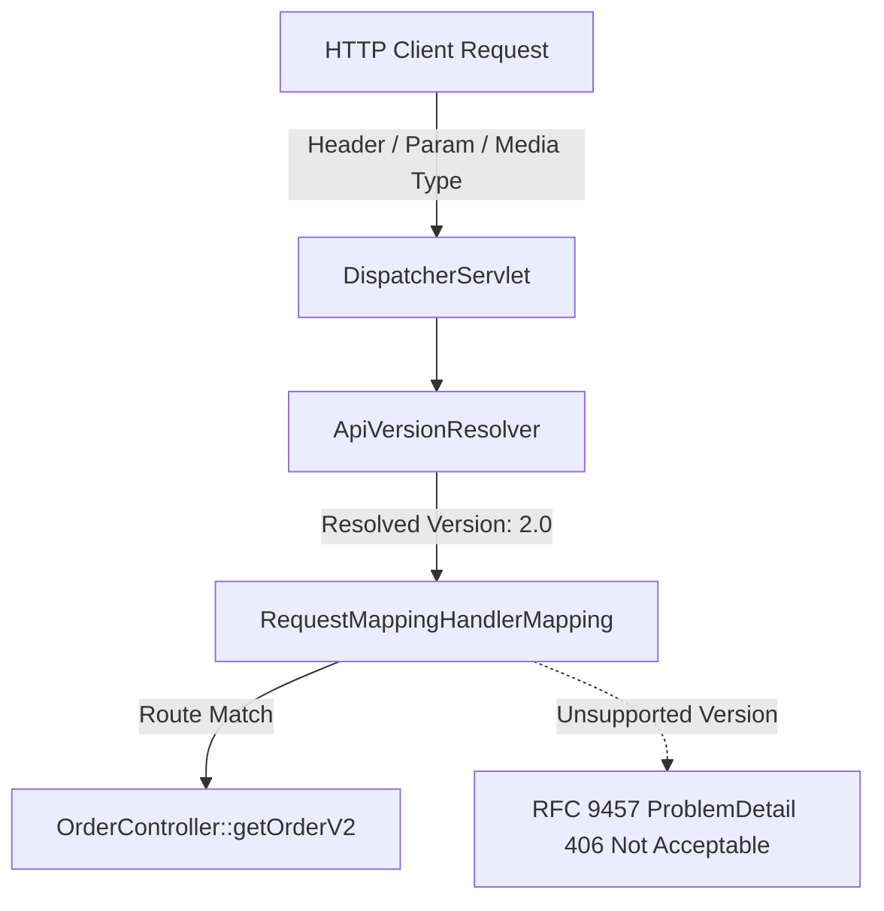
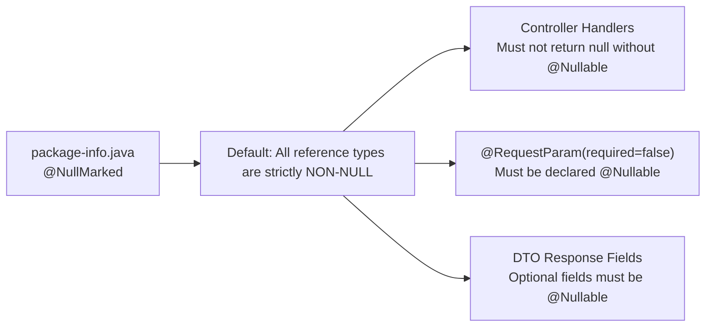

# Concepts: Modern Web MVC in Spring Boot 4 / Framework 7

!!! info "Delta from baseline"
    Baseline concepts in [`docs/topics/spring-mvc/concepts.md`](../../../topics/spring-mvc/concepts.md) cover Request Mapping, Controllers, Path Variables, and Request Body parsing.
    This page details the **Spring Framework 7 / Boot 4 additions**: First-class API versioning, JSpecify nullness contracts, and Jackson 3.

---

## 1. First-Class API Versioning

In prior versions of Spring, teams wanting to support multiple API versions (e.g. `/orders` across `v1` and `v2`) had to resort to:
- Creating custom path prefixes (e.g., `@RequestMapping("/v1/orders")`), which breaks clean REST URI resource naming.
- Writing custom `HandlerInterceptor` classes that read headers and dispatch via reflection or `if-else` blocks inside a single method.
- Writing custom `RequestMappingHandlerMapping` beans with custom `RequestCondition` classes.

### The Spring Framework 7 Versioning Architecture

Spring Framework 7 introduces built-in API version routing:



### Version Declaration

Endpoints declare version criteria directly on the mapping annotations:

```java
@GetMapping(value = "/{id}", headers = "X-API-Version=1.0")
public ResponseEntity<OrderV1> getOrderV1(@PathVariable String id) { ... }

@GetMapping(value = "/{id}", headers = "X-API-Version=2.0")
public ResponseEntity<OrderV2> getOrderV2(@PathVariable String id) { ... }
```

When an unsupported version is requested, the framework generates a standardized RFC 9457 `ProblemDetail` with status `406 Not Acceptable` or `400 Bad Request`.

---

## 2. JSpecify Null-Safety Integration

Spring Framework 7 transitions from proprietary Spring annotations (`@NonNullApi`, `@NonNullFields`, `@Nullable`) to the industry standard **JSpecify** specification (`org.jspecify.annotations.*`).



### Contract Enforcement
1. **Unannotated Types**: A method returning `String` in a `@NullMarked` package promises non-null. Returning `null` triggers static analysis warnings and API contract violations.
2. **`@Nullable`**: Must be explicitly applied to any optional request parameters, headers, or DTO properties that may be absent.

---

## 3. Jackson 3 / Modern Serialization Evolution

Spring Boot 4 supports Jackson 3 (`tools.jackson.*`), the first major rewrite of Jackson in over a decade:
- Immutable `JsonMapper` builders replacing mutable `ObjectMapper` configuration.
- Native, zero-overhead support for Java 21+ records.
- Stricter null-handling and typed deserialization pipelines.
