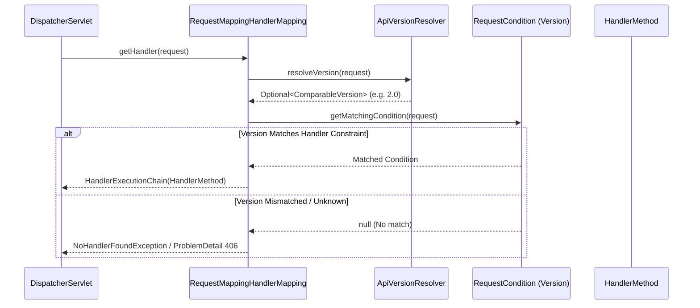

# Internals: Spring MVC Routing Engine & JSpecify Bytecode

!!! info "Delta from baseline"
    Baseline internals in [`docs/topics/spring-mvc/internals.md`](../../../topics/spring-mvc/internals.md) detail `DispatcherServlet.doDispatch()`, `HandlerExecutionChain`, and Jackson message converter pipelines.
    This page covers the **Spring Framework 7 internal mechanics**: declarative `ApiVersionResolver` condition matching and JSpecify type-use bytecode representations.

---

## 1. Native API Version Condition Matching

In Spring Framework 7, `RequestMappingInfo` evaluates API version conditions directly during the handler selection phase:



### Advantages over Hand-Rolled Interceptors
- **Zero Reflection Overhead**: Resolution occurs before method invocation, avoiding costly interceptor reflection or `if-else` branching.
- **OpenAPI Schema Isolation**: Different versioned methods on the same base path generate isolated, accurate OpenAPI schemas.
- **Content Negotiation Compatibility**: Version conditions cleanly compose with `Accept` header and media type constraints.

---

## 2. JSpecify Bytecode & Type-Use Annotation Encoding

Unlike legacy `@NonNullApi` package annotations that operated strictly as static analysis hints:
- JSpecify annotations (`@NullMarked`, `@Nullable`) target `ElementType.TYPE_USE`.
- The compiler emits these into the class file's `RuntimeVisibleTypeAnnotations` attribute:

```text
// Compiled from CustomerProfile.class
public final java.lang.String phoneNumber();
  descriptor: ()Ljava/lang/String;
  flags: (0x0001) ACC_PUBLIC
  RuntimeVisibleTypeAnnotations:
    0: #15(): METHOD_RETURN, org.jspecify.annotations.Nullable
```

This guarantees that runtime reflection, Spring argument resolvers, and serialization libraries (like Jackson 3) can inspect nullness contracts at runtime.
