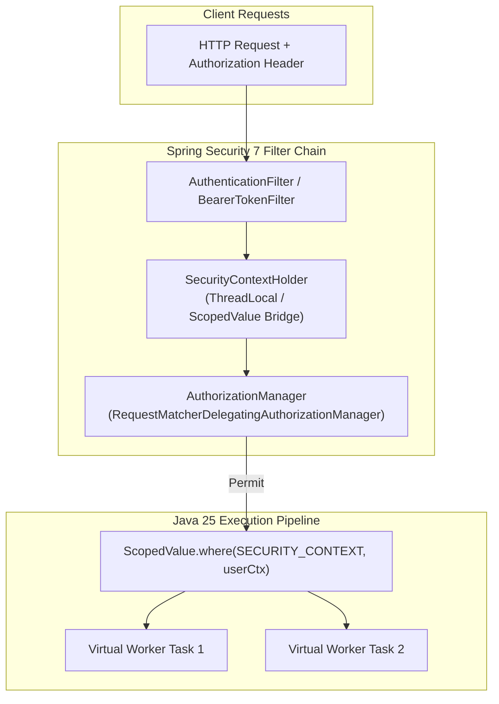

# Spring Security in Spring Boot 4 / Spring Security 7

!!! info "Delta from baseline"
    Baseline module [`modules/11-spring-security`](../../../topics/spring-security/index.md) covers Spring Security fundamentals: `SecurityFilterChain` filter ordering, authentication vs authorization, JWT handling, password hashing, and CSRF/CORS mechanisms on Spring Boot 3.5 / Security 6.
    This track module teaches the **Spring Boot 4.0 / Spring Security 7 & Java 25 delta**:
    
    - **Spring Security 7 Lambda-Only DSL**: Complete removal of legacy `and()` chaining and parameterless configuration methods in favor of pure lambda-based `Customizer` configurations.
    - **Virtual Thread Security Context Propagation**: Safe concurrency models eliminating memory retention and context leakage associated with `MODE_INHERITABLETHREADLOCAL`, utilizing Java 25 `ScopedValue` for zero-overhead, strictly scoped authentication propagation.
    - **Modern Authorization Managers & Customizers**: Explicit request matching, stateless session management, and granular method security.

---

## 1. Security Architecture Evolution

---

## 2. Feature Comparison Matrix

| Capability | Baseline (Security 6 / Boot 3.5) | Track (Security 7 / Boot 4.0) |
|---|---|---|
| **Configuration DSL** | Lambda DSL preferred, `and()` deprecated but present | Lambda-only DSL mandatory (`Customizer<T>`); `and()` completely removed |
| **Authorization Engine** | `AuthorizationManager` replacing `AccessDecisionManager` | Strict `AuthorizationManager` hierarchy throughout MVC and WebFlux |
| **Context Propagation** | `MODE_INHERITABLETHREADLOCAL` common for async child tasks | `ScopedValue` recommended for virtual threads; `InheritableThreadLocal` discouraged |
| **Session Management** | Imperative method chains (`sessionManagement().sessionCreationPolicy(...)`) | Explicit lambda customizer (`sessionManagement(s -> s.sessionCreationPolicy(...))`) |
| **CSRF & CORS** | `csrf().disable()` or lambda customizers | Pure lambda customizers (`csrf(AbstractHttpConfigurer::disable)`) |

---

## 3. Module Roadmap

1. [Concepts](concepts.md) — Lambda-only DSL, ScopedValue security propagation, and modern authorization.
2. [Internals](internals.md) — Security filter chain invocation, holder strategy mechanics, and scoped value inheritance.
3. [Interview Questions](questions.md) — 13 senior and scenario questions with runnable code snippets.
4. [Code Review](code-review.md) — Review targets exhibiting legacy `and()` chaining and context leakage.
5. [Solutions](solutions.md) — Production refactoring guide with issue catalogue mappings.
6. [Testing Guide](tests.md) — Testing security filter chains and scoped context isolation.
7. [Production Scenarios](production.md) — InheritableThreadLocal identity spoofing and carrier thread leaks.
8. [Exercises](exercises.md) — Hands-on migration exercises.
