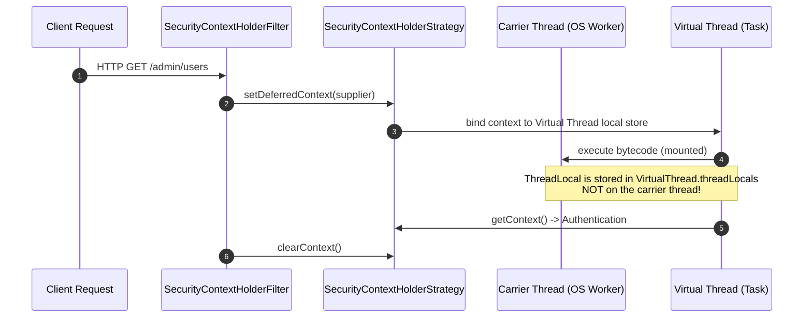

# Spring Security 7 Internals

!!! info "Delta from baseline"
    Baseline module [`modules/11-spring-security`](../../../topics/spring-security/internals.md) explains `SecurityFilterChain` execution, `AuthenticationManagerBuilder`, and `FilterSecurityInterceptor` mechanics.
    This page covers the **Spring Boot 4.0 / Spring Security 7 & Java 25 internals**: `SecurityContextHolderStrategy` thread models, `AuthorizationFilter` routing, and `ScopedValue` carrier mechanics.

---

## 1. `SecurityContextHolderStrategy` & Virtual Threads

The default strategy in Spring Security is `ThreadLocalSecurityContextHolderStrategy`:

### Critical Invariant
When using standard `ThreadLocal`, each virtual thread has its own private `threadLocals` map. Unmounting a virtual thread preserves its thread-local state without leaking onto the carrier thread. However, if code uses `InheritableThreadLocal` or dispatches work to thread pools without clearing, the context survives task completion, creating cross-task data pollution.

---

## 2. Java 25 `ScopedValue` vs `ThreadLocal` Internals

| Dimension | `ThreadLocal` / `InheritableThreadLocal` | Java 25 `ScopedValue` |
|---|---|---|
| **Mutability** | Mutable (`set()`, `remove()`) | Strictly immutable once bound |
| **Lifecycle** | Unbounded; requires explicit `remove()` in `finally` | Bounded to lexical scope block |
| **Child Thread Inheritance** | Deep copies hash maps on thread creation; massive memory cost | Zero-copy pointer sharing along parent scope tree |
| **Carrier Thread Safety** | Vulnerable to pool worker contamination | Impossible to bleed beyond scope invocation |

---

## 3. `AuthorizationFilter` Mechanics

In Spring Security 7:
- `AuthorizationFilter` replaces the legacy `FilterSecurityInterceptor`.
- It invokes `RequestMatcherDelegatingAuthorizationManager`, matching the incoming `HttpServletRequest` against pre-compiled request matchers in exact insertion order.
- The first matching rule evaluates `AuthorizationDecision check(...)`. If denied, it throws `AccessDeniedException`, routed directly to `AccessDeniedHandler` without invoking downstream servlets.
